# 转录
### mRNA（和部分lncRNA）的一生
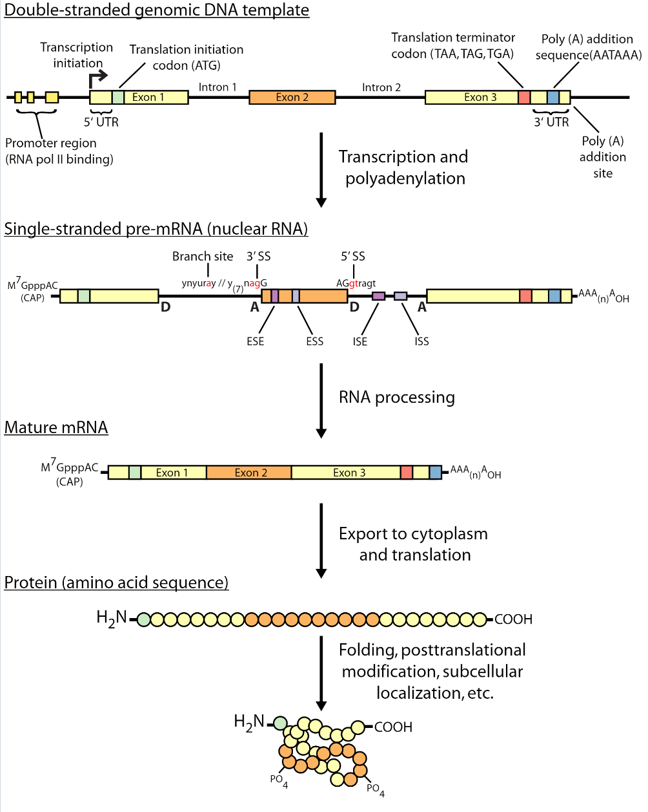
来源：https://github.com/griffithlab/rnaseq_tutorial/blob/master/manuscript/figures/Figure1.pdf
### 转录复合物
[RNA 聚合酶 I负责核糖体 RNA (rRNA) 基因的转录。RNA 聚合酶 II (Pol II) 转录所有蛋白质编码基因，但也转录一些非编码 RNA（例如、snRNA、snoRNA 或长链非编码 RNA）。RNA聚合酶III转录5S rRNA基因，转移RNA（tRNA）的基因，和一些小的非编码RNA（例如，7SK）。当聚合酶遇到称为终止子的序列时，转录结束。](https://en.wikipedia.org/wiki/Gene_expression)

[虽然原核蛋白质编码基因的转录产生了准备翻译成蛋白质的信使 RNA (mRNA)，但真核基因的转录留下了RNA ( pre-RNA )的初级转录物，它首先必须经过一系列修饰才能成为成熟的 RNA。成熟过程中涉及的类型和步骤在编码和非编码 preRNA 之间有所不同；即，即使 mRNA 和tRNA 的preRNA 分子都经过剪接，所涉及的步骤和机制是不同的。[8]非编码 RNA 的加工描述如下（非核心 RNA 成熟）。premRNA 的加工包括 5' 加帽，这是一组酶促反应，将7-甲基鸟苷(m 7 G) 添加到 pre-mRNA 的 5' 末端，从而保护 RNA 免受外切核酸酶的降解。然后 m 7 G 帽被帽结合复合异二聚体 (CBC20/CBC80) 结合，这有助于 mRNA 输出到细胞质并保护 RNA 免于脱帽。另一种修饰是 3'切割和聚腺苷酸化。如果前体 mRNA 中存在多聚腺苷酸化信号序列 (5'-AAUAAA-3')，则它们会发生，前体 mRNA 通常位于蛋白质编码序列和终止子之间。前体 mRNA 首先被切割，然后添加一系列约 200 个腺嘌呤 (A) 以形成聚 (A) 尾，从而保护 RNA 免于降解。poly(A) 尾部与mRNA 输出和翻译重新启动所必需的多个poly(A) 结合蛋白 (PABP) 结合。在去腺苷酸化的逆过程中，poly(A) 尾巴被CCR4-Not 3'-5' 核酸外切酶缩短，这通常会导致完整的转录本衰减。Pre-mRNA被剪接形成成熟的mRNA。前 mRNA 中的外显子和内含子以及通过剪接形成成熟 mRNA 的图示。UTR（绿色）是 mRNA 末端外显子的非编码部分。真核前体 mRNA 的一个非常重要的修饰是RNA 剪接。大多数真核前体 mRNA 由称为外显子和内含子的交替片段组成。在剪接过程中，一种称为剪接体的RNA-蛋白质催化复合物催化两个酯交换反应，去除一个内含子并以套索结构的形式释放它，然后将相邻的外显子剪接在一起。在某些情况下，一些内含子或外显子可以被去除或保留在成熟的 mRNA 中。这种所谓的选择性剪接创建一系列源自单个基因的不同转录本。因为这些转录本可能被翻译成不同的蛋白质，剪接扩展了真核基因表达的复杂性和物种蛋白质组的大小。广泛的 RNA 加工可能是真核生物细胞核带来的进化优势。在原核生物中，转录和翻译同时发生，而在真核生物中，核膜将这两个过程分开，为 RNA 加工提供时间。](https://en.wikipedia.org/wiki/Gene_expression)

[在大多数生物体中，非编码基因 (ncRNA)被转录为经过进一步加工的前体。在核糖体 RNA (rRNA) 的情况下，它们通常被转录为包含一个或多个 rRNA 的 pre-rRNA。pre-rRNA在特定位点被大约 150 种不同的小核仁限制性 RNA切割和修饰（2'-O-甲基化和假尿苷形成），称为 snoRNA。SnoRNAs 与蛋白质结合，形成 snoRNPs。当 snoRNA 部分与目标 RNA 碱基配对并因此将修饰定位在精确位点时，蛋白质部分执行催化反应。在真核生物中，特别是称为 RNase 的 snoRNP，MRP 将 45S 前体 rRNA 切割成 28S、5.8S 和 18S rRNA。rRNA 和 RNA 加工因子形成称为核仁。例如，在转移 RNA (tRNA) 的情况下，5' 序列被RNase P去除，而 3' 末端被tRNase Z酶去除和非模板化的 3' CCA 尾由核苷酸转移酶添加。在微小 RNA (miRNA)的情况下，miRNA 首先转录为初级转录本或带有帽和 poly-A 尾的 pri-miRNA，然后被加工成短的 70 个核苷酸的茎环结构，称为 pre-miRNA。细胞核由Drosha和Pasha酶组成。输出后，通过与核酸内切酶的相互作用，在细胞质中加工成成熟的 miRNADicer也启动了RNA 诱导的沉默复合物 (RISC)的形成，该复合物由Argonaute蛋白组成。甚至 snRNA 和 snoRNA 本身在成为功能性 RNP 复合体的一部分之前也会经历一系列修饰。这是在核质或称为Cajal 小体的专门隔室中完成的。它们的碱基被一组小卡哈尔体特异性 RNA (scaRNA)甲基化或假尿苷化，其结构与 snoRNA 相似。](https://en.wikipedia.org/wiki/Gene_expression)

### RNA分类
[可在wikipedia上查看到详细](https://en.wikipedia.org/wiki/Category:RNA)<br/>
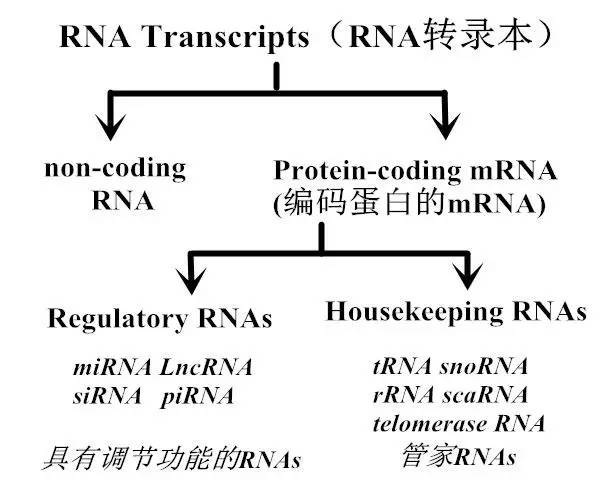<br/>
小于50 nt：microRNA，siRNA，piRNA；<br/>
50 nt到500 nt：rRNA，tRNA，snRNA，snoRNA，SLRNA，SRPRNA 等等；<br/>
大于500 nt：包括长的mRNA-like的非编码RNA，长的不带polyA 尾巴的非编码RNA等等。<br/>

tRNA（转运RNA）:氨基酸转运<br/>
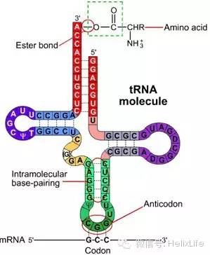<br/>
gRNA（导引RNA）：mRNA编辑<br/>
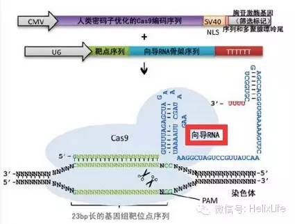<br/>
snRNA（核内小分子RNA）：mRNA加工（剪接和成熟）<br/>
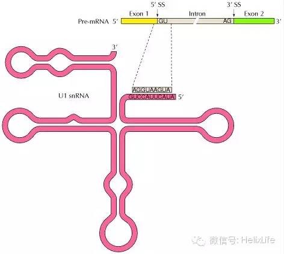<br/>
snoRNA（核仁小分子RNA）：rRNA加工（切割和修饰）<br/>
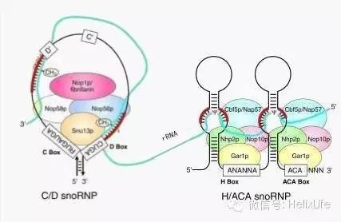<br/>
Telomerase RNA：DNA复制<br/>
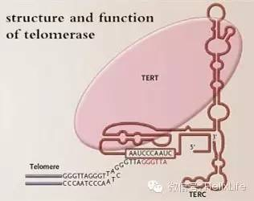<br/>
SRP（信号识别颗粒）-RNA：参与蛋白质的转运分泌<br/>
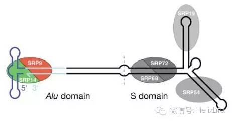<br/>

### rDNA(核糖体DNA 45S)
可用RNAmmer预测<br/>
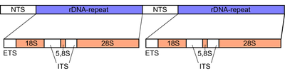
核糖体DNA（Ribosomal DNA，rDNA）是一种DNA序列，该序列用于rRNA编码。核糖体是蛋白质和rRNA分子的组合，翻译mRNA分子以产生蛋白质的组件。如该图所示，真核生物的rDNA包括一个单元段，一个操纵子，以及由NTS、ETS、18S、ITS1、5.8S、ITS2和28S束组成的串联重复序列。rDNA的还有另一个基因，由5S rRNA基因编码，位于大多数真核生物的基因组中。5S rDNA序列也存在于果蝇的串联重复序列

### RNA定量
为什么RNA的表达需要做标准化？<br/>
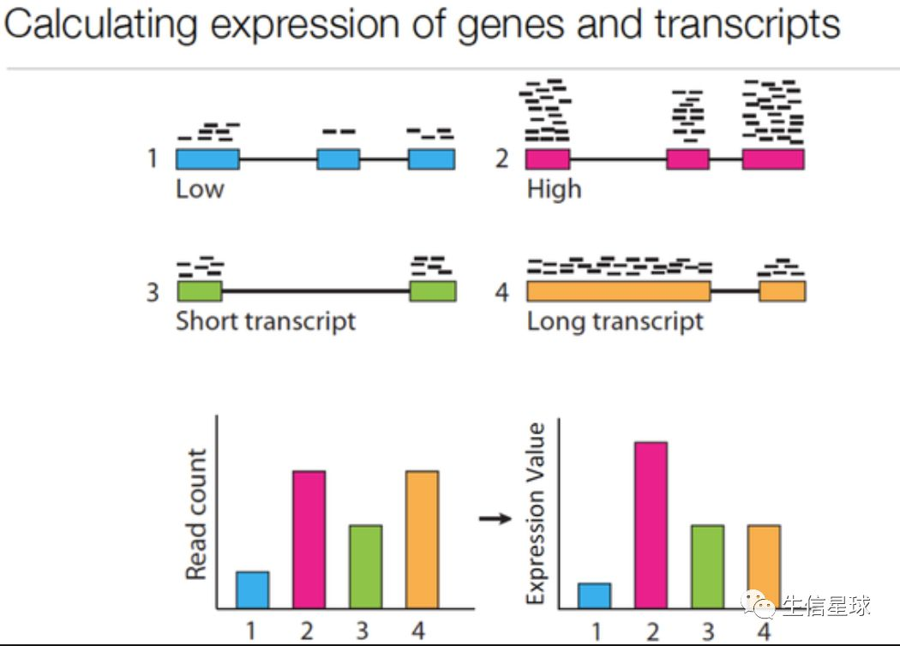<br/>
- R/FPKM：针对测序深度和转录本长度进行标准化，目的是在不同的样品中比较一个基因，在样品中比较不同的基因（极易受到表达量特别大的rna的影响）
- TMM：针对转录本库组成的差异和极端异常值进行标准化，目的更好的进行样本间的比较
- TPM：针对转录本库组成的差异进行标准化，目的更好的进行样本间的比较

<br/>
<br/>
<br/>
<br/>
```
countToTpm <- function(counts, effLen)
{
    rate <- log(counts) - log(effLen)
    denom <- log(sum(exp(rate)))
    exp(rate - denom + log(1e6))
}
countToFpkm <- function(counts, effLen)
{
    N <- sum(counts)
    exp( log(counts) + log(1e9) - log(effLen) - log(N) )
}
fpkmToTpm <- function(fpkm)
{
    exp(log(fpkm) - log(sum(fpkm)) + log(1e6))
}
countToEffCounts <- function(counts, len, effLen)
{
    counts * (len / effLen)
}
```


Xi表示比对到某基因的reads数目，单位是Millions， Li表示该基因的外显子长度，单位是Kilobase，所以分子的部分就是外显子长度为1Kb的基因的reads数目，即<strong>转录本丰度</strong>。但是二者的分母不一致，FPKM的是总reads数目，没有考虑长度的影响，而TPM的分母是所有转录风度的和，考虑了转录本长度的影响。所以对表达量在各个样本中求和，TPM总是相等，FPKM一般不相等。<br/>

用基因芯片得到的样本的各个基因的表达量服从正态分布。RNA-seq中的抽样过程是离散的，reads count服从泊松分布，样本间差异服从负二项分布。<br/>
对于RNA-seq count而言，当均值增加时，方差期望也会提高，直接对count或者标准化后的count做PCA分析，由于高count在不同样本间的绝对差值大，对结果有影响，所以对齐取对数就会好很多（log2（n+1）），慢慢就约定俗成了。人为生成了服从泊松分布的数据，然后做log变换，发现基本服从了负二项分布（后面拿真实数据测试一下）。<br/>
```
lambda = 10^seq(from=-1, to=2, length=1000)
ots = matrix(rpois(1000*100, lambda), ncol=100)
library(vsn)
meanSdPlot(ots, ranks=F)

logots = log2(ots+1)
meanSdPlot(logots, ranks=F)
```
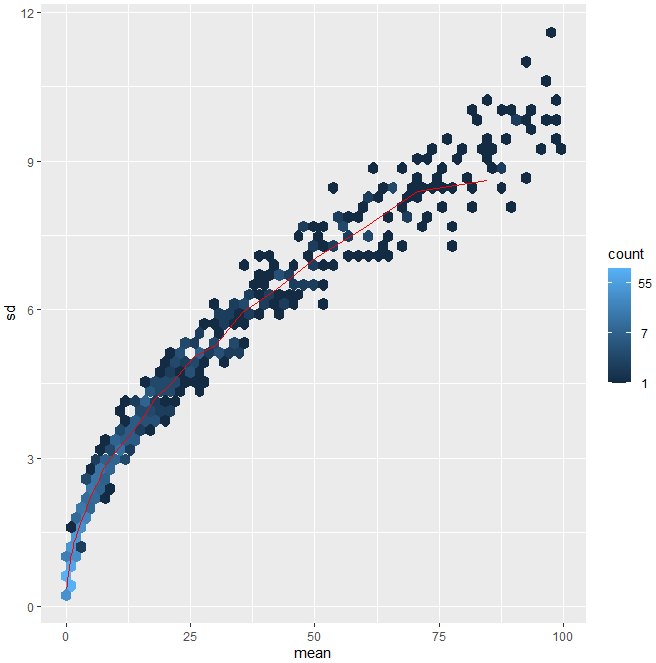
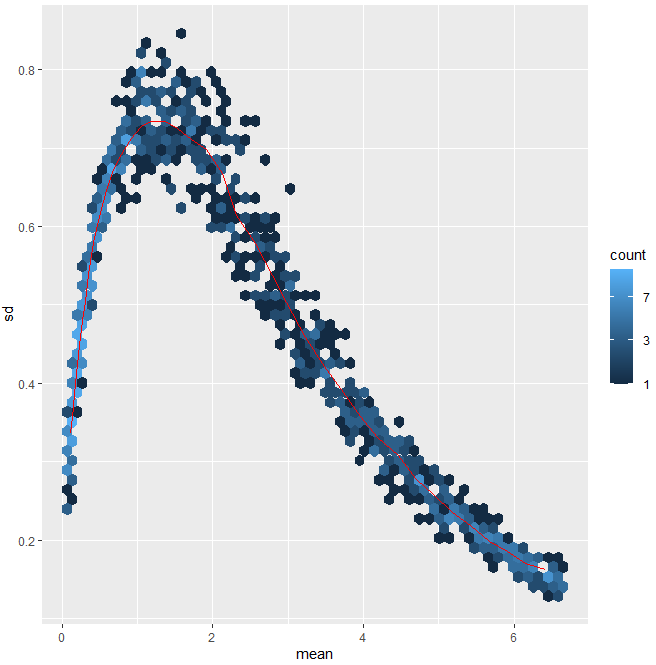
DESeq2为count数据提供了两类变换方法，使得不同均值的方差趋于稳定：regularized-logarithm transformation or rlog和variance stabilizing transformation（VST）。数据集少于30选用rlog，大数据集选用VST。<br/>
RNA定量的方式包括：gene count（原始值）、CPM（counts per million）、log-CPM、FPKM（fragments per kilobase of transcript per million），RPKM（reads per kilobase of transcript per million）<br/>
第一类：CPM（n/N*1000000）、RPKM（CPM/l * 1000）、FPKM（CPM/l * 1000）、TPM。使用此类计算方式时，如果不同样品之间存在某些基因的表达值极高或者极低，由于它们对细胞中分子总数的影响较大（也就是公式中的分母较大), 有可能导致标准化之后这些基因不存在表达差异，而原本没有差异的基因在标准化之后却显示出差异。<br/>
第二类：通过多个样本的比较来进行标准化。DESeq2采用的量化因子（RLE），计算所有样本的几何平均值，然后再计算该值与每个比值的中位数。UQ：上四分位数 (upper quartile, UQ)是样品中所有基因的表达除以处于上四分位数的基因的表达值。同时为了保证表达水平的相对稳定，计算得到的上四分位数值要除以所有样品中上四分位数值的中位数。TMM。[三种方法](https://www.jianshu.com/p/a3b78bd49bcc)，[三种方法的介绍](https://www.plob.org/article/14417.html)

# 基因组
[基因组中有什么](https://gatk.broadinstitute.org/hc/en-us/articles/360041155232-Reference-Genome-Components)<br/>
[基因组组装](https://www.jianshu.com/p/f1ba7c96160f)<br/>

# 测序
### 二代测序
illumina测序的核心在于利用可逆终止的、荧光标记的dNTP进行边合成边测序（Sequencing-By-Synthesis,SBS）。Flowcell（流动池）是有着2个或8个lane（泳道）的玻璃板，每个lane可以测一个样本或者多样本的混合物，且随机布满了能够与文库两端接头分别互补配对或一致的寡核苷酸（oligos，P7和P5接头）。一个lane包含两列，每一列有60个tile，每个tile会种下不同的cluster，每个tile在一次循环中会拍照4次（每个碱基一次）。<br/>
1. 利用转座子（transposome）对双链DNA进行剪切以及接头（adapter）的连接<br/>
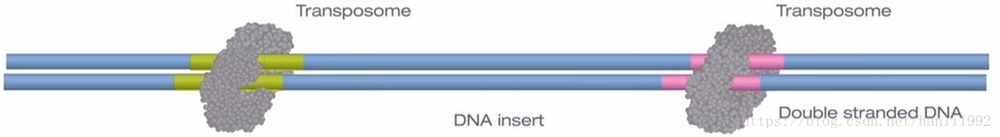
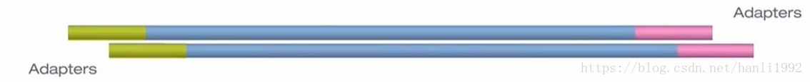
2. 接头连接成功后，利用低循环扩增技术在接头处进行修饰，分别在两端添加sequencing primer binding site1 / sequencing primer binding site2（即测序引物结合位点）、index1/index2以及我们称之P5和P7的寡核苷酸序列<br/>
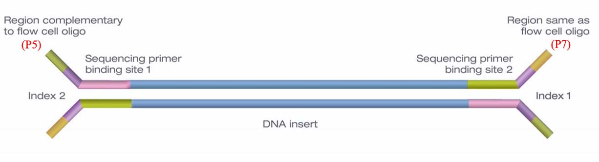
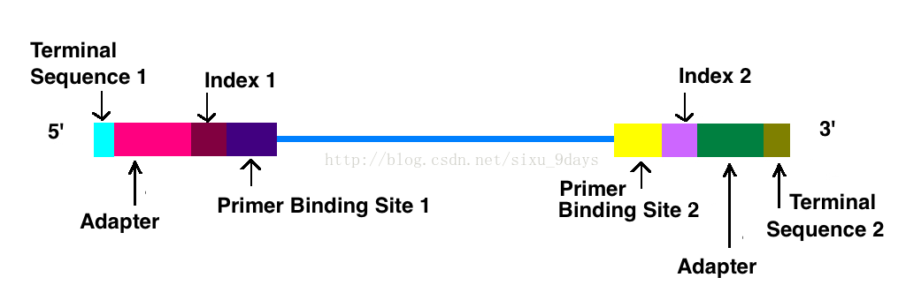
P5和P7是不同的，它们分别和flowcell上的接头互补和相同。为了方便阐述，将与P5互补的接头称为P5’，与P7互补的接头称为P7’。index1和index2也是不同的，与P5相连的是index2，与P7相连的是index1。关于index，也叫barcodes，因为一个lane可以同时测多个样品，为了避免混淆样品的read products，每种样品的DNA由一种index修饰，这样测序得到的reads都是具有index标记的，在测序结果中，依据之前标签与样品的对应关系，就可以获得对应样品的数据。而这里的index1和index2是为了区分paired-end测序得到的双端reads。
3. Flowcell上随机分布了两种不同的寡核苷酸序列，分别与P5互补（即P5’），与P7一致（即P7）。<br/>
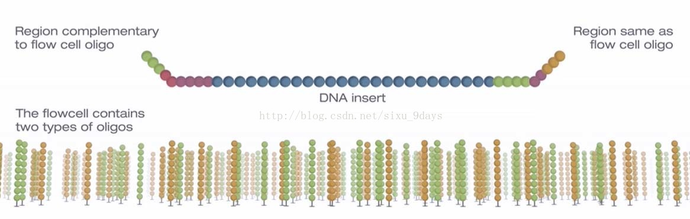
4. 待测sequence通过P5与folwcell上的P5’序列杂交互补，以待测sequence为模板进行互补链（即reverse strand）的延伸，互补链的两端为P5’和P7’。<br/>
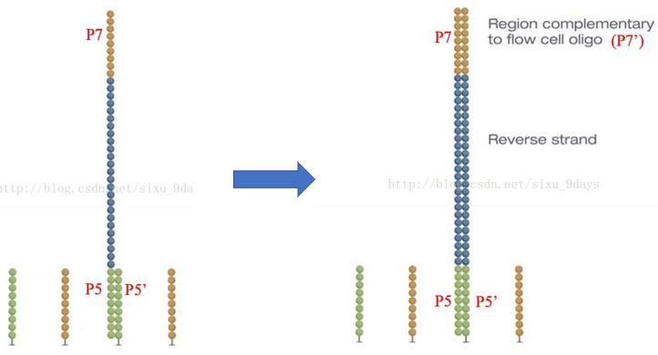
5.  接下来模板链被切断并洗下<br/>
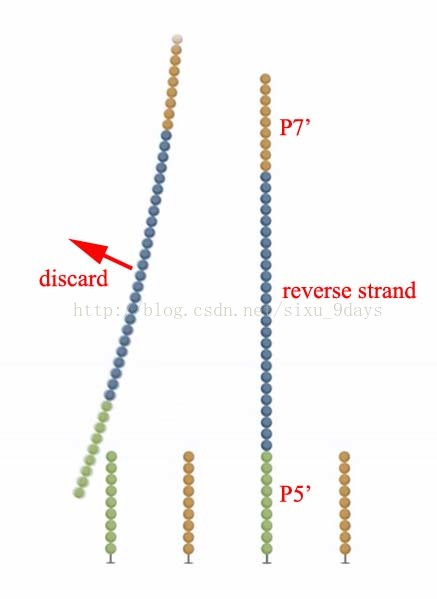
6. Reverse strand的P7’与Flowcell上的P7杂交互补，进行链的合成，这就是我们所熟知的桥式PCR。接下来合成的双链被解链，再分别与Flowcell上的接头杂交互补，延伸，解链，杂交，延伸，解链...如此重复35个循环<br/>
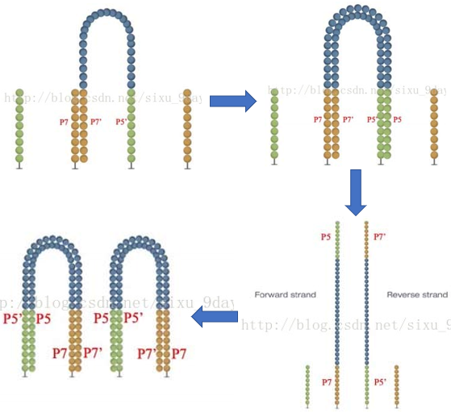
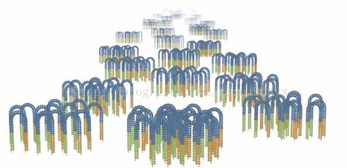
7. 桥式PCR完成后，使用NAOH将双链解链，并利用甲酰胺基嘧啶糖苷酶（Fpg）对8-氧鸟嘌呤糖苷（8-oxo-G）的选择性切断作用，选择性地将P5’与链的连接切断，留下与Flowcell上P7连接的链，也就是Forward strand。同时游离的3’端被阻断，防止不必要的DNA延伸<br/>
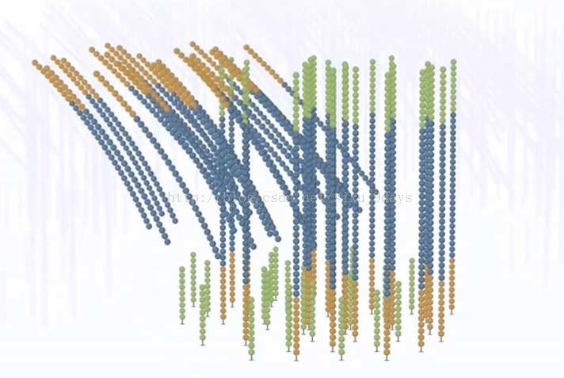
8. 测序引物（sequencing primer）结合到靠近P5的测序引物结合位点1（sequencing primer binding site 1）上，在系统中加入四种dNTP和DNA聚合酶。这里的dNTP有两个特点：它是有荧光基团标记的，每种碱基标记的荧光基团不一样；它的3’末端连了一个叠氮基，这个叠氮基能够阻断后面的碱基与它相连<br/>
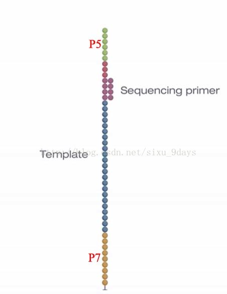
因此在聚合酶的作用下，与Forward strand相应位置碱基配对的dNTP就会结合到新合成的链上，而由于叠氮基的存在，后面的dNTP无法继续连接。这时用水将剩余的dNTP和酶给冲掉，将Flowcell进行扫描，扫描出来的荧光对应的碱基的配对碱基即是该链该位置的碱基。同时在这个Flowcell上有成千上万个cluster也在进行同样的反应，因此一个循环就能同时检测多个样本（这也是高通量的核心所在）。这个循环完成后，加入化学试剂把叠氮基和标记的荧光基团切掉，进行下一个循环（碱基的连接、检测与切除）。如此重复直至所有链的碱基序列被检测出，也就是Forward read 序列。<br/>
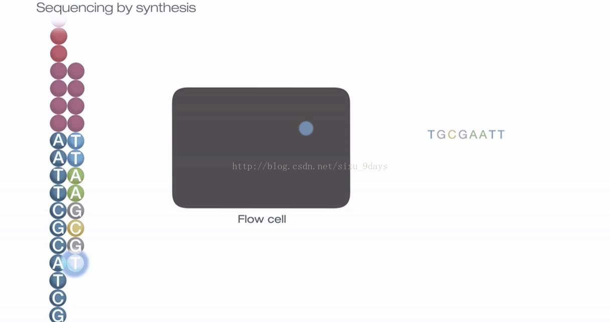
9. Index测序：所有循环结束后，read products 被洗掉，index1 primer与链上index primer1 结合位点杂交配对，进行index1的合成及检测<br/>
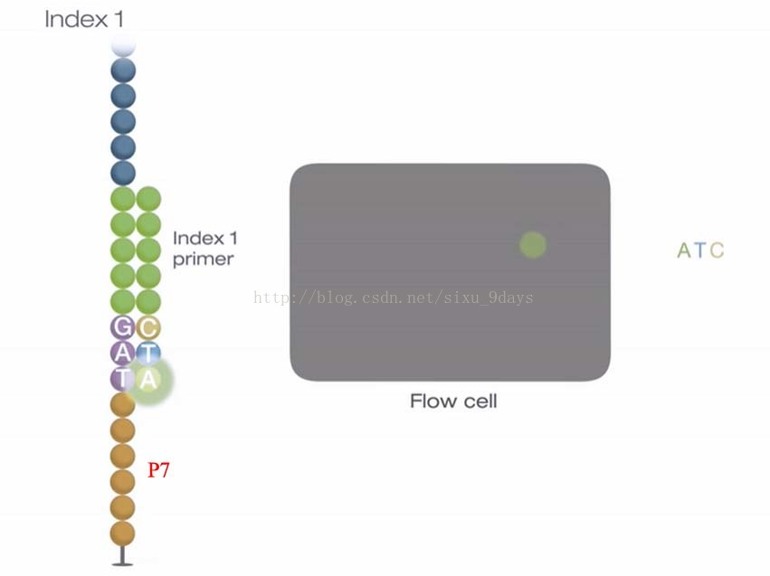
10. Index1测序完成后，洗脱测序产物。此时机器已通过荧光得到了index1的序列<br/>
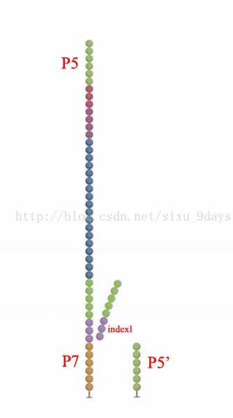
11. Index2测序：Forward strand顶端的P5序列与Flowcell上的P5’杂交配对，进行index2测序。测序完成后洗脱产物<br/>
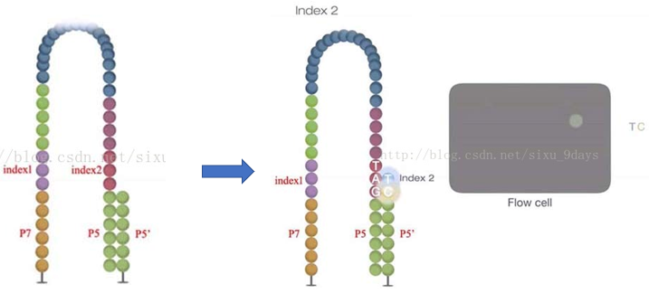
12. 洗脱index2测序产物后，以Flowcell上的P5’为引物，Forward strand为模板进行桥式扩增，得到双链<br/>
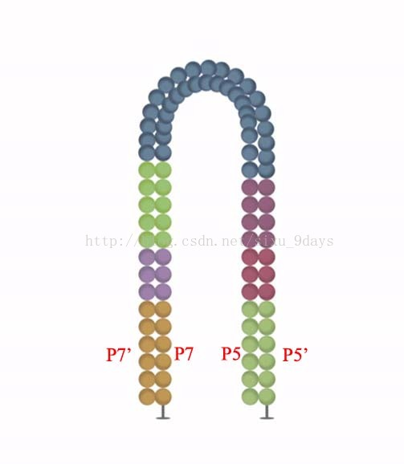
13. NAOH使双链变性为单链，并洗去已经测序完成的Forward strand<br/>
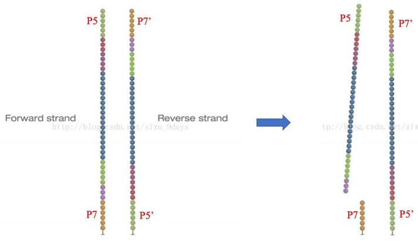
14. 类似的，readprimer2结合到靠近P7’的read primer binding site 2开始对Reverse strand的测序。测序完成后即可得到Reverse read序列。<br/>
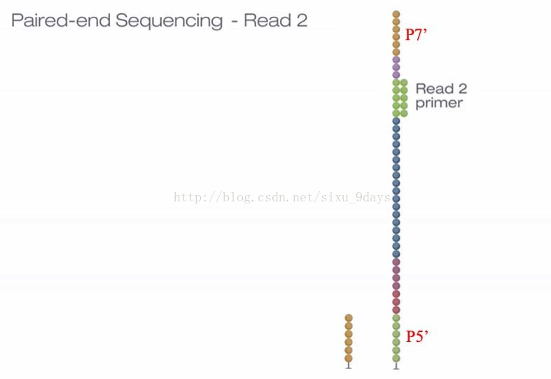
总结<br/>
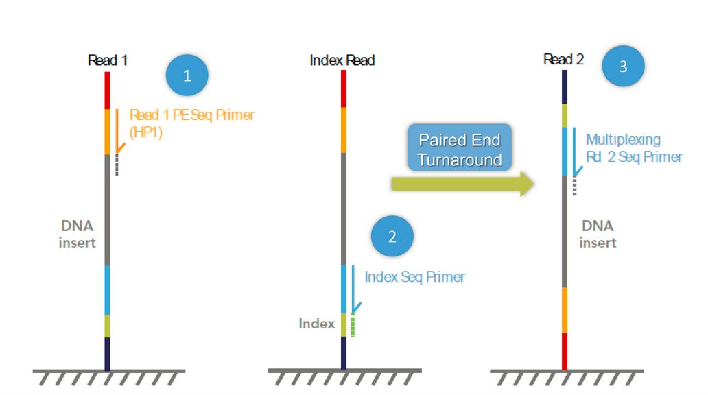
文库片段示意图<br/>
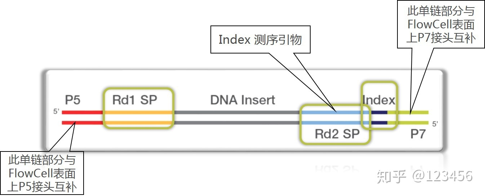
<br/>

##### 双端测序比单端测序的优点
测序最简单的办法是单端测序，单端测序顾名思义，只有一种测序引物 ，使得PCR只能沿着这个引物的方向进行，所有的 reads 都只能按照一个方向进行读取。但是这带来了一些问题，以 illumina 为例，测序的质量会随着测序的进行而下降，所以 reads 约往后面越不准确；研究者们想出来的解决办法就是双端测序，对一个长为 500 bp 的序列，单端测序下游质量会很差，但是从两个方向上分别测 250 bp-300 bp 然后再拼接起来，就可以大大提高测序的准确率了。

### insert size (插入片段大小)
不管构建多大的文库，测序得到的都是两端很短的序列（比如双端150就是得到两个150bp的reads）；其次中间测不通并不会有问题，而且是非常正常的现象！因为文库构建是随机打断过程，所以即使第一条片段中间没有被测到也没关系，后面的其他片段一定能测到这中间的部分（因为一次测序过程会产生成百上千万条reads，而基因组就那么大）。另外，既然只能测两端很短的一部分，那么小片段和大片段文库的区别在哪？反正都测不完。其实，大片段文库的目的，除了得到序列以外，更重要的是，为了获取片段的坐标距离（即两条reads之间的物理距离关系，将会为序列拼接和基因组结构变异检测提供帮助） 。当然，目前大片段文库还有一些问题，比如现在PCR手段不能扩增太长的片段，另外我们只能测两侧的很短的片段，那么中间合成出来却不能测，造成了浪费！但是这些问题illumina给出了大片段文库的解决办法：在随机打断序列后，大片段比小片段文库多了一个环化处理，经过末端修复，再将一个线性长片段头部进行生物素标记，再进行环化（即：把片段首尾连接成一个环）【我们现在知道了：小片段文库是pair end； 大片段文库是mate pair】
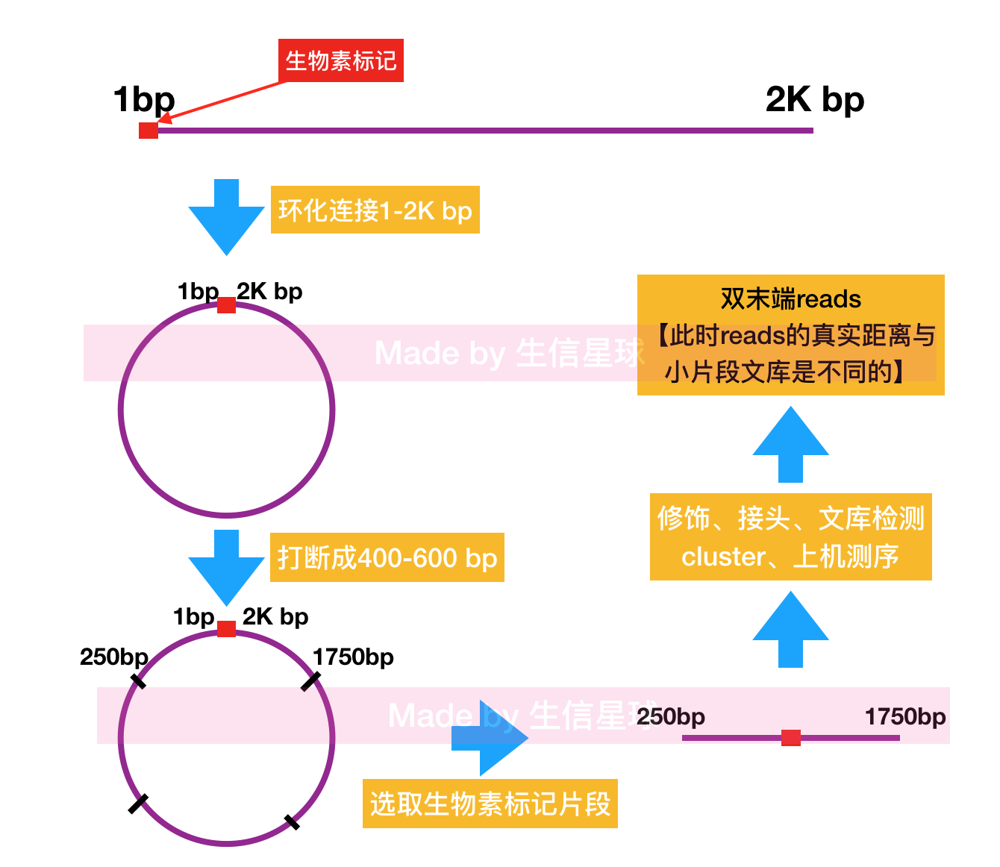
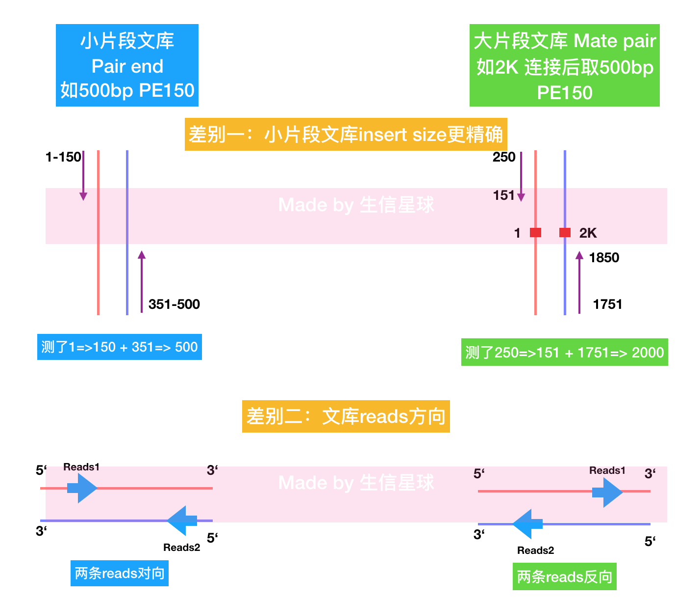
```
fragment                  ========================================
fragment + adaptors    ~~~========================================~~~
SE read                   --------->
PE reads                R1--------->                    <---------R2
unknown gap                         ....................
```
insertion并不是指R1和R2之间的unknown gap，早在NGS之前，当我们在使用ecoli构建载体的时候，这个概念就已经形成，它是adaptors之间的序列。而unknown gap则称之为inner mate：
```
PE reads      R1--------->                    <---------R2
fragment     ~~~========================================~~~
insert          ========================================
inner mate                ....................
```

### 特异性链
FR: 我们正常碰到的所有文库<br/>
RF: 大型插入序列文库<br>
这里的FR和FR是不管R1和R2的结果，比对到正链的pos会小于比对到负链的pos，这种情况就是FR（在我们正常数据中也是比例最大的，用picard CollectInsertSizeMetrics可以看到），比对到正链的pos大于比对到负链的pos，就是RF（大型经过环化的文库，正常不考虑这种情况）<br/>。至于FF和RR表示R1和R2同时比对到正链或者负链（更少见了，意味着存在SV）。

| Tool | RF/fr-firststrand stranded (dUTP) | FR/fr-secondstrand stranded (Ligation) | Unstranded |
| --- | --- | --- | --- |
| IGV (5p to 3p read orientation code) + | F2R1 | F1R2 | F2R1 or F1R2 |
| TopHat (–library-type parameter) | fr-firststrand | fr-secondstrand | fr-unstranded |
| HISAT2 (–rna-strandness parameter) | R/RF | F/FR | NONE |
| HTSeq (–stranded/-s parameter) | reverse | yes | no |
| STAR | n/a (STAR doesn’t use library strandedness info for mapping) | NONE | NONE |
| Picard CollectRnaSeqMetrics (STRAND_SPECIFICITY parameter) | SECOND_READ_TRANSCRIPTION_STRAND | FIRST_READ_TRANSCRIPTION_STRAND | NONE |
| Kallisto quant (parameter) | –rf-stranded | –fr-stranded | NONE |
| StringTie (parameter) | –rf | –fr | NONE |
| FeatureCounts (-s parameter) | 2 | 1 | 0 |
| RSEM (–forward-prob parameter) | 0 | 1 | 0.5 |
| Salmon (–libType parameter) | ISR (assuming paired-end with inward read orientation) | ISF (assuming paired-end with inward read orientation) | IU (assuming paired-end with inward read orientation) |
| Trinity (–SS_lib_type parameter) | RF | FR | NONE |
| MGI CWL YAML (strand parameter) | first | second | NONE |
| RegTools (strand parameter) | -s 1 | -s 2 | -s 0 |
| library methods | Example methods/kits: dUTP, NSR, NNSR, Illumina TruSeq Strand Specific Total RNA, NEBNext Ultra II Directional | Example methods/kits: Ligation, Standard SOLiD, NuGEN Encore, 10X 5’ scRNA data | Example kits/data: Standard Illumina, NuGEN OvationV2, SMARTer universal low input RNA kit (TaKara), GDC normalized TCGA data |

补充。对于hisat2参数，--fr/--rf/--ff 这个不是链特异性的参数，已经跟测序原理相关了，illunima 永远是 --fr， 链特异性参数是 --rna-strandness

### 碱基
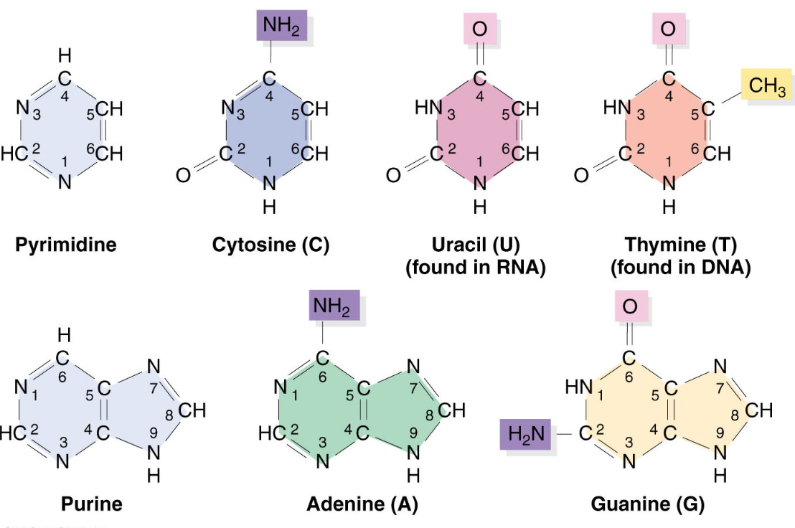
其中A、G结构类似，属于嘌呤类；C、T（U）结构类似，属于嘧啶类

### [Duplicate (重复)](https://mp.weixin.qq.com/s?__biz=MzIxOTQzNTg5NQ==&mid=2247485740&idx=2&sn=0d15036377f25d2949cfc3ead09654d2&chksm=97da0f34a0ad862281a5529909fcbbd632ceb44949f1abe8dabf862eb1752049c1bc9cec2899&mpshare=1&scene=23&srcid=0824RNRZGFgYlVdWPLKuXDAG%23rd)
所谓Dup，即重复序列Duplicate reads，指通过测序得到的两对或两对以上的Pair-End Reads同时比对到参考基因组上相同的起始和结束位置的序列（如图1所示）。这些重复序列在总测序序列中占比简称为Dup rate。由于这些重复序列并不能带来额外信息，相反会影响变异检测结果准确性，因此下游生信分析中这些重复序列是需要去除的去掉，这也就意味着Dup rate越高，数据利用率越低，测序成本浪费的也就越多。此外，对于不适于去除Dup的基因表达定量测序中，高Dup rate也很大程度上影响了中低表达量转录本定量的准确性。
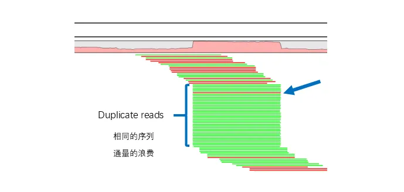

##### 1、样本本身的Dup
以组织样本为研究对象，这里以人基因组(大概6.6pg/copy)为例，如果获得100ng的gDNA就意味着大概有100ng/3.3pg≈30000个copy的人基因组。不同细胞相同编号染色体在基因组片段化过程中是有可能产生一些起始位置和终止位置相同的分子片段的，这些分子产生的几率实际上与样本DNA的总量有关，而不是建库和测序过程中引入的Dup。这就是为什么在做PCR-free文库时大家还是会发现存在1.5-3%比例Dup rate的原因之一。当然，由于这部分比例非常之低，对于结果影响基本上可以忽略不计。
##### 2、文库构建中扩增引入的Dup（即PCR Dup）
同样以人的基因组DNA文库制备为例，我们通常认为理论情况下PCR扩增6个循环已经把样本分子数量放大64倍（26=64），最起码也是20-30倍（如按照1.6-1.7的扩增效率计算）。这些PCR扩增产生了Dup reads理论上应该体现在最终的测序Reads中，约占20/21*100% ~ 30/31*100%,这样算来应该是高达96%以上Dup rate？但一组真实数据为例，如表1所示，相同文库基于不同平台的数据表现，实际的Dup rate并没有这么高，而且其中BGISEQ平台的Dup rate更是稳定的在个位数波动。这是怎么做到的呢？PCR放大成百上千倍，为什么NGS的Dup rate只有十位数甚至是个位数呢？
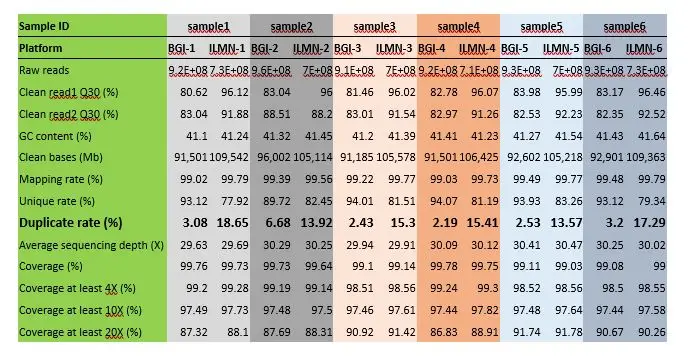
这里我们采用Broad研究所的大神Eric Vallabh（著名的遗传性阮病毒学家）对此问题的专业解释（高能预警！此处有大量公式出没，可直接跳至模型推导结果），基于一个数学模型大体估算PCR Dup rate:
- 假设1.每条待测DNA分子链/球进入纳米孔或与测序芯片Spot结合是完全随机的，不具有任何的Loading Bias。
- 假设2.待测DNA分子链/球Loading到测序芯片纳米孔/点中，只考虑单克隆的情况（即每个孔/点只进入或结合的1条分子链或1个DNB，其他多克隆或无结合的情况无法产生有效荧光信号，所以也不会对后续总reads数中的Dup rate计算造成影响）。
- 假设3.不考虑PCR扩增的Bias(即认为每一条分子在每一轮PCR中都获得了扩增机会)。

我们还是以人基因测序为例并基于以上假设，对于接头连接产物进行6个PCR循环的扩增，要求最终得到约1μg PCR扩增产物，那这也就意味这我们需要1μg/（26）=15.6ng的DNA，假设待测分子片段长度平均为200bp，根据{（15.6×103pg）/（6.6pg/细胞基因组）}×2倍体×（30亿对碱基/基因组）≈14×1012bp的公式计算出PCR前样本本身的Unique Molecules（此处不考虑样本本身Dup）数量如下：
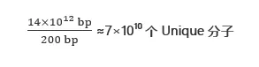
1个标准的人WGS按40X测深120G数据量计算，在100PE读长条件下需要600M reads，即需要6×108个单克隆纳米孔或点产生600M的PE reads。经过6轮PCR扩增后，7×1010个Unique分子，每一个都有64个Copy，即有6×108个孔，而有7×1010个Unique分子簇（每簇又有64个Copy）想公平的、完全随机的进入这些孔。就此，这完全转化成了一个数学问题，一个概率：
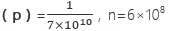
的二项分布模型，一个符合二项分布模型的实验应具有一下基本属性：
- 1.需要进行n次实验（需进行6×108次，每次从7×1010个分子簇中随机选1个）；
- 2.每次实验都是相互独立的；
- 3.事件发生的概率p是固定的（每次实验，每一个分子簇被选中的概率为    图片）；
- 4.每次实验的结果只有两种，只有成功选中（p）或者未选中（q=1-p）。

又因为当p足够小，n足够大时，泊松分布（Poisson distribution）是二项分布模型的近似，因此我们直接使用泊松分布公式对PCR Dup rate进行估算，公式如下：
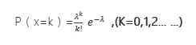
其中λ为期望值：
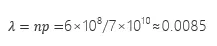
根据以上参数，使用R来做7×1010个Unique分子簇中同一个分子簇被随机抽取获得0次、1次、2次… …n次呈现机会的概率直方图（获得呈现>2次的，即为Dup）。

显而易见的是7×1010个Unique分子簇绝大部分的都没有幸运的获得呈现的机会（即“0”）我们睁大眼睛能看到呈现1次的幸运儿，但为了更好的看看更幸运的“>2”的部分（即PCR Dup），我们将“0”值去掉。
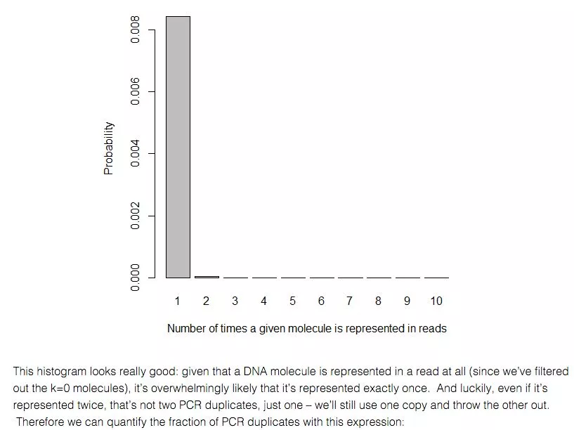
我们利用上述数据调用dpois（x，Lambda）来计算PCR Dup的结果，计算公式如下：

sum(dpois(×,lambda=0.0085)/×1)/(1-dpois(0, lambda=0.0085))

按此公式计算所得，（7×1010个Unique分子簇呈现1次的概率）/（7×1010个Unique分子簇呈现不小于1次的概率）约为99.79%，即PCR Dup rate为0.21%（这与实际实验操作中大概4%的PCR Dup rate存在一定差距，主要原因是由于此算法忽略PCR Bias因素）。当我们将PCR循环数增加到9个时（PCR产物总量仍为1μg，起始样本的Unique Molecules数量降低为9×109个，每个分子拥有29个Copy，λ=np≈0.067）。经运算，PCR Dup rate为1.7%，Eric还计算了PCR循环数为15时，PCR Dup rate的理论值已经达到了15%。

综上，该简化的泊松分布模型有助于我们理解关于PCR Dup rate的问题：虽然PCR将待测分子放大了成百上千倍，但是相对于数量远远多于纳米孔/点数的Unique分子来说，能在茫茫人海中被1个孔随机选中已是万万幸，更何况是再次随机选中同一个Unique分子簇中的Copy形成Dup呢？另外PCR前Unique分子数量也至关重要，当分子的数目（图片）很少，或者抽样次数（n↑）大幅增加时，多次抽到同一个Unique分子簇的概率也就会大大增加了，这就是为什么我们做降解样本或者做小基因组物种，当数据量很高时得到Dup rate相对正常完整的大基因组高的原因。那么，我们如何能够避免这些分子被误判为Dup reads？其实现阶段一个通用的方案就是分子序列标签（Unique Identifier，UID或者Unique Molecular Identifer，UMI），全基因组片段化后产生的DNA片段随机的被UMI标记，在后续生信分析中，利用UMI就可以将样本本身来源的Dup与PCR引入的Dup区分开来。另外，还有一些采用ExAmp（Exclusion Amplification）+NanoWell技术的测序平台上突出的“标签跳跃”（index hoppig）问题也正是采用UDI（Unique Dual index）+UMI技术来“缓解”，否则index hopping很大程度上降低了低频突变检测的精确性。
##### 3、测序前信号放大（荧光信号采集单元生成过程）引入的Dup，测序前信号放大（荧光信号采集单元生成过程）过程中产生的 Dup
如图所示，DNA双链加上接头（A B接头）后经过后续的PCR放大，其正链和负链会分别形成双链PCR产物文库（两种PCR产物文库插入片段相同，但接头连接方式是180°反转）。
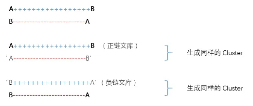
其他平台的文库形态即为上图所示的2种双链PCR产物，该双链产物随后在NaOH碱溶液中变性为2条游离态单链，如果在文库加载过程中，这2条序列互补的单链分别掉到不同的纳米孔中，则会形成2个一模一样的Cluster，从而产生一对Duplication reads。华大智造MGI测序平台得到PCR双链文库后并不直接变性为单链，而是在后续环化实验中只环化双链中的1条，另外一条则被核酸外切酶消化，不用于形成DNA Nanoball。因此，在理论上，MGI平台的DUP rate要远低于其他平台。此外，由于部分其他平台全部采用NanoWell结构＋排他性扩增技术（Exclusion Amplification），双链PCR产物变性解链后直接加入排他性扩增试剂Mix（DNA聚合酶、dNTP、Mg2+、Capture Primer… …）。该Mix中含有可以跟单链分子接头互补的Capture Primer（3’端带有双脱氧BLOCK），已经被BLOCK的单链模板即使已经加载到Flowcell并进入Nanowell中，也不能跟孔里面的草坪接头（P5、P7）互补进行Bridge PCR（互补序列被BLOCK），这种设计使得如果有两条单链模板掉到同一个纳米孔里也不会形成两个Cluster导致Polyclone，这种专利技术只会让每个孔中有且仅有一条的单链分子的BLOCK的3'端恢复为-OH状态并快速在聚合酶的作用下形成互补双链，随后又在解旋酶和单链结合蛋白的作用下解开双链，完全恢复自由状态的2条单链跟草坪接头快速结合进行Bridge PCR形成Cluster占满整个孔。但双链解链后产生了两条单链，如果其中一条漂到了其他的孔里，则又会形成Duplication reads增加Dup rate。
##### 4、芯片测序过程中引入的光学Dup。测序过程中流体可能给不同类型芯片带来的光学 Dup
在信号放大过程中，无论是指数扩增而来的线性分子还是线性滚环扩增而来的DNA Nanoball，待测分子在测序芯片上加载和固定的过程中都是靠流体来保证芯片表面利用率的，高芯片利用率是数据高产出的基础，此乃流体的作用之一。另外，当前市面上应用最为广泛的待测分子结合芯片的方式有两类，一类是通过特殊蛋白质介导分子（如DNB）结合到“平坦的”芯片表面上，另外一类则是把单链分子退火到底部附着有特异序列的纳米孔内。这两类方式的主要区别源自于同属Patterned Array芯片的芯片表面是否采用凹陷的纳米孔，流体保证了文库分子能够最大限度铺遍整个芯片之外，其作用之二就是将测序生化反应所需的酶、dNTP等物料“运输”到每个信号点进行生化反应，这也不可避免的导致了不同芯片类型之间、同芯片上不同信号点之间生化反应速率的差异，流体在“一马平川”的芯片表面更新酶和dNTP等物料的效率理论上大于经过一个个小孔“减速带”并将孔内的物料更新的效率，因此纳米孔中的酶反应有更大几率的出现反应不充分的情况，这也就可能导致反应不充分的信号点因为信号强度显著弱于反应充分的“邻居”，从而被映射成两个孔表达出一样的信号，也就是一种光学上的Dup。

##### 基于上述方法学差异，可知：
- 1、基于矩阵芯片的NGS平台的Dup rate要明显低于非矩阵芯片的；
- 2、规则光信号点大小的NGS平台的Dup rate要低于不规则平台的。

# 一些专门的名词
mirSVR：热力学稳定性大小（要求小于等于-0.1）分值越低，表明miRNA-mRNA二者结合稳定性越强，相应miRNA下调基因的可能性越大<br/>
PhastCons：为基因非翻译区在各物种中进化保守性的强弱（大于等于0），保守性越大约好。<br/>
cheRNAs: chromatin-enriched RNAs（染色质富集RNA）
二代测序错误：二代测序中使用的dNTP不是天然存在的，是经过工程改造的ddNTP。合成酶对ddNTP是有偏好性的，最喜欢的是ddGTP，因此更容易测出的结果是G。因此再统计序列突变的时候，会发现突变都倾向于往G的方向。
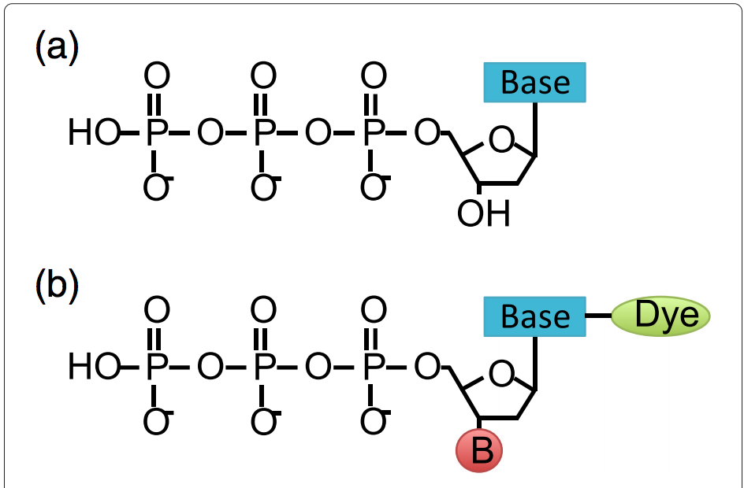