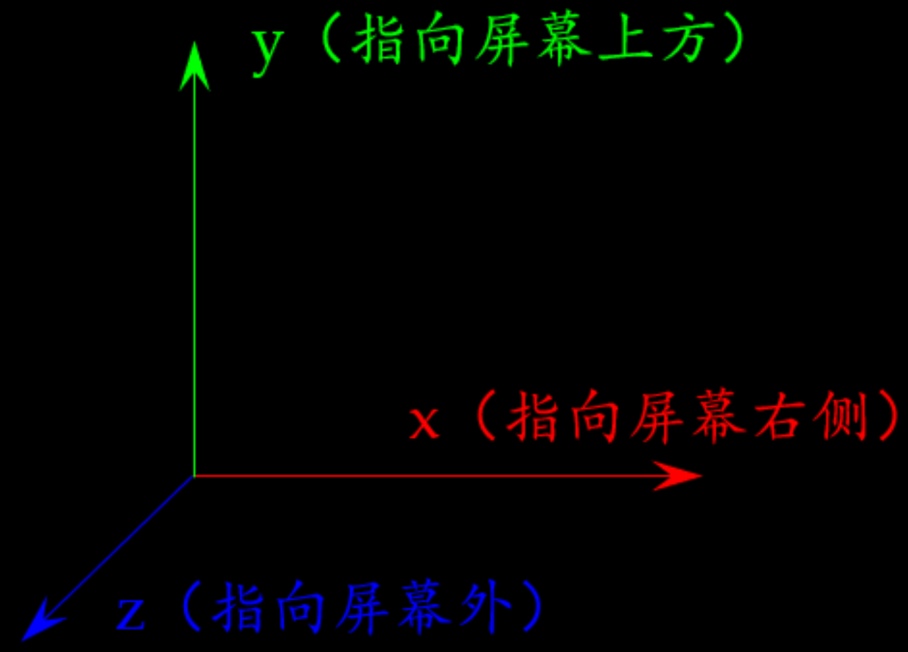
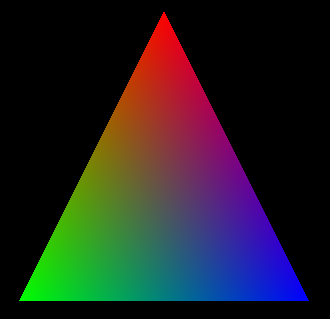
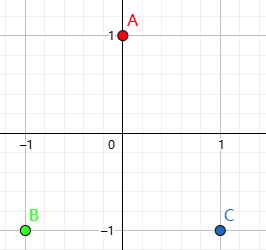
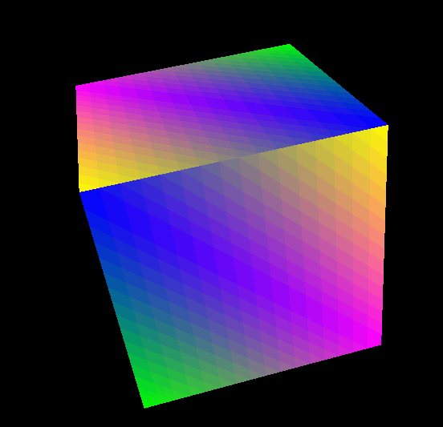

#### 学习网址资料
https://zhuanlan.zhihu.com/p/644395075
https://zhuanlan.zhihu.com/p/590491329

### 什么是 OpenGL，以及它如何工作
OpenGL (Open Graphics Library) 是一种用于渲染 2D 和 3D 图形的跨语言、跨平台的编程接口(API)。OpenGL 提供了一组底层的图形渲染函数，这些函数可以直接与图形硬件交互，实现高效的图形渲染。
OpenGL 是一个基于状态的系统，也就是说，你可以通过设置一系列的选项来改变它的行为。这些选项会影响到 OpenGL 后续的渲染操作。例如，你可以设置颜色、光照模型、混合模式等状态，这些状态会在绘制图形时使用。
OpenGL 的工作流程大致可以分为以下几个步骤：
- 定义图形数据：首先，你需要定义你要渲染的图形数据，这些数据主要包括顶点数据。例如，如果你要渲染一个三角形，你就需要定义三个顶点的坐标。这些数据通常存储在顶点缓冲对象（Vertex Buffer Object，VBO）中。
- 定义着色器程序：着色器是运行在图形处理器（GPU）上的小程序，用于控制图形的渲染过程。最常见的着色器类型有顶点着色器（Vertex Shader）和片元着色器（Fragment Shader）。顶点着色器用于处理顶点数据，片元着色器用于计算像素的颜色。
- 渲染图形：在图形数据和着色器程序都准备好之后，你可以调用 OpenGL 的函数来渲染图形。在渲染过程中，OpenGL 会根据你设置的状态和着色器程序来处理顶点数据，生成图形，并将图形绘制到一个叫做帧缓冲（Frame Buffer）的内存区域。
- 显示图形：最后，你可以将帧缓冲的内容显示到屏幕上。这通常是通过交换前后帧缓冲（在双缓冲模式下）或者直接复制帧缓冲的内容到屏幕上完成的。
- 需要注意的是，OpenGL 只负责渲染图形，它并不包含创建窗口、处理用户输入等功能。这些功能通常需要通过其他的库（如 GLFW、SDL 等）来实现。
### OpenGL 的基本组件，包括顶点、坐标、颜色、纹理等
OpenGL 通过一系列的基本组件和概念来定义和渲染 3D 图形。下面是其中的一些基本组件：

顶点（Vertex）：顶点是构成图形的基本元素。一个顶点主要包含位置信息，但也可能包含颜色、法线、纹理坐标等其他信息。在 OpenGL 中，顶点数据通常存储在顶点缓冲对象（VBO）中，并通过顶点数组对象（VAO）来管理。
坐标（Coordinates）：OpenGL 使用坐标来描述顶点的位置。在 3D 空间中，每个顶点都有一个三维坐标（x, y, z）。在 OpenGL 中，所有的坐标都被归一化到一个叫做裁剪空间（Clip Space）的立方体中，这个立方体的中心位于原点，长度、宽度和高度都是 2。
颜色（Color）：颜色用于描述顶点或者片元的颜色。在 OpenGL 中，颜色通常由红、绿、蓝三个分量来表示，每个分量的值在 0 到 1 之间。有时候还会有一个额外的分量 alpha，用于表示颜色的透明度。
纹理（Texture）：纹理是一个图像，可以被映射到图形的表面上，增加图形的细节。每个顶点都可以有一个或多个纹理坐标，用于指定纹理的哪一部分应该被映射到顶点上。在 OpenGL 中，纹理数据通常存储在纹理对象中。
着色器（Shader）：着色器是运行在 GPU 上的小程序，用于控制图形的渲染过程。顶点着色器（Vertex Shader）用于处理顶点数据，片元着色器（Fragment Shader）用于计算像素的颜色。
帧缓冲（Frame Buffer）：帧缓冲是一个内存区域，用于存储渲染的结果。在渲染过程中，OpenGL 会将图形绘制到帧缓冲中。帧缓冲中的数据最终可以被复制到屏幕上，或者被保存为图像文件。
### OpenGL 的状态机模型
OpenGL 使用一种称为 "状态机" 的模型来管理它的操作。这意味着在任何给定的时间点，OpenGL 都有一组相关的 "状态" ，这些状态会影响 OpenGL 的操作和行为。
状态机模型的工作方式是，你设置一些状态，然后执行一些操作，这些操作会根据当前的状态来执行。例如，你可以设置颜色状态为红色，然后绘制一个形状，这个形状就会被渲染成红色。如果你改变颜色状态为蓝色，然后再绘制一个形状，那么新的形状就会被渲染成蓝色。
OpenGL 的状态包括诸如当前的颜色、光照参数、纹理参数、视口大小、裁剪平面等等。这些状态可以通过特定的 OpenGL 函数进行设置。例如，使用 glColor3f 函数可以设置当前的颜色，使用 glViewport 函数可以设置视口大小。
一旦设置了 OpenGL 的某个状态，该状态就会保持不变，直到你明确地改变它。这就是为什么 OpenGL 被称为状态机：它保存了一系列的状态，这些状态在调用绘图命令时决定了行为。
一个重要的概念是，OpenGL 的状态是全局的。这意味着如果你在一部分代码中改变了状态，那么这个改变会影响到所有后续的 OpenGL 调用，直到你再次改变那个状态。这就是为什么良好的编程实践是在更改了 OpenGL 状态后尽快恢复它，这样你就不会意外地影响到其他部分的代码。
总的来说，理解 OpenGL 是一种状态机，并且知道如何设置和管理这些状态，是有效使用 OpenGL 的关键。
### python连接OpenGL
Python连接OpenGL的方式有多种，包括使用PyOpenGL库、GLFW库以及Pygame库等。其中，PyOpenGL 是最常用的库，它提供了Python对OpenGL的绑定，允许在Python程序中直接调用OpenGL的函数。GLFW 是一个轻量级库，用于创建窗口和上下文，管理输入等，它与PyOpenGL结合使用效果很好。Pygame 是一个跨平台的多媒体库，可以用于简单的OpenGL应用开发。接下来，我们将详细介绍如何在Python中使用这些库连接OpenGL。
### 在OpenGL中，坐标系是理解和操作图形的基础。常见的坐标系包括：
- 世界坐标系：全局坐标系，用于定义物体的位置。
- 模型坐标系：物体自身的坐标系。
- 视图坐标系：摄像机坐标系，用于定义观察者的位置和方向。
- 屏幕坐标系：最终显示在屏幕上的坐标系。
### 变换矩阵, OpenGL通过变换矩阵来实现图形的平移、旋转和缩放。常见的变换矩阵包括：
- 模型变换矩阵：用于将物体从模型坐标系变换到世界坐标系。
- 视图变换矩阵：用于将物体从世界坐标系变换到视图坐标系。
- 投影变换矩阵：用于将物体从视图坐标系变换到屏幕坐标系。

### 安装
```
pip install PyOpenGL PyOpenGL_accelerate pygame numpy pyqt5 pyglet
```
### 坐标轴


#### OpenGL1
```
import pygame  # 导入 Pygame 库，用于创建游戏窗口和处理事件
from pygame.locals import *  # 导入 Pygame 的本地模块，包含常用的变量和函数
from OpenGL.GL import *  # 导入 OpenGL 的核心功能
from OpenGL.GLUT import *  # 导入 OpenGL 的实用工具库
from OpenGL.GLU import *  # 导入 OpenGL 的实用工具库
# 定义三角形的顶点
vertices = [
    [0, 1, 0],  # 顶点0
    [-1, -1, 0],  # 顶点1
    [1, -1, 0]  # 顶点2
]
# 定义三角形的颜色
colors = [
    [1, 0, 0],  # 红色
    [0, 1, 0],  # 绿色
    [0, 0, 1]  # 蓝色
]

def Triangle():
    """
    绘制三角形
    """
    glBegin(GL_TRIANGLES)  # 开始绘制三角形
    for i, vertex in enumerate(vertices):
        print(i, vertex)
        glColor3fv(colors[i])  # 设置颜色
        glVertex3fv(vertex)  # 设置顶点
    glEnd()  # 结束绘制三角形

def main():
    """
    主函数
    """
    pygame.init()  # 初始化 Pygame
    display = (800, 600)
    pygame.display.set_mode(display, DOUBLEBUF|OPENGL)  # 创建窗口

    gluPerspective(45, (display[0]/display[1]), 0.1, 50.0)  # 设置透视参数
    glTranslatef(0.0, 0.0, -5)  # 平移视图

    while True:  # 主循环
        for event in pygame.event.get():  # 处理事件
            if event.type == pygame.QUIT:  # 如果是退出事件，则退出程序
                pygame.quit()
                quit()

        glClear(GL_COLOR_BUFFER_BIT|GL_DEPTH_BUFFER_BIT)  # 清除屏幕和深度缓冲
        Triangle()  # 绘制三角形
        pygame.display.flip()  # 刷新屏幕
        pygame.time.wait(10)  # 稍微等待一下，减少 CPU 占用
main()  # 调用主函数，启动程序
```

在这个例子中，我们首先定义了三角形的顶点和颜色。然后，我们定义了一个函数 Triangle，它使用 OpenGL 的函数 glBegin、glColor3fv 和 glVertex3fv 来绘制三角形。
在 main 函数中，我们初始化 Pygame，并创建一个 800x600 的窗口。然后，我们设置 OpenGL 的视口和透视参数。接着，我们进入一个无限循环，在这个循环中，我们处理事件（例如，检测到窗口关闭事件时退出程序），清除屏幕和深度缓冲，然后调用 Triangle 函数绘制三角形，最后刷新屏幕。
注意：这是一个非常基础的 OpenGL 程序，它并没有使用到像顶点缓冲区（VBO）、顶点数组对象（VAO）、着色器等更高级的 OpenGL 特性。如果你想了解这些特性，我建议你查阅更高级的 OpenGL 教程或者书籍。
pygame.display.set_mode(display, DOUBLEBUF|OPENGL) 在这行代码中，pygame.display.set_mode() 是 Pygame 的函数，用于创建游戏窗口。参数 DOUBLEBUF|OPENGL 表示我们希望窗口支持双缓冲和 OpenGL。双缓冲可以防止画面闪烁，OpenGL 是我们要使用的图形库。





#### OpenGL1
```
import pygame  # 导入 Pygame 库，用于创建游戏窗口和处理事件
from pygame.locals import *  # 导入 Pygame 的本地模块，包含常用的变量和函数
from OpenGL.GL import *  # 导入 OpenGL 的核心功能
from OpenGL.GLUT import *  # 导入 OpenGL 的实用工具库
from OpenGL.GLU import *  # 导入 OpenGL 的实用工具库

# 定义立方体的顶点坐标
vertices = (
    (1, -1, -1), (1, 1, -1),  # 前面的两个顶点
    (-1, 1, -1), (-1, -1, -1),  # 左面的两个顶点
    (1, -1, 1), (1, 1, 1),  # 后面的两个顶点
    (-1, -1, 1), (-1, 1, 1)  # 右面的两个顶点
)
# 定义立方体的面
faces = (
    (0, 1, 2, 3),  # 前面的四个顶点
    (3, 2, 7, 6),  # 左面的四个顶点
    (6, 7, 5, 4),  # 后面的四个顶点
    (4, 5, 1, 0),  # 右面的四个顶点
    (1, 5, 7, 2),  # 上面的四个顶点
    (4, 0, 3, 6)  # 下面的四个顶点
)
# 定义面的颜色
colors = (
    (1, 0, 0),  # 红色
    (0, 1, 0),  # 绿色
    (0, 0, 1),  # 蓝色
    (1, 1, 0),  # 黄色
    (1, 0, 1),  # 紫色
    (0, 1, 1),  # 青色
    (1, 1, 1),  # 白色
    (0, 0, 0)  # 黑色
)
def Cube():
    """
    绘制立方体
    """
    glBegin(GL_QUADS)  # 开始绘制四边形
    for face in faces:
        x = 0
        for vertex in face:
            x += 1
            glColor3fv(colors[x])  # 设置顶点颜色
            glVertex3fv(vertices[vertex])  # 设置顶点坐标
    glEnd()  # 结束绘制四边形

def main():
    """
    主函数
    """
    pygame.init()  # 初始化 Pygame
    display = (800, 600)
    pygame.display.set_mode(display, DOUBLEBUF | OPENGL)  # 创建窗口
    gluPerspective(45, (display[0] / display[1]), 0.1, 50.0)  # 设置透视参数
    glTranslatef(0.0, 0.0, -5)  # 平移视图
    # Enable depth testing
    glEnable(GL_DEPTH_TEST)  # 启用深度测试
    while True:  # 主循环
        for event in pygame.event.get():  # 处理事件
            if event.type == pygame.QUIT:  # 如果是退出事件，则退出程序
                pygame.quit()
                quit()
        glRotatef(1, 3, 1, 1)  # 旋转立方体
        glClear(GL_COLOR_BUFFER_BIT | GL_DEPTH_BUFFER_BIT)  # 清除屏幕和深度缓冲
        Cube()  # 绘制立方体
        pygame.display.flip()  # 刷新屏幕
        pygame.time.wait(10)  # 稍微等待一下，减少 CPU 占用
main()  # 调用主函数，启动程序
```



### OpenGL 库及函数简介
OpenGL函数的命名格式如下：
```
<库前缀><根命令><可选的参数个数><可选的参数类型>
```
常见的库前缀有 gl、glu、glut、aux、wgl、glx、agl 等。库前缀表示该函数属于 OpenGL 哪一个开发库。从函数名后面中还可以看出需要多少个参数以及参数的类型。I 代表 int 型，f 代表 float 型，d 代表 double 型，u 代表无符号整型。例如 glColor3f() 表示了该函数属于gl库，参数是三个浮点数。<br/>
OpenGL 函数库相关的 API 有核心库(gl)、实用库(glu)、实用工具库(glut)、辅助库(aux)、窗口库(glx、agl、wgl)和扩展函数库等。gl是核心，glu是对gl的部分封装。glut是为跨平台的OpenGL程序的工具包，比aux功能强大。glx、agl、wgl 是针对不同窗口系统的函数。扩展函数库是硬件厂商为实现硬件更新利用OpenGL的扩展机制开发的函数。本文仅对常用的四个库做简单介绍。<br/>
###### 一、OpenGL 核心库 GL
核心库包含有115个函数，函数名的前缀为gl。这部分函数用于常规的、核心的图形处理。此函数由gl.dll来负责解释执行。由于许多函数可以接收不同数以下几类。据类型的参数，因此派生出来的函数原形多达300多个。核心库中的函数主要可以分为以下几类函数：
- 绘制基本几何图元的函数：
glBegain()、glEnd()、glNormal*()、glVertex*()
- 矩阵操作、几何变换和投影变换的函数：
如矩阵入栈函数glPushMatrix()，矩阵出栈函数glPopMatrix()，装载矩阵函数glLoadMatrix()，矩阵相乘函数glMultMatrix()，当前矩阵函数glMatrixMode()和矩阵标准化函数glLoadIdentity()，几何变换函数glTranslate*()、glRotate*()和glScale*()，投影变换函数glOrtho()、glFrustum()和视口变换函数glViewport()
- 颜色、光照和材质的函数：
如设置颜色模式函数glColor*()、glIndex*()，设置光照效果的函数glLight*() 、glLightModel*()和设置材质效果函数glMaterial()
- 显示列表函数：
主要有创建、结束、生成、删除和调用显示列表的函数glNewList()、glEndList()、glGenLists()、glCallList()和glDeleteLists()
- 纹理映射函数：
主要有一维纹理函数glTexImage1D()、二维纹理函数glTexImage2D()、设置纹理参数、纹理环境和纹理坐标的函数glTexParameter*()、glTexEnv*()和glTetCoord*()
- 特殊效果函数：
融合函数glBlendFunc()、反走样函数glHint()和雾化效果glFog*()
- 光栅化、象素操作函数：
如象素位置glRasterPos*()、线型宽度glLineWidth()、多边形绘制模式glPolygonMode()，读取象素glReadPixel()、复制象素glCopyPixel()
- 选择与反馈函数：
主要有渲染模式glRenderMode()、选择缓冲区glSelectBuffer()和反馈缓冲区glFeedbackBuffer()
- 曲线与曲面的绘制函数：
生成曲线或曲面的函数glMap*()、glMapGrid*()，求值器的函数glEvalCoord*() glEvalMesh*()
- 状态设置与查询函数：
glGet*()、glEnable()、glGetError()
###### 二、OpenGL 实用库 GLU
包含有43个函数，函数名的前缀为glu。OpenGL提供了强大的但是为数不多的绘图命令，所有较复杂的绘图都必须从点、线、面开始。Glu 为了减轻繁重的编程工作，封装了OpenGL函数，Glu函数通过调用核心库的函数，为开发者提供相对简单的用法，实现一些较为复杂的操作。此函数由glu.dll来负责解释执行。OpenGL中的核心库和实用库可以在所有的OpenGL平台上运行。主要包括了以下几种：
- 辅助纹理贴图函数：
gluScaleImage() 、gluBuild1Dmipmaps()、gluBuild2Dmipmaps()
- 坐标转换和投影变换函数：
定义投影方式函数gluPerspective()、gluOrtho2D() 、gluLookAt()，拾取投影视景体函数gluPickMatrix()，投影矩阵计算gluProject()和gluUnProject()
- 多边形镶嵌工具：
gluNewTess()、gluDeleteTess()、gluTessCallback()、gluBeginPolygon()、gluTessVertex()、gluNextContour()、gluEndPolygon()
- 二次曲面绘制工具：
主要有绘制球面、锥面、柱面、圆环面gluNewQuadric()、gluSphere()、gluCylinder()、gluDisk()、gluPartialDisk()、gluDeleteQuadric()
- 非均匀有理B样条绘制工具：
主要用来定义和绘制Nurbs曲线和曲面，包括gluNewNurbsRenderer()、gluNurbsCurve()、gluBeginSurface()、gluEndSurface()、gluBeginCurve()、gluNurbsProperty()
- 错误反馈工具：
获取出错信息的字符串gluErrorString()
###### 三、OpenGL 工具库 GLUT
包含大约30多个函数，函数名前缀为glut。glut是不依赖于窗口平台的OpenGL工具包，由Mark KLilgrad在SGI编写（现在在Nvidia），目的是隐藏不同窗口平台API的复杂度。函数以glut开头，它们作为aux库功能更强的替代品，提供更为复杂的绘制功能，此函数由glut.dll来负责解释执行。由于glut中的窗口管理函数是不依赖于运行环境的，因此OpenGL中的工具库可以在X-Window、Windows NT、OS/2等系统下运行，特别适合于开发不需要复杂界面的OpenGL示例程序。对于有经验的程序员来说，一般先用glut理顺3D图形代码，然后再集成为完整的应用程序。这部分函数主要包括：
- 窗口操作函数：
窗口初始化、窗口大小、窗口位置函数等 glutInit()、glutInitDisplayMode()、glutInitWindowSize()、glutInitWindowPosition()
- 回调函数：
响应刷新消息、键盘消息、鼠标消息、定时器函数 GlutDisplayFunc()、glutPostRedisplay()、glutReshapeFunc()、glutTimerFunc()、glutKeyboardFunc()、glutMouseFunc()
- 创建复杂的三维物体：
这些和aux库的函数功能相同。
- 菜单函数：
创建添加菜单的函数 GlutCreateMenu()、glutSetMenu()、glutAddMenuEntry()、glutAddSubMenu() 和 glutAttachMenu()
- 程序运行函数：
glutMainLoop()
###### 四、Windows 专用库 WGL
针对Windows平台的扩展，包含有16个函数，函数名前缀为wgl。这部分函数主要用于连接OpenGL和Windows ，以弥补OpenGL在文本方面的不足。Windows专用库只能用于Windows环境中。这类函数主要包括以下几类：
- 绘图上下文相关函数：
wglCreateContext()、wglDeleteContext()、wglGetCurrentContent()、wglGetCurrentDC()、wglDeleteContent()
- 文字和文本处理函数：
wglUseFontBitmaps()、wglUseFontOutlines()
- 覆盖层、地层和主平面层处理函数：
wglCopyContext()、wglCreateLayerPlane()、wglDescribeLayerPlane()、wglReakizeLayerPlatte()
- 其他函数：
wglShareLists()、wglGetProcAddress()

通常，我们使用工具库（GLUT）创建 OpenGL 应用程序。为啥不用 GL 或者 GLU 库呢？画画之前总得先有一块画布吧，不能直接拿起画笔就开画。前文说过，工具库主要提供窗口相关的函数，有了窗口，就相当于有了画布，而核心库和实用库，就好比各式各样的画笔、颜料。使用工具库（GLUT）创建 OpenGL 应用程序只需要四步（当然，前提是你需要先准备好绘图函数，并给它取一个合适的名字）：
- 初始化glut库
- 创建glut窗口
- 注册绘图的回调函数
- 进入glut主循环
