# some little tools for bioinformatics

python在服务器上画图，开头添加
```python
import matplotlib
matplotlib.use('agg')
```

python默认的绘图字体无法编辑，会被转化为选区，需要指定为一些其它的字体
```python
import matplotlib as mpl 
mpl.rcParams['pdf.fonttype'] = 42 
mpl.rcParams['ps.fonttype'] = 42
```

任务提交系统
```
# LSF
ls | while read i; do bsub -q qv2 -J sh.run -n 10 -o sh.run.out -e sh.run.err -R span[hosts=1] " tar cf $i.tar $i && pigz -p 10 $i.tar "; done
# qsub
ls | while read i; do echo " tar cf $i.tar $i && pigz -p 10 $i.tar " | qsub -d . -l nodes=1:ppn=10 -N sh.run; done
# Slurm

```

pdf转png
```
pdftoppm -png -r 600 umap.pdf umap.pdf2png
```

在线工具<br/>
GO KEGG 富集分析：[Enrichr](https://maayanlab.cloud/Enrichr/)，[Metascape](https://metascape.org/gp/index.html#/main/step1)，[juicerbox](https://aidenlab.org/juicebox/)，[掌机游戏下载1](https://www.gbarom.cn/)，[掌机游戏下载2](https://www.oldmantvg.net/)，[GO层级注释文件](http://current.geneontology.org/products/pages/downloads.html)

模式/模型图绘制<br/>
[Figdraw](https://www.figdraw.com/static/index.html#/)，[biorender](https://app.biorender.com/illustrations/66288c5f0ac7dbfcaa1b83c9)

## 程序开发工具集
codelibrary.java。    java语言的常用工具集<br/>
codelibrary.py。      python语言的常用工具集<br/>
codelibrary.r。       R语言的常用工具集<br/>

### cal-RNA-file.py
Statistical RNA-Seq data alignment results(hisat2/star/magic-blast/tophat2)<br/>
python ~/cal-RNA-file.py input.sam/bam

### flt_bam.py
split hisat2 alignment file to un/uniq/multi-map file
python flt_bam.py input.bam/sam output_prefix

### overlap.pl
Calculate the distance between two intervals(chr1   start1  end1    chr2    start2  end2)<br/>
perl overlap.pl bedpe.bed

### compare_exon_intron_coverage.py
if we don't know what type of file(DNA or RNA),wo can detect it through comparing exon and intron coverage,if it RNA file,the exon have higher coverage <br/>
python compare_exon_intron_coverage.py

### reptile.136book.py
using urllib and bs4 to get the story from 136book.com<br/>
python reptile.136book.py

### word_cloud_test.py
using jieba and pyecharts to generate the word cloud<br/>
python word_cloud_test.py

### count2FPKM.py
using htseq-count output and gene exon length to calculator the [FPKM and FPKM-UQ](https://docs.gdc.cancer.gov/Data/Bioinformatics_Pipelines/Expression_mRNA_Pipeline/)<br/>
python count2FPKM htseq.count exon_gene_length.txt out.txt<br/>
different with TCGA:<br/>
- the total reads just use protein_coding gene to calculate the total reads and Q75 reads<br/>
count2FPKMforMatrix.py<br/>
针对多样本矩阵形式的count转化成FPKM<br/>
python count2FPKMforMatrix.py combine.gene.flt.count exon_gene_cg_length combine.gene.flt.count.fpkm

### annopeak.py
using bedtools to annotation peak<br/>
python annopeak.py peak/allrich-06.DNA.promoter.overlap.bed peak/allrich-06.DNA.genebody.overlap.bed peak/allrich-06.DNA.exon.overlap.bed peak/allrich-06.DNA.terminal.overlap.bed > peak/allrich-06.DNA.anno.result.txt<br>
future word<br/>
- using pybedtools to do this work.

### parsegtf.py
if use stringtie or cufflinks to assemble,the output gtf file don't contain the gene line.this script is used to add it.<br/>
python parsegtf.py MH63.seedling.nove.annotated.gtf > MH63.seedling.nove.cg.gtf

### combine_fastq.py
对于RNA-Seq,如果是两个重复数据(生物学重复,两个 library)。在第一个文件里的某个 reads 它会比对到基因组的某个位置,然后再将两个文件直接合并,这个同样的 reads 有一定的概率比对到其它的位置,可能这些 RNA-Seq 比对工具(tophat/hisat/star,已验证,有数据集在百度云)会根据 insert size 评估比对的结果导致的。所以合并两个RNA-Seq的时候建议 A-B-A-B-A-B 的形式合并而不是A-A-...-A-A-B-B-...-B的合并。<br/>
python combine.py test1.fq test2.fq test.fq<br/>
待做的<br/>
- 没有考虑数据大小的差异，如果A文件时B文件的n倍大,那么应该时 nA-B-nA-B 的形式。

### bam2fastq.py
对按照name排序的bam文件转化成fastq文件 <br/>
$ `samtools sort -n -o file.sorted.bam file.bam` <br/>
$ `python bam2fq.py ORP-113.multimap.bam ORP-113.multimap`<br/>
将bam/sam文件转化成fastq文件，支持单端比对/双端比对。如果输入的是双端数据,双端数据中成对的结果保存在ORP-113.multimap.N.fq中,如果是单端数据则在ORP-113.multimap.fq中,混合数据也同理

### divide_bam.py
python divide_bam.py -i test.bam -t bwamem -f bam<br/>
将bam/sam文件分成uniq,multi,unmap,lowuniq四类，并且统计<br/>

### UniqFileBam.py
python UniqFileBam.py -t bowtie2 -i mappings.bowtie2.sam -o test2.sam -q 20 -f True<br/>
提取bam/sam文件中的unique比对的结果，支持 bwa-aln bwa-mem bowtie2 hisat/hisat2 STAR (后续用过别的软件持续更新)<br/>

### UniqFileBamAsPair.py
python UniqFileBamAsPair.py -t bowtie2 -i mappings.bowtie2.sam -o test2.sam -q 20 -f True<br/>
提取bam/sam文件中的unique比对的结果（双端都成对的unique map），支持 bwa-aln bwa-mem bowtie2 hisat/hisat2 STAR (后续用过别的软件持续更新)<br/>

### htseq.py
python htseq.py<br/>
修改自htseq-count,可以同时计算sense(yes),no-sense(no),anti-sense(reverse)的结果,目前只适合单端数据,日后也没有添加双端的计划,STAR的count的结果默认就有三种<br/>

### split_bam_SE.py
python split_bam_SE.py input.bam input <br/>
根据指定的文件行数分割文件，暂时没有提供接口，目前都是切分1000000左右<br/>

### split_bam_PE.py
python split_bam_SE.py input.bam input <br/>
类上的split_bam_SE.py，根据指定的文件行数分割文件，暂时没有提供接口，目前都是切分1000000左右<br/>

### add_count.py
python add_count.py input 1 39 > total.count <br/>
通过上面的 split_bam 将文件分割，然后用 htseq-count 统计基因的表达数量，通过该软件合并起来<br/>

### CalculateCoveragePerBinsize.py
python CalculateCoveragePerBinsize.py hg38.100K.bin 100000 RUNX1.bedpe RUNX1.bedpe.bedgraph <br/>
对bed文件计算给定binsize的bedgraph结果<br/>

### SplitNLineBam.py
python SplitNLineBam.py input.bam 100000 outprefix <br/>
将给定的sam/bam文件拆分成多个bam文件，如果中间涉及了多位点比对，则文件必须按照name排序，然后有些文件会稍微多余给定的值<br/>

### downSample.py
python downSample.py -i ../7_reads_annotation/A549.CTCF.DNARNA.bedpe -n 15013571 -o A549.CTCF.DNARNA.bedpe -s 123456789 <br/>
对按行的文件取子样本<br/>

### fingBigData.sh
bash fingBigData.sh > user.text.size.txt <br/>
寻找大文件，代码中是寻找大于4G以上的文件，可以自定义 <br/>

### kmer.py
python kmer.py 100 10 full.fa genome.fastq.gz <br/>
将基因组文件以10bp为步长，提取100bp长度的序列片段，生成fastq文件<br/>


### pair2single.py
python pair2single.py input.bam R1.bam R2.bam <br/>
将双端比对的结果拆分成单端比对的结果<br/>

### getRegionCoverage.py
python getRegionCoverage.py peak.file alignfile.bw peak.coverage <br/>
计算指定区域的平均测序深度<br/>

### remove_duplicated_reads.py/remove_duplicated_reads_SE.py
python remove_duplicated_reads.py infile1.fastq.gz infile2.fastq.gz uniq1.fastq.gz uniq2.fastq.gz <br/>
python remove_duplicated_reads_SE.py infile.fastq.gz uniq.fastq.gz <br/>
对测序数据去除PCR/光学重复<br/>

### bedpe2matrix_normal.all.py
python bedpe2matrix_normal.all.py input.1M.bed input.1M.mat output.1M.pdf <br/>
python cal.py -p input.uniq.bedpe -g genome.size -b 1000000 -o output.1M <br/>
计算HiC或者类似数据的交互矩阵，并画图 <br/>
```
input.1M.bed
chr1	0	1000000	1
chr1	1000000	2000000	2
chr1	2000000	3000000	3
chr1	3000000	4000000	4
chr1	4000000	5000000	5
chr1	5000000	6000000	6

input.1M.mat
1	1	241
1	2	10
1	3	24
1	4	4
1	5	21
1	6	8
1	7	4
1	8	10
```

### mergeGeneCountFile.py
python mergeGeneCountFile.py combine.count sample1.gene.count sample2.gene.count sample2.gene.count <br/>
合并多个样本的gene表达情况 <br/>
```
MH01g0010000	119
MH01g0010100	882
MH01g0010200	26
MH01g0010300	32
MH01g0010400	184
MH01g0010500	302
MH01g0010600	422
MH01g0010700	416
MH01g0010900	19
MH01g0011000	3387
```

## CombinationPermutations.java
计算排列组合 <br/>

## RandomSampling.java
随机抽样，用区间树来代替超大型列表，节省内存 <br/>

## RandomSampling.py
numpy自带的 <br/>

## 打包程序
#### singularity打包
[参考华中农业大学集群管理资料](http://hpc.ncpgr.cn/)
```
vim juicer_tools

#!/bin/bash -l
java -Djava.awt.headless=true -Djava.library.path=`dirname $0`/lib64 -Ddevelopment=false -jar `dirname $0`/juicer_tools.1.8.9_jcuda.0.8.jar $*
```

建立一个新沙盒
```
1. 来源于容器库（Container Library）以 library:// 开头的 URL 链接
singularity build --sandbox lolcow/ library://sylabs-jms/testing/lolcow
2. 来源于 Docker Hub 以 docker:// 开头的 URL 链接
singularity build lolcow docker://godlovedc/lolcow
3. 来源于 Singularity Hub 以 shub:// 开头的 URL 链接
singularity build mycontainer.sif shub://singularityhub/ubuntu
4. 本地现存的容器路径
docker save eeb6ee3f44bd -o centos7.tar
singularity build --sandbox centos7 docker-archive://centos7.tar
singularity build --sandbox centos7 docker-archive:///root/centos7.tar
5. 沙盒（sandbox）目录路径
6. Singularity 容器定义文件
7. 从Dockerfiles文件直接创建
singularity build --oci ./debian.oci.sif ./Dockerfile
singularity run --oci ./debian.oci.sif
```

```
yum install -y autoconf automake cryptsetup fuse3-devel git glib2-devel libseccomp-devel libtool runc wget zlib-devel rpm-build squashfs-tools
yum install epel-release; yum install golang

wget https://github.com/apptainer/singularity/releases/download/v3.8.7/singularity-3.8
.7.tar.gz
rpmbuild -tb singularity-3.8.7.tar.gz
rpm -ivh ~/rpmbuild/RPMS/x86_64/singularity-3.8.7-1.el7.x86_64.rpm

mkdir tmp
singularity build --sandbox ./tmp/centos docker://centos:centos7
singularity shell --writable ./tmp/centos/
Singularity> yum group install "Development Tools" # 可以不安装的
Singularity> yum install java # 如果有封装jar包的话
Singularity> cp -r /current_path/software/ /opt/software/
Singularity> chmod 755 /opt/software/juicer_tools
Singularity> vi /environment # 编辑环境变量，和~/.bashrc一样，让环境中的程序可以被访问
Singularity> exit

singularity build first.sif ./tmp/centos/

singularity run first.sif bedtools
```
在调用singularity sif的时候，当文件的目录不在家目录之下时，会出现报错，需要将那个目录添加到环境变量中或者将该文件拷贝过来
```
SINGULARITY_BIND="/opt,/data:/mnt" # 逗号分隔
```

#### docker打包
[docker-desktop](https://desktop.docker.com/win/main/amd64/Docker%20Desktop%20Installer.exe?_gl=1*9gcrlr*_ga*MjA1MDkxNzk2MS4xNzE2MDkwMTc2*_ga_XJWPQMJYHQ*MTcxNjQyNjkxNi4yLjEuMTcxNjQyODA3NS4zNS4wLjA.)下载。
```
1. 注册docker账户（我关联的GitHub账号）
2. 依次点击Repositories -> Create repository
3. 下载安装docker-desktop （用的windows），安装完之后，在windows的cmd/PowerShell中运行docker run hello-world查看是否成功安装。

4. 新建一个目录，编辑Dockerfile，写入如下内容（保证和上面的singularity内容一致）
FROM centos:centos7

LABEL Author="XingyuHuang"
LABEL Mail="huang182@live.cn"

RUN yum group install -y "Development Tools"
RUN yum install -y java

COPY ./software/ /opt/software/
RUN chmod +x /opt/software/juicer_tools # 不可以写755

ENV PATH=/opt/software/:$PATH

5. 以下命令在windows的cmd/PowerShell中运行
cd pathdir_to_Dockerfile
docker build -t your-dockerhub-username/your-image-name . # docker build -t fengchuiguo1994/scchair .
docker push your-dockerhub-username/your-image-name # docker push fengchuiguo1994/scchair

6. 此时本地和docker hub均有一个镜像方便任意下载使用
singularity build scchair.sif docker://fengchuiguo1994/scchair
```
本地保存
```
$ docker images
REPOSITORY                         TAG                 IMAGE ID            CREATED             SIZE
basic_docker_web                   latest              6981d9ba51b1        4 months ago        1.86 GB
basic_docker_storage               latest              09e21d8ad7c8        4 months ago        12.8 GB
hoang/basic_base                   latest              78b090c3777d        4 months ago        1.86 GB
<none>                             <none>              c8f844cc746b        4 months ago        1.86 GB
<none>                             <none>              6e4c928c565c        4 months ago        1.74 GB
basic-browser                      latest              33cc061d4ae8        16 months ago       2.18 GB
docker.io/higlass/higlass-docker   latest              601b9cfe950e        2 years ago         2.21 GB
docker.io/centos                   7                   eeb6ee3f44bd        2 years ago         204 MB
docker.io/centos                   centos7             eeb6ee3f44bd        2 years ago         204 MB
docker.io/continuumio/miniconda3   4.6.14              6b5cf97566c3        5 years ago         457 MB

$ docker save eeb6ee3f44bd -o centos7.tar
$ docker load --input basic-browser.tar # 本地读取到镜像。
$ docker tag 2a0ae7aa16d3 basic-browser # 对于load的镜像，它是none的，需指定镜像id重命名。
$ docker tag none:none basic-browser:latest # 重命名
$ docker run  -d --name basic-browser -p 39999:8000 -v mongodb:/data/db -v mysql:/var/lib/mysql  basic-browser # 将镜像提交到容器
```

## Shell开发
#### 寻找大文件
bash judge.sh > user.text.size.txt
awk '{print $NF}' user.text.size.txt | while read line; pigz $line; done

## python开发
#### 排序
###### pythonSort.py包含了常用到的排序场景

#### 合并多文件数据 mergeMultiInfo.py


## NGS数据分析
#### NGS.pipeline.sh 
包含了主流数据的分析，以及软件的介绍。

## 绘图
[ggplot2 常见用法](https://exts.ggplot2.tidyverse.org/gallery/)
```
library(ggplot2)
ggplot(data = <DATA>,
      mapping = aes(<MAPPINGS>)) +
      <GEOM_FUNCTION> (
            mapping = aes(<MAPPINGS>),
            stat = <STAT>,
            position = <POSITION>) +
      <SCALE_FUNCTION> +
      <COORDINATE_FUNCTION> +
      <FACET_FUNCTION> +
      <THEME_FUNCTION>
```
gganimate # 绘制动图
gapminder # 绘制动图
plotly    # 绘制交互图
ggigraph  # 绘制交互图
ggridges  # 绘制时间序列图
#### Box Plot
###### boxplot.1.r
要绘制离群点，请注释掉outlier.colour=NA。特别在绘制基因表达量的时候，因为需要取log，所以请绘制两边，用原始值的wilcoxon test的结果替换取对数后的结果。<br/>
[R中均值方法比较的详细描述](http://www.sthda.com/english/wiki/comparing-means-in-r)。<br/>
<br/>
```
compare_means(len ~ supp, data = ToothGrowth)
.y: 用于检验的y变量
p: p值
p.adj: 矫正p值，默认矫正方法p.adjust.method="holm"
p.format: 格式化p值
p.signif: 显著性水平
方法： 用于比较组别的统计检验
```
###### boxplot.2.r
组合绘制提琴图<br/>
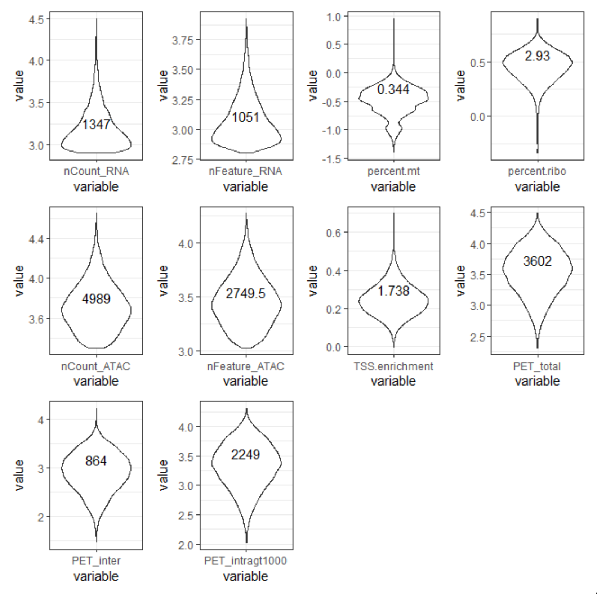<br/>
```
Rscript boxplot.2.r MOSCCA0062.raw.metadata.txt MOSCCA0062.raw.metadata.txt.pdf MOSCCA0062
```

#### Pie Plot
###### pieplot.1.r


#### Scatter Plot
###### scatterplot.1.r


#### Bar Plot
###### barplot.1.r


###### barplot.2.r
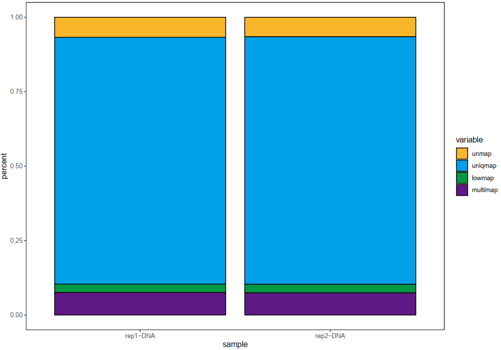

#### Line Plot
###### lineplot.1.r
其中带宽参数，带宽越大，曲线越光滑，默认带宽为1，可以通过adjust参数进行调整。


###### lineplot.2.r
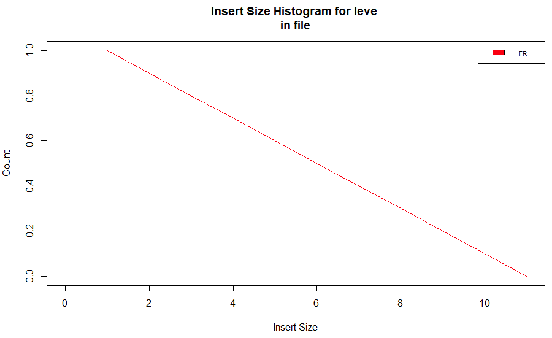

#### alluvium Plot (冲积图/桑葚图)
###### ggalluvial.1.r
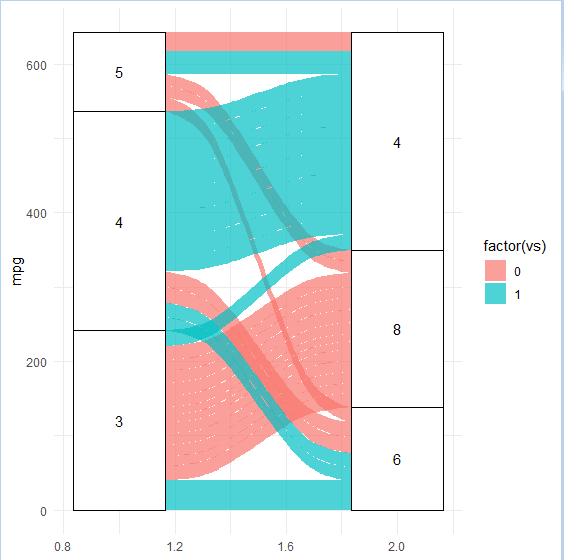
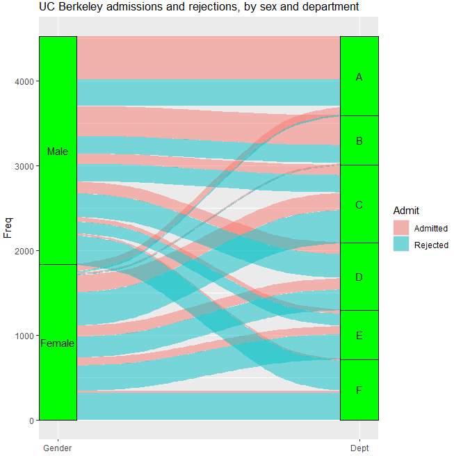
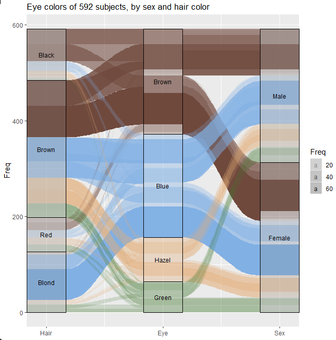
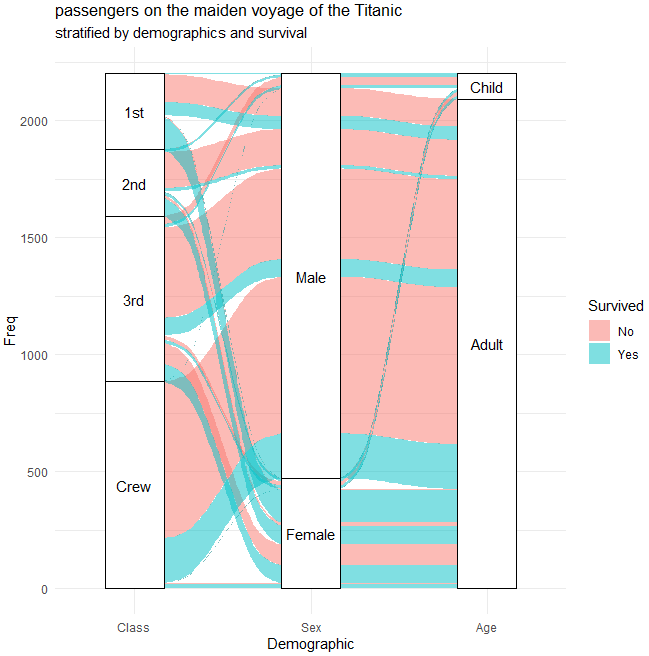

###### ggalluvial.2.r
优点：可以详细的控制每个组件的信息。缺点：导出的是html，转化成pdf的时候部分组件的样式会发生变化，需要用AI再修改。
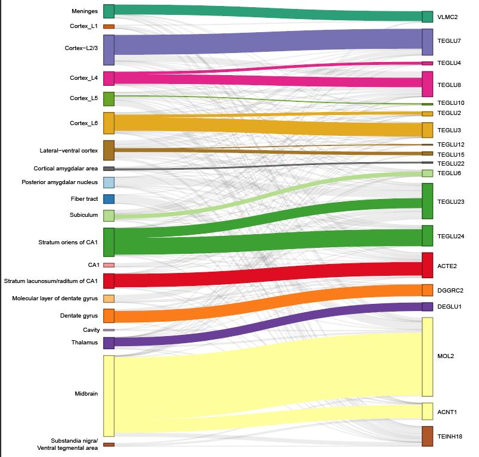

###### ggalluvial.3.r
优点：符合ggplot2的绘图形式，简单，高效。缺点：不能自由修改连线的颜色，比如将一些连线设置成灰色。
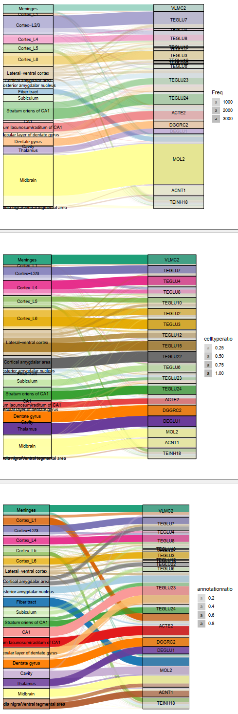

#### Density Plot
###### density.plot.1.r
带柱子的密度曲线<br/>
Rscript density.plot.1.r density.plot.1.txt density.plot.1.txt.pdf 14425<br/>
该示例是我将交互随机模拟产生了500次，然后统计每次的结果得到density.plot.1.txt文件。14425是实际数据得到的结果，用于说明差异。然后以后用截断坐标轴画出来就更完美了（目前不会~~~~）<br/>


#### PCA Plot
###### plotPCA.1.r
三维的PCA分析图<br/>
Rscript plotPCA.1.r<br/>


#### 三维散点图
###### 3D.plot.1.r
三维散点图<br/>
Rscript 3D.plot.1.r<br/>
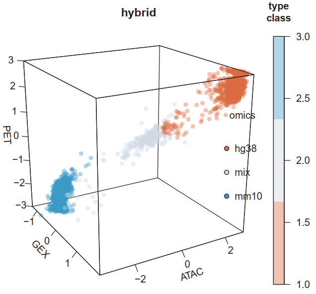

###### 3D.plot.2.r
三维散点图，交互式绘图<br/>
Rscript 3D.plot.2.r<br/>
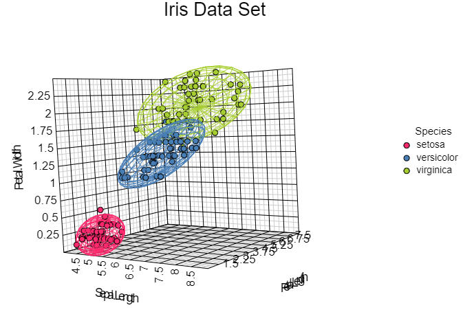

#### Table Plot
###### table.plot.1.r
绘制表格
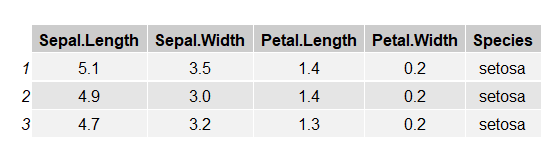

#### Interaction Plot
###### [interactionplot.1.r](plotInteractionCurve/)
不知道为什么cyto文件不能着色，日后改进<br/>


## 数据库
#### SQLite3
```
```
#### MySQL
安装
```
rpm -qa | grep mysql # check
# https://dev.mysql.com/downloads/repo/yum/ # 下载rpm # https://repo.mysql.com//mysql84-community-release-el7-1.noarch.rpm

rpm -ivh mysql-community-release-el7-5.noarch.rpm
yum update
yum install mysql-server
chown -R mysql:mysql /var/lib/mysql/

mysqld --initialize
systemctl start mysqld
systemctl status mysqld

# 如果报错
cat /etc/my.cnf
chmod -R 777 /var/lib/mysql
rm -rf /var/lib/mysql/*
systemctl restart mysqld
```
启动
```
mysql

```
#### mariadb 
```
yum install mariadb-server mariadb
systemctl start mariadb 
systemctl enable mariadb  #设置开机启动

mysqladmin -u root password "kkltmax8"; # 修改密码
mysql -uroot -p
show databases;
exit/quit
```
#### 添加用户
```
INSERT INTO user (host, user, password, 
           select_priv, insert_priv, update_priv) 
           VALUES ('localhost', 'guest', 
           PASSWORD('guest123'), 'Y', 'Y', 'Y');
FLUSH PRIVILEGES;
SELECT host, user, password FROM user WHERE user = 'guest';
```
#### 基础命令
```
mysqladmin -u your_username -p create your_database # 命令行中直接创建database
mysqladmin -u your_username -p create your_database --default-character-set=utf8mb4 --default-collation=utf8mb4_general_ci
mysqladmin -u your_username -p your_command # 命令行直接操作数据库
mysqladmin -u your_username -p drop your_database # 命令行删除database
show databases; # 列出所有的database
use mysql; # 进入指定database
show tables; # 列出当前database的所有表
show table status from mysql; # 列出指定database的表
show columns from user; # 显示表的属性（表头）
show indexs from user; # 显示表的主键的详细信息
DROP DATABASE [IF EXISTS] <database_name>; # 删除database
DROP TABLE [IF EXISTS] table_name; # 删除表

CREATE DATABASE [IF NOT EXISTS] database_name
  [CHARACTER SET charset_name]
  [COLLATE collation_name];

CREATE TABLE users (
    id INT AUTO_INCREMENT PRIMARY KEY,
    username VARCHAR(50) NOT NULL,
    email VARCHAR(100) NOT NULL,
    birthdate DATE,
    is_active BOOLEAN DEFAULT TRUE
) [CHARACTER SET utf8mb4 COLLATE utf8mb4_general_ci] ;

INSERT INTO table_name (column1, column2, column3, ...)
VALUES (value1, value2, value3, ...);
INSERT INTO users 
VALUES (NULL,'test', 'test@runoob.com', '1990-01-01', true); # 插入所有列的时候，可以省略列名。
INSERT INTO users (username, email, birthdate, is_active)
VALUES
    ('test1', 'test1@runoob.com', '1985-07-10', true),
    ('test2', 'test2@runoob.com', '1988-11-25', false),
    ('test3', 'test3@runoob.com', '1993-05-03', true); # 一次性插入多行记录

SELECT column1, column2, ...
FROM table_name
[WHERE condition]
[ORDER BY column_name [ASC | DESC]]
[LIMIT number];
SELECT * FROM users WHERE is_active = TRUE;
SELECT * FROM users ORDER BY birthdate;
SELECT * FROM users LIMIT 10;
SELECT * FROM countries WHERE country_code IN ('US', 'CA', 'MX');
```

## 图论
#### 连通图
###### 获取所有的连通图的点
```
JNnc_loci0001   JNnc_loci0001
JNnc_loci0002   JNnc_loci0002
JNnc_loci0003   JNnc_loci0003
JNnc_loci0004   JNnc_loci0004
JNnc_loci0005   JNnc_loci0005
JNnc_loci0006   JNnc_loci0006
JNnc_loci0007   JNnc_loci0007
JNnc_loci0008   JNnc_loci0008
JNnc_loci0009   JNnc_loci0009
JNnc_loci0010   JNnc_loci0010
JNnc_loci0011   JNnc_loci0011
JNnc_loci0012   JNnc_loci0012
JNnc_loci0013   JNnc_loci0013
```
python GetConnectedSubGraph.py input.edge out.node

## 处理fasta格式的文件(所有的文件自动识别压缩后缀.gz .gzip)
#### 下载的sra文件转成的fastq文件丢失了readid（少量软件必须识别readid），sra2readsid.py可以自定义一个随机的readid。
python /data/home/ruanlab/huangxingyu/Tools/littletools/sra2readsid.py -r1 SRR17666401_1.fastq.gz -r2 SRR17666401_2.fastq.gz -o1 SRR17666401.name_1.fastq -o2 SRR17666401.name_2.fastq && pigz -p 10 SRR17666401.name_1.fastq && pigz -p 10 SRR17666401.name_2.fastq <br/>

#### 将大的fasta格式的文件拆分成指定大小的fasta小文件
python splitFasta.py MH63.nove.ios.ijoux.rna.fa 1000 test <br/>
输入文件，每个文件包含的序列条数，输出前缀

#### 将fasta格式的文件转化成fastq格式
python fasta2fastq.py in.fa out.fq<br/>
输入fasta文件，输出fastq文件

#### 将solid测序数据转化成普通的fastq格式数据
python solid2fastq.py

#### 序列比对（基于动态规划）
GlobalAlignment.py 全局比对，一般不用<br/>
LocalAlignment.py 局部比对，但是只匹配一次<br/>
LocalAlignmentFull.py 局部比对，配对到不能匹配为止<br/>
ChIAPETLinkerFilter 因为纯python跑的太慢了，用java重构了，专门为ChIA-PET数据过滤linker<br/>

```
for i in {00..74}
do
    # wget https://ftp.ncbi.nlm.nih.gov/blast/db/nt.$i.tar.gz
    # wget https://ftp.ncbi.nlm.nih.gov/blast/db/nt.$i.tar.gz.md5
    # md5sum -c nt.$i.tar.gz.md5
    # tar zxf nt.$i.tar.gz
    sleep 0.001
done

for i in {00..62}
do
    # wget https://ftp.ncbi.nlm.nih.gov/blast/db/nr.$i.tar.gz
    # wget https://ftp.ncbi.nlm.nih.gov/blast/db/nr.$i.tar.gz.md5
    # md5sum -c nr.$i.tar.gz.md5
    # tar zxf nr.$i.tar.gz
    sleep 0.001
done

# wget https://ftp.ncbi.nlm.nih.gov/blast/db/taxdb.tar.gz
# wget https://ftp.ncbi.nlm.nih.gov/blast/db/taxdb.tar.gz.md5
# md5sum -c taxdb.tar.gz.md5
# tar zxf taxdb.tar.gz

bsub -q q2680v2 -J sh.run -n 10 -o sh.run.out -e sh.run.err -R span[hosts=1] " /public/home/xyhuang/Tools/ncbi-blast-2.13.0+/bin/blastn -db nt -query RMCD001.unmap.fa -out RMCD001.unmap.fa.aln -outfmt '6 qseqid qlen sseqid sgi slen pident length mismatch gapopen qstart qend sstart send evalue bitscore staxid ssciname' -max_target_seqs 2 -num_threads 10 "
```

#### 根据染色体编号排序基因组文件（for cellranger/cellranger-arc/cellranger-atac）
```
# https://www.ncbi.nlm.nih.gov/datasets/genome/GCF_036370855.1/
# https://ftp.ncbi.nlm.nih.gov/genomes/all/GCF/036/370/855/GCF_036370855.1_bDroNov1.hap1/
# https://www.ncbi.nlm.nih.gov/nuccore/CM072429.1/

# wget https://ftp.ncbi.nlm.nih.gov/genomes/all/GCF/036/370/855/GCF_036370855.1_bDroNov1.hap1/GCF_036370855.1_bDroNov1.hap1_assembly_report.txt
# wget https://ftp.ncbi.nlm.nih.gov/genomes/all/GCF/036/370/855/GCF_036370855.1_bDroNov1.hap1/GCF_036370855.1_bDroNov1.hap1_genomic.gff.gz
# wget https://ftp.ncbi.nlm.nih.gov/genomes/all/GCF/036/370/855/GCF_036370855.1_bDroNov1.hap1/GCF_036370855.1_bDroNov1.hap1_genomic.gtf.gz
# wget https://ftp.ncbi.nlm.nih.gov/genomes/all/GCF/036/370/855/GCF_036370855.1_bDroNov1.hap1/GCF_036370855.1_bDroNov1.hap1_genomic.fna.gz

python renameChromName.py -r GCF_036370855.1_bDroNov1.hap1_assembly_report.txt -g GCF_036370855.1_bDroNov1.hap1_genomic.fna.gz -t GCF_036370855.1_bDroNov1.hap1_genomic.gtf.gz -f GCF_036370855.1_bDroNov1.hap1_genomic.gff.gz -og bDroNov1.fa.tmp -ot bDroNov1.gtf -of bDroNov1.gff
cat <(echo ">chrM") <(sed '1d' sequence.fasta) | cat bDroNov1.fa.tmp - > bDroNov1.fa
samtools faidx bDroNov1.fa
perl -lane 'if($F[2] eq "gene"){if(/gene_id "(.+?)";.+?gene "(.+?)";.+?gene_biotype "(.+?)";/){print "$F[0]\t".($F[3]-1)."\t$F[4]\t$1\t.\t$F[6]\t$2\t$3"}}' bDroNov1.gtf > bDroNov1.info

# https://www.10xgenomics.com/support/software/cell-ranger/downloads/cr-ref-build-steps
# awk '$3=="gene"' bDroNov1.gtf | perl -lane 'if(/gene_biotype "(.+?)";/){print $1}' | sort | uniq 
# C_region
# lncRNA
# misc_RNA
# ncRNA
# protein_coding
# pseudogene
# rRNA
# snoRNA
# snRNA
# tRNA
# V_segment

python fltTypeForSC.py bDroNov1.gtf > bDroNov1.sc.gtf
python sortGenome.py -g bDroNov1.fa -og bDroNov1.sorted.fa
mv bDroNov1.sorted.fa bDroNov1.fa
bwa index bDroNov1.fa
```

```
# https://www.ncbi.nlm.nih.gov/datasets/genome/GCF_003339765.1/
# wget https://ftp.ncbi.nlm.nih.gov/genomes/all/GCF/003/339/765/GCF_003339765.1_Mmul_10/GCF_003339765.1_Mmul_10_assembly_report.txt
# wget https://ftp.ncbi.nlm.nih.gov/genomes/all/GCF/003/339/765/GCF_003339765.1_Mmul_10/GCF_003339765.1_Mmul_10_genomic.gtf.gz
# wget https://ftp.ncbi.nlm.nih.gov/genomes/all/GCF/003/339/765/GCF_003339765.1_Mmul_10/GCF_003339765.1_Mmul_10_genomic.gff.gz
# wget https://ftp.ncbi.nlm.nih.gov/genomes/all/GCF/003/339/765/GCF_003339765.1_Mmul_10/GCF_003339765.1_Mmul_10_genomic.fna.gz

python renameChromName.py -r GCF_003339765.1_Mmul_10_assembly_report.txt -g GCF_003339765.1_Mmul_10_genomic.fna.gz -t GCF_003339765.1_Mmul_10_genomic.gtf.gz -f GCF_003339765.1_Mmul_10_genomic.gff.gz -og rheMac10.fa -ot rheMac10.gtf -of rheMac10.gff
samtools faidx rheMac10.fa
# perl -lane 'if($F[2] eq "gene"){if(/gene_id "(.+?)";.+?gene "(.+?)";.+?gene_biotype "(.+?)";/){print "$F[0]\t".($F[3]-1)."\t$F[4]\t$1\t.\t$F[6]\t$2\t$3"}}' rheMac10.gtf > rheMac10.info

# https://www.10xgenomics.com/support/software/cell-ranger/downloads/cr-ref-build-steps
# awk '$3=="gene"' rheMac10.gtf | perl -lane 'if(/gene_biotype "(.+?)";/){print $1}' | sort | uniq 
# C_region
# guide_RNA
# lncRNA
# miRNA
# misc_RNA
# other
# protein_coding
# pseudogene
# rRNA
# snoRNA
# snRNA
# telomerase_RNA
# transcribed_pseudogene
# tRNA
# V_segment

# python fltTypeForSC.2.py rheMac10.gtf > rheMac10.sc.gtf
# python sortGenome.py -g rheMac10.fa -og rheMac10.sorted.fa
# mv rheMac10.sorted.fa rheMac10.fa
# bwa index rheMac10.fa
```

```
cat bDroNov1.genome.config
{
    organism: "Dromaius novaehollandiae (emu)",
    genome: ["bDroNov1"],
    input_fasta: ["/data/home/ruanlab/huangxingyu/Tools/cellranger-7.1.0/genome/genome/bDroNov1/bDroNov1.fa"],
    input_gtf: ["/data/home/ruanlab/huangxingyu/Tools/cellranger-7.1.0/genome/genome/bDroNov1/bDroNov1.sc.gtf"],
    non_nuclear_contigs: ["chrM"],
    input_motifs: "/data/home/ruanlab/huangxingyu/Tools/meme/reference/JASPAR2024_CORE_vertebrates_non-redundant_pfms_jaspar.txt",
}

cat rheMac10.genome.config
{
    organism: "macacue",
    genome: ["rheMac10"],
    input_fasta: ["/data/home/ruanlab/huangxingyu/Tools/cellranger-7.1.0/genome/genome/rheMac10/rheMac10.fa"],
    input_gtf: ["/data/home/ruanlab/huangxingyu/Tools/cellranger-7.1.0/genome/genome/rheMac10/rheMac10.sc.gtf"],
    non_nuclear_contigs: ["chrM"],
    input_motifs: "/data/home/ruanlab/huangxingyu/Tools/meme/reference/JASPAR2024_CORE_vertebrates_non-redundant_pfms_jaspar.txt",
}

cellranger-atac mkref --ref-version="v10" --config=rheMac10.genome.config
cellranger-atac mkref --ref-version="v1" --config=bDroNov1.genome.config

cellranger mkref --genome=refdata-gex-rheMac10-2024-A --fasta=genome/rheMac10/rheMac10.fa --genes=genome/rheMac10/rheMac10.sc.gtf --nthreads=10 --memgb=40 --ref-version="v10"
cellranger mkref --genome=refdata-gex-bDroNov1-2024-A --fasta=genome/bDroNov1/bDroNov1.fa --genes=genome/bDroNov1/bDroNov1.sc.gtf --nthreads=10 --memgb=40 --ref-version="v1"

cat rheMac10.genome.config
{
    organism: "macacue",
    genome: ["rheMac10"],
    input_fasta: ["/data/home/ruanlab/huangxingyu/Tools/cellranger-7.1.0/genome/genome/rheMac10/rheMac10.fa"],
    input_gtf: ["/data/home/ruanlab/huangxingyu/Tools/cellranger-7.1.0/genome/genome/rheMac10/rheMac10.sc.gtf"],
    non_nuclear_contigs: ["chrM"],
    input_motifs: "/data/home/ruanlab/huangxingyu/Tools/meme/reference/JASPAR2024_CORE_vertebrates_non-redundant_pfms_jaspar.txt",
}

cat bDroNov1.genome.config
{
    organism: "Dromaius novaehollandiae (emu)",
    genome: ["bDroNov1"],
    input_fasta: ["/data/home/ruanlab/huangxingyu/Tools/cellranger-7.1.0/genome/genome/bDroNov1/bDroNov1.fa"],
    input_gtf: ["/data/home/ruanlab/huangxingyu/Tools/cellranger-7.1.0/genome/genome/bDroNov1/bDroNov1.sc.gtf"],
    non_nuclear_contigs: ["chrM"],
    input_motifs: "/data/home/ruanlab/huangxingyu/Tools/meme/reference/JASPAR2024_CORE_vertebrates_non-redundant_pfms_jaspar.txt",
}

cellranger-arc mkref --nthreads 10 --memgb 45 --ref-version="v10" --config=rheMac10.genome.config
cellranger-arc mkref --nthreads 10 --memgb 45 --ref-version="v1" --config=bDroNov1.genome.config
```
人鼠混合（hg38-mm10）
```
cat <(sed 's/^>/>GRCh38_/g' refdata-cellranger-arc-GRCh38-2020-A-2.0.0/fasta/genome.fa) <(sed 's/^>/>mm10___/g' refdata-cellranger-arc-mm10-2020-A-2.0.0/fasta/genome.fa) > hybrid.genome.fa
cat <(zcat refdata-cellranger-arc-GRCh38-2020-A-2.0.0/genes/genes.gtf.gz | grep -v "^#" | sed 's/gene_id \"/gene_id \"GRCh38_/g;s/transcript_id \"/transcript_id \"GRCh38_/g;s/gene_name \"/gene_name \"GRCh38_/g;s/transcript_name \"/transcript_name \"GRCh38_/g;s/^/GRCh38_/') <(zcat refdata-cellranger-arc-mm10-2020-A-2.0.0/genes/genes.gtf.gz | grep -v "^#" | sed 's/gene_id \"/gene_id \"mm10___/g;s/transcript_id \"/transcript_id \"mm10___/g;s/gene_name \"/gene_name \"mm10___/g;s/transcript_name \"/transcript_name \"mm10___/g;s/^/mm10___/') > hybrid.genome.gtf

cat hybrid.genome.config 
{
    organism: "hybrid"
    genome: ["hybrid"]
    input_fasta: ["hybrid.genome.fa"]
    input_gtf: ["hybrid.genome.gtf"]
}

cellranger-arc mkref --nthreads 10 --memgb 50 --config=hybrid.genome.config
```

## 处理bam/sam格式的文件(所有的文件自动识别后缀)
#### bam2bed.py
将bam或者sam文件转化成bed格式，方便自定义。目前只给出了一些必要的信息。 <br/>
python bam2bed.py in.bam/in.sam out.bed <br/>

#### catBam.py
将bam或者sam文件直接合并成一个文件<br/>
python catBam.py file1.bam,file2.sam,file3.bam,file4.sam merge.bam

## 操作GTF文件
```
# 提取基因信息和位置
perl -lane 'if($F[2] eq "gene"){if(/gene_id "(.+?)\.\d+";.+?gene_type "(.+?)";.+?gene_name "(.+?)";/){print "$F[0]\t".($F[3]-1)."\t$F[4]\t$1\t.\t$F[6]\t$3\t$2"}}' ~/Tools/cellranger-7.1.0/genome/refdata-gex-GRCh38-2020-A/genes/genes.gtf > hg38.info # 提取基因信息和位置
perl -lane 'if($F[2] eq "gene"){if(/gene_id "(.+?)";.+?gene_type "(.+?)";.+?gene_name "(.+?)";/){print "$F[0]\t".($F[3]-1)."\t$F[4]\t$1\t.\t$F[6]\t$3\t$2"}}' ~/Tools/cellranger-7.1.0/genome/refdata-gex-GRCh38-2020-A/genes/genes.gtf > hg38.info # 提取基因信息和位置

# 提取promoter位置
awk -v OFS="\t" '{$8="promoter";if($6=="+"){$3=$2+2000;$2=$2-2000;print $0}else{$2=$3-2000;$3=$3+2000;print $0}}' hg38.info > hg38.promoter.info

perl -Mwarnings -F"\t" -lane 'BEGIN{my %gene;}if($F[2]eq"transcript" && /gene_id "(.+?)\.\d+"; transcript_id "(.+?)";/){$gene{$1}+=1;print "$2\t$1-$gene{$1}"}' gencode.v24.annotation.gtf > transcript2gene.txt
2：获取基因的最长转录本的长度：
perl -lane 'BEGIN{my %h}{if($F[2] eq "exon" && /gene_id "(.+?)"; transcript_id "(.+?)";/){$h{$1}{$2}+=$F[4]-$F[3]+1;}}END{foreach my $gen (keys %h){foreach(keys %{$h{$gen}}){print "$gen\t$h{$gen}{$_}"}}}' ~/Genome/GRCh3885/gencode.v24.annotation.gtf | perl -lane 'BEGIN{my %h}{if($F[1]>$h{$F[0]}){$h{$F[0]}=$F[1]}}END{foreach(keys %h){print "$_\t$h{$_}"}}' > gene.length
3：生成gene id 和 gene name 的映射表：
perl -lane 'if($F[2] eq "gene" && /gene_id "(.+?)";.+?gene_name "(.+?)";/){print "$1\t$2"}' ~/Genome/GRCh3885/gencode.v24.annotation.gtf > id2name.txt

grep -w transcript gencode.v24.annotation.gtf | perl -lane 'BEGIN{%h;%count;}{if($_=~/transcript_id "(.+?)".+?gene_name "(.+?)";/){$count{$2}+=1;$h{$1}="$2#$count{$2}"};}END{print "$_\t$h{$_}" foreach(keys %h);}' | awk '{if(NR==FNR){a[$1]=$2}else if($4 in a){$4=a[$4];print $0}}' - hg38.bed12

perl -lane 'if($F[2]eq"gene"){if(/gene_id "(.+?)\.\d+";.+?gene_type "(.+?)";.+?gene_name "(.+?)";/){print "$F[0]\t".($F[3]-1)."\t$F[4]\t$1\t.\t$F[6]\t$3\t$2"}}' gencode.vM23.annotation.gtf > mm10.info

4：查看10X genome的summary.csv文件
perl -F"," -lane '{push(@arr,[@F])}END{print "$arr[0][$_]\t$arr[1][$_]" foreach(0..$#{$arr[0]})}' ../summary.csv
```

#### markgene.longest.py定量
python markgene.longest.py in.bam genome.gtf out.count reverse

## 处理bed格式的文件(所有的文件自动识别后缀)
#### recordDistance.py
对已经排过序的bed文件，查看region之间的距离（查看peak之间的距离分布） <br/>
python recordDistance.py file.peak distance.txt <br/>

#### filterMACS2nolambda.py
查看某个区域，以及该区域附近区域的覆盖度情况，用于peak过滤，和下面的处理coverage文件中的代码相似 <br/>
python filterMACS2nolambda.py sample_peaks.narrowPeak sample.bw sample_peaks.cal.narrowPeak > filterMACS2nolambda.log <br/>

#### mergePeak.py
去掉一些距离很近的不显著的peak <br/>
python mergePeak.py sample_peaks.cal.flt.narrowPeak 1000 sample_peaks.cal.flt.out.narrowPeak sample_peaks.cal.flt.merge.narrowPeak <br/>

## 处理coverage文件(所有的文件自动识别压缩后缀.gz .gzip .bigwig)
#### 将多个bedgraph/bigwig文件合并成一个（未来将改为多线程实现）
测试的每10M用时27s左右，需要用多线程来加速实现。
```
cat file1.bedgraph file2.bedgraph file3.bedgraph | sort -k1,1 -k2,2n -k3,3n > test.bed
bgzip test.bed
tabix test.bed.gz
python bed2bedgraph.py test.size test.bed.gz 1 4 combine.bedgraph
```
python bed2bedgraph.py test.size test.bed.gz 1 4 combine.bedgraph <br/>
test.size: 染色体大小 <br/>
```
chr1   1000
chr2   40000
```
test.bed.gz: bed4 format(chrom, start, end, coverage) <br/>
8: 步长，可以设置为1，会花很多时间，取决于input的步长设置的多少 <br/>
4: 计算的方式，设置为0，则每一行的记录视作coverage为1，若设置为正整数n，则计算的coverage是第n列的值 <br/>
combine.bedgraph: 输出文件

## Single cell分析
#### Seurat
```
library(dplyr)
library(Seurat)
library(patchwork)

pbmc.data <- Read10X(data.dir = "fileinput")
test.seu <- CreateSeuratObject(counts = pbmc.data, project = "pbmc3k") # test.seu@meta.data # 存储细胞属性 # test.seu[["RNA"]]@counts/test.seu[["ATAC"]]@counts # 存储的数据矩阵
test.seu <- subset(test.seu, subset = nFeature_RNA > 100 & nFeature_RNA < 2500 & percent.mt < 5)
test.seu <- NormalizeData(test.seu) # test.seu[["RNA"]]@data # LogNormalize消除文库大小的影响，标准后的结果
test.seu <- FindVariableFeatures(test.seu, nfeatures = 3000) # VariableFeatures(test.seu) # 寻找到的高变基因
test.seu <- ScaleData(test.seu, features = rownames(test.seu)) # test.seu[["RNA"]]@scale.data # 让基因表达量分布很大的缩小，让不同的基因的表达量分布差不多，达到可以比较的目的，方便以后画热图（画热图一般会用scale之后的z-score）
test.seu <- RunPCA(test.seu, features = VariableFeatures(object = test.seu)) # test.seu@meta.data # 多了两列，PCA聚类的结果。RNA_snn_res.0.5记录了你用的分辨率，最终的聚类结果保存在seurat_clusters中
DimPlot(test.seu, reduction = "pca")
DimHeatmap(test.seu, dims = 1:15, cells = 500, balanced = TRUE)

test.seu <- JackStraw(test.seu, num.replicate = 100) # 因为PCA默认跑出来分了50个主成分，但实际上我们不一定需要那么多，选择一个适当的阈值
test.seu <- ScoreJackStraw(test.seu, dims = 1:20)
ElbowPlot(test.seu)

test.seu <- FindNeighbors(test.seu, dims = 1:30) # 细胞聚类 Number of communities: 9 这个指细胞聚类的数量
test.seu <- FindClusters(test.seu, resolution = 0.5)

test.seu <- RunUMAP(test.seu, dims = 1:30)
DimPlot(test.seu, reduction = "umap")
DimPlot(test.seu, reduction = "umap", label = TRUE)
test.seu <- RunTSNE(test.seu, dims = 1:30)
DimPlot(test.seu, reduction = "tsne")
DimPlot(test.seu, reduction = "tsne", label = TRUE)

cluster2.markers <- FindMarkers(test.seu, ident.1 = 2, min.pct = 0.25) # 鉴定cluster2类中的特征基因 # 一般不用
head(cluster2.markers, n = 5)
cluster5.markers <- FindMarkers(test.seu, ident.1 = 5, ident.2 = c(0, 3), min.pct = 0.25) # 寻找出cluster 5区别于cluster 0 & 3的marker # 一般不用
head(cluster5.markers, n = 5)

test.seu.markers <- FindAllMarkers(test.seu, only.pos = TRUE, min.pct = 0.25, logfc.threshold = 0.25) # 寻找所有类的特征基因
test.seu.markers %>% group_by(cluster) %>% slice_max(n = 2, order_by = avg_log2FC)
VlnPlot(test.seu, features = c("NKG7", "PF4"), slot = "counts", log = TRUE) # 可视化mark基因
FeaturePlot(test.seu, features = c("MS4A1", "GNLY", "CD3E", "CD14", "FCER1A", "FCGR3A", "LYZ", "PPBP","CD8A"))
test.seu.markers %>% group_by(cluster) %>% top_n(n = 10, wt = avg_log2FC) -> top10
DoHeatmap(test.seu, features = top10$gene) + NoLegend()

saveRDS(test.seu, file = "test.seu.rds")
```
https://github.com/dbrg77/ISSAAC-seq/blob/main/mCortex_main/mCortex_analysis.R

## ChIP-Seq分析
#### spikein
见spiker.run.sh、spiker.run.2.sh。
```
split_bam.py -i ${i}.bowtie2.rmd.flt.bam -o ${i}.bowtie2.split -p dm3_
split_bam.py -i ${i}.bowtie2.rmd.flt.bam -o ${i}.bowtie2.split -p mm10_

cat *bowtie2.split.report.txt | grep -v n_exogenous | awk '{print $0"\t"1000000/$NF}' > all.bowtie2.split.report.txt
spiker.py -t H3K27ac.sorted.bam -c control.sorted.bam --spikeIn --csf 1.23 --tsf 0.95 -o H3K27ac

# cat *.*.bowtie2.split.report.txt Input?.bowtie2.split.report.txt | grep -v n_exogenous | awk '{print $0"\t"1000000/$NF}' 
# SiHa.H3K27ac.bowtie2.bam	0	0	0	0	0	5915	53446975	3734602	0.267766
# SiHa.H3K4me1.bowtie2.bam	0	0	0	0	0	10170	45975680	6968612	0.143501
# SiHa.H3K4me3.bowtie2.bam	0	0	0	0	0	15537	50099972	10304583	0.0970442
# SiHa.Sp1.bowtie2.bam	0	0	0	0	0	31101	14845555	32470912	0.0307968
# SP.H3K27ac.bowtie2.bam	0	0	0	0	0	2374	58747591	1535134	0.651409
# SP.H3K4me1.bowtie2.bam	0	0	0	0	0	3325	52031762	2864862	0.349057
# SP.H3K4me3.bowtie2.bam	0	0	0	0	0	5087	59371899	4325836	0.231169
# SP.Sp1.bowtie2.bam	0	0	0	0	0	18642	43724447	11898767	0.0840423
# Input1.bowtie2.rmd.flt.bam	0	0	0	0	0	1914	9739531	1866272	0.535828
# Input2.bowtie2.rmd.flt.bam	0	0	0	0	0	6692	1915524	7028230	0.142283
# Input3.bowtie2.rmd.flt.bam	0	0	0	0	0	937	11306186	502054	1.99182
# Input4.bowtie2.rmd.flt.bam	0	0	0	0	0	7366	3867423	6079070	0.164499

bsub -q q2680v2 -J test -n 8 -o test.out -e test.err -R span[hosts=1] " spiker.py -t SiHa.H3K27ac.bowtie2.bam -c Input1.bowtie2.rmd.flt.bam --spikeIn --csf 0.535828 --tsf 0.267766 -o SiHa.H3K27ac.bowtie2.narrowpeak --bw --frip "
```

#### ChromHMM
[ChromHMM下载连接](http://compbio.mit.edu/ChromHMM/)<br/>
在动物中，不同的表观修饰对应的功能
|mark|function|
|:-:|:-:|
|K3K4me3|promoter, gene activation (在Compartment A和TAD boundaries 都有富集)|
|H3K27me3|promoter, poised enhancers, gene silencing|
|H2AZ|promoter|
|H3K4me1|enhancer (H3K4me1&H3K27ac的组合常作为active enhancer的标志)|
|H3K36me3|transcribed regions|
|H3K9me3|gene silencing (Compartment B区域有富集) |
|H3K27ac|active enhancers (富集在Compartment A和TAD boundaries)|
|H3K9ac|enhancer (富集在Compartment A和TAD boundaries )|

```
cat cellmarkfiletable.txt
MH63_mature_leaf	H3K27ac	MH63_mature_leaf_H3K27ac.bam	MH63_seedling_INPUT.flt.bam
MH63_mature_leaf	H3K27me3	MH63_mature_leaf_H3K27me3.bam	MH63_seedling_INPUT.flt.bam
MH63_mature_leaf	FAIRE	MH63_mature_leaf_FAIRE.bam	MH63_seedling_INPUT.flt.bam
MH63_mature_leaf	H3K4me1	MH63_mature_leaf_H3K4me1.bam	MH63_seedling_INPUT.flt.bam
MH63_mature_leaf	H3K4me3	MH63_mature_leaf_H3K4me3.bam	MH63_seedling_INPUT.flt.bam
MH63_mature_leaf	H3K9me2	MH63_mature_leaf_H3K9me2.bam	MH63_seedling_INPUT.flt.bam
MH63_mature_leaf	RNAPII	MH63_mature_leaf_RNAPII.bam	MH63_seedling_INPUT.flt.bam
MH63_panicle	H3K27ac	MH63_panicle_H3K27ac.bam	MH63_seedling_INPUT.flt.bam
MH63_panicle	H3K27me3	MH63_panicle_H3K27me3.bam	MH63_seedling_INPUT.flt.bam
MH63_panicle	FAIRE	MH63_panicle_FAIRE.bam	MH63_seedling_INPUT.flt.bam
MH63_panicle	H3K4me1	MH63_panicle_H3K4me1.bam	MH63_seedling_INPUT.flt.bam
MH63_panicle	H3K4me3	MH63_panicle_H3K4me3.bam	MH63_seedling_INPUT.flt.bam
MH63_panicle	H3K9me2	MH63_panicle_H3K9me2.bam	MH63_seedling_INPUT.flt.bam
MH63_panicle	RNAPII	MH63_panicle_RNAPII.bam	MH63_seedling_INPUT.flt.bam
MH63_seedling	H3K27ac	MH63_seedling_H3K27ac.bam	MH63_seedling_INPUT.flt.bam
MH63_seedling	H3K27me3	MH63_seedling_H3K27me3.bam	MH63_seedling_INPUT.flt.bam
MH63_seedling	FAIRE	MH63_seedling_FAIRE.bam	MH63_seedling_INPUT.flt.bam
MH63_seedling	H3K4me1	MH63_seedling_H3K4me1.bam	MH63_seedling_INPUT.flt.bam
MH63_seedling	H3K4me3	MH63_seedling_H3K4me3.bam	MH63_seedling_INPUT.flt.bam
MH63_seedling	H3K9me2	MH63_seedling_H3K9me2.bam	MH63_seedling_INPUT.flt.bam
MH63_seedling	RNAPII	MH63_seedling_RNAPII.bam	MH63_seedling_INPUT.flt.bam

java -Xmx50G -jar ChromHMM.jar BinarizeBam -b 200 genome.forRNAseq.fa.size ./ cellmarkfiletable.txt chromresult/
java -Xmx50G -jar ChromHMM.jar LearnModel -l genome.forRNAseq.fa.size -b 200 -s 1234 chromresult chromresult.15stat 15 MH63
```
```
# ANCHORFILES
awk '$3=="gene"' genome.gtf | awk '{if($7=="+"){print $1"\t"$4-1"\t"$7;}else{print $1"\t"$5"\t"$7;}}' | gzip > RefSeqTSS.MH63.txt.gz
awk '$3=="gene"' genome.gtf | awk '{if($7=="+"){print $1"\t"$5"\t"$7;}else{print $1"\t"$4-1"\t"$7;}}' | gzip > RefSeqTES.MH63.txt.gz
# CHROMSIZES
samtools faidx genome.fa.fai
cut -f 1-2 genome.fa.fai > MH63.txt
# COORDS

awk '$3=="exon"' genome.gtf | awk '{print $1"\t"$4-1"\t"$5}' | sort --parallel=4 -k1,1 -k2,2n -k3,3n | uniq | gzip > RefSeqExon.MH63.bed.gz
awk '$3=="gene"' genome.gtf | awk '{print $1"\t"$4-1"\t"$5}' | sort --parallel=4 -k1,1 -k2,2n -k3,3n | uniq | gzip > RefSeqGene.MH63.bed.gz
zcat ../../ANCHORFILES/MH63/RefSeqTES.MH63.txt.gz | awk '{print $1"\t"$2"\t"$2+1}' | gzip > RefSeqTES.MH63.bed.gz
zcat ../../ANCHORFILES/MH63/RefSeqTSS.MH63.txt.gz | awk '{print $1"\t"$2"\t"$2+1}' | gzip > RefSeqTSS.MH63.bed.gz
zcat ../../ANCHORFILES/MH63/RefSeqTSS.MH63.txt.gz | awk '{start=$2-2000;if(start<0){start=0;}print $1"\t"start"\t"$2+2000}' | gzip > RefSeqTSS2kb.MH63.bed.gz
cpg_lh genome.fa | awk '{$2 = $2 - 1; width = $3 - $2; printf("%s\t%d\t%s\t%s %s\t%s\t%s\t%0.0f\t%0.1f\t%s\t%s\n", $1, $2, $3, $5, $6, width, $6, width*$7*0.01, 100.0*2*$6/width, $7, $9);}' | sort -k1,1 -k2,2n | cut -f 1-3 | gzip > CpGIsland.MH63.bed.gz # ucsc
```

## RNA-seq分析
#### FPKM定量
###### 用stringtie定量fpkm (有些基因会出现多次)
```
stringtie sample.sorted.bam -G anno.gtf --rf -o sample.calfpkm.gtf -A sample.calfpkm.gtf.abundance -e -v
python getfpkm.py sample.calfpkm.gtf.abundance sample.fpkm
```
#### 鉴定组织特异性基因
鉴定组织特异性基因，可以用变异系数或者香农熵<br/>
一个简单的香农熵例子：InformationEntropyDifferentiallyExpressedGenes.py<br/>
[ROKU](https://www.rdocumentation.org/packages/TCC/versions/1.12.1/topics/ROKU)

#### small-RNA-seq分析
```
fastq2fasta.pl ../MH63.H3K4me3.RNA.fastq > MH63.H3K4me3.RNA.fa
mapper.pl MH63.H3K4me3.RNA.fa -c -j -l 18 -m -p ~/xiaoqing/genome/newgenome/bowtieindex/MH63 -s ./MH63.H3K4me3.fa -t MH63.H3K4me3.arf -v -o 4

quantifier.pl -p ~/Genome/miRNA/hairpin_osa.fa -m ~/Genome/miRNA/mature_osa.all.fa -r MH63.H3K4me3.fa # -t sja  


make_html2.pl -q expression_analyses/expression_analyses_1560745016/miRBase.mrd -k ~/Genome/miRNA/mature_osa.all.fa -y 1559072487 -o -i expression_analyses/expression_analyses_1560745016/mature_osa.all.fa_mapped.arf -l -M miRNAs_expressed_all_samples_1560745016.csv
```
```
###控制序列长度

1.去除reads fastq文件尾端乱码序列 /data12/qwzhou/practice/Oryza/data/result_primary_mutant
	awk -v RS="@" -v ORS="" '{if(NF==4&&$0!=""&&length($2)==length($4)&&length($2)>18){print"@"$0}}' 6-1.fq > 6-1_quWei.fq
2.fastqc
	
3.fastx 去除adaptor && 质量控制 
    WT：{/data12/qwzhou/practice/Oryza/data/result_primary_WT/fastx_2}
	fastq_quality_filter -q 20 -p 85 -i ZH11.fq -o fastx_quality.fq
	fastx_clipper -a TCGTATGCCGTCTTCTGCTTGAAAA -l 18   -i  fastx_quality.fq -o fastx_adaptor.fq
	控制长度18~30：
	awk -v RS="@" 'NF!=0{if(length($2)<=30){printf "@"$0}}' fastx_adaptor.fq > fastx_adaptor_max30.fq
	长度分布：
	awk 'NR%4==2{print length($0)}' fastx_adaptor.fq |sort |uniq -c > fastx.adaptor.unique-length.txt
    mutant：{/data12/qwzhou/practice/Oryza/data/result_primary_mutant/fastx_2}
	fastq_quality_filter -q 20 -p 85 -i 6-1_quWei.fq -o fastx_quality.fq
	fastx_clipper -a TCGTATGCCGTCTTCTGCTTGAAAA -l 18   -i  fastx_quality.fq -o fastx_adaptor.fq
	控制长度18~30：
	awk -v RS="@" 'NF!=0{if(length($2)<=30){printf "@"$0}}' fastx_adaptor.fq > fastx_adaptor_max30.fq

    ******后续处理用miRDeep2处理******************

4.参考基因组建立索引  /data12/qwzhou/practice/Oryza/genome/bowtie_genome7.0
	bowtie-build  ../Oryza_msu/genome7.0/all.con

5.处理reads文件并且把它map到基因上--mapper.pl  并检测质量情况
    突变株： {/data12/qwzhou/practice/Oryza/data/result_primary_mutant/fastx_2}
	mapper.pl fastx_adaptor_max30.fq -e -h  -j  -g ory -l 18 -m -p ../../../genome/bowtie_genome7.0/Oryza_genome7.0 -s reads_collapsed_fastx.fa  -t  reads_collapsed_vs_genome_fastx.arf -v -n
    野生株： {/data12/qwzhou/practice/Oryza/data/result_primary_WT/fastx_2} 
	mapper.pl fastx_adaptor_max30.fq -e -h  -j  -g ory -l 18 -m -p ../../../genome/bowtie_genome7.0/Oryza_genome7.0 -s reads_collapsed_fastx.fa  -t  reads_collapsed_vs_genome_fastx.arf -v -n
    计算结果文件序列长度分布：
	awk -F"x" -v ORS="" '{if(NR%2==1){print $2"\t"}else{len=length($0);print len"\n"}}' reads_collapsed_fastx.fa | awk '{a[$2]+=$1}END{for(i in a){print i"\t"a[i]}}' | sort > numberVSlength_fastx.txt
    序列长度uniq分布：
	awk '!/>/{print length($0)}' reads_collapsed_fastx.fa |sort|uniq -c|less


6.将miRNA前体和mature数据U替换为T <在之前mirdeep2处理过程中已经做过> /data12/qwzhou/practice/Oryza/genome/miRBase
	awk '/>/{print}!/>/{gsub(/U/,"T");print}' ory_hairpin.fa > ory_hairpin_UtoT.fa
	awk '/>/{print}!/>/{gsub(/U/,"T");print}' ory_mature.fa > ory_mature_UtoT.fa

  将前体文件与mature文件头标改为一致
	awk -F"_" '/>/{print $1}!/>/{print}' ory_hairpin_UtoT.fa > ory_hairpin_UtoT_biaoShi.fa
	awk -F"_" '/>/{print $1}!/>/{print}' ory_mature_UtoT.fa > ory_mature_UtoT_biaoShi.fa

7.快速定量reads mapping到已知的miRNA前体。利用miRDeep.pl在deep sequencing数据中鉴定已知和未知的miRNA。 {/data12/qwzhou/practice/Oryza/data/result_primary_mutant/fastx_2} && {/data12/qwzhou/practice/Oryza/data/result_primary_WT/fastx_2}
	quantifier.pl -p ../../../genome/miRBase/ory_hairpin_UtoT_biaoShi.fa -m ../../../genome/miRBase/ory_mature_UtoT_biaoShi.fa -r ./reads_collapsed_fastx.fa

	筛选miRNA比对结果（reads与mature miRNA比对结果）：
	awk '{if(ARGIND==1){gsub(/MIR/,"miR");t[$6] += 1;a[$6t[$6]]=$1;b[$6t[$6]]=$8;c[$6t[$6]]=$9}if(ARGIND==2){gsub(/MIR/,"miR");if($1 ~ $6){for(i=1;i<=954;i++){if(($6i in a)&&b[$6i]>= $8-2 && c[$6i]<= $9+5){print a[$6i]"\t"$1}}}}}' reads_collapsed_fastx_mapped.arf ory_mature_UtoT_biaoShi_mapped.arf > miRNA_mature.txt
	比较结果可靠性：
	awk '{a+=$2}END{print a}' miRNA_expressed.csv （标准结果与下述命令得到结果比较。）
	awk '{if(ARGIND==1){gsub(/MIR/,"miR");t[$6] += 1;a[$6t[$6]]=$1;b[$6t[$6]]=$8;c[$6t[$6]]=$9}if(ARGIND==2){gsub(/MIR/,"miR");if($1 ~ $6){for(i=1;i<=954;i++){if(($6i in a)&&b[$6i]>= $8-2 && c[$6i]<= $9+5){print a[$6i]"\t"$1}}}}}' reads_collapsed_fastx_mapped.arf ory_mature_UtoT_biaoShi_mapped.arf |awk -F'[x\t]' '{ a[$3] += $2} END{for(i in a){print i"\t"a[i]} }' > aaa
	awk '{if(ARGIND==1){gsub(/MIR/,"miR");t[$6] += 1;a[$6t[$6]]=$1;b[$6t[$6]]=$8;c[$6t[$6]]=$9}if(ARGIND==2){gsub(/MIR/,"miR");if($1 ~ $6){for(i=1;i<=954;i++){if(($6i in a)&&b[$6i]>= $8-2 && c[$6i]<= $9+5){print a[$6i]"\t"$1}}}}}' reads_collapsed_fastx_mapped.arf ory_mature_UtoT_biaoShi_mapped.arf |awk -F'[x\t]' '{ a[$3] += $2} END{for(i in a){print i"\t"a[i]} }' |awk '{a += $2}END{print a}'

	得到miRNA序列（比对到mature miRNA上的reads）：
	awk '{print ">"$1}' miRNA_mature.txt > miRNA_mature.id
	awk -v RS=">" 'NF!=0{if(ARGIND==1){a[$1]}else{if($1 in a){print ">"$1"\n"$2}}}' miRNA_mature.id ../../reads_collapsed_fastx.fa  > miRNA_mature.fa

	计算碱基偏好性：
	突变组：
	perl jianjiPianHao.pl miRNA_mature_mutant.fa miRNA_mutant.jianjiPH
	野生组：
	perl jianjiPianHao.pl miRNA_mature_WT.fa miRNA_WT.jianjiPH
	或者直接在桌面运行：perl -ne 'if($_ =~ /^>/){@temp=split/x/,$_};next if($_ =~ /^>/);@N=split//,$_;for(0..21){if($N[$_]=~A){$A[$_] += 1*$temp[-1]} if($N[$_]=~T){$T[$_] += 1*$temp[-1]} if($N[$_]=~C){$C[$_] += 1*$temp[-1]} if($N[$_]=~G){$G[$_] += 1*$temp[-1]}};END{print "A\t@A\nU\t@T\nC\t@C\nG\t@G"} ' miRNA_mature.fa 
	预处理后所有reads碱基偏好性：
	perl -ne 'if($_ =~ /^>/){@temp=split/x/,$_};next if($_ =~ /^>/);@N=split//,$_;for(0..21){if($N[$_]=~A){$A[$_] += 1*$temp[-1]} if($N[$_]=~T){$T[$_] += 1*$temp[-1]} if($N[$_]=~C){$C[$_] += 1*$temp[-1]} if($N[$_]=~G){$G[$_] += 1*$temp[-1]}};END{print "A\t@A\nU\t@T\nC\t@C\nG\t@G"} ' reads_collapsed_fastx.fa > reads_collapsed_fastx.jianjiPH
	
8.差异表达分析：   {/data12/qwzhou/practice/Oryza/data/result_primary_mutant/fastx_2/expression_analyses/}&&{/data12/qwzhou/practice/Oryza/data/result_primary_WT/fastx_2/expression_analyses/}
	awk '{print $1"\t"$2}' miRNA_expressed_mutant.csv > miRNA_expressed_mutant.count
	awk '{print $1"\t"$2}' miRNA_expressed_WT.csv > miRNA_expressed_WT.count
	将数据归一化：
	Normalized expression = (Actual miRNA count / Total count of clean reads) * 10^6
	Total count of clean reads:	awk -F"_x" '/>/{a+=$2}END{print a}' reads_collapsed_fastx.fa  
					WT:	13038382
					mutant:	6482343
	pwd:	{/data12/qwzhou/practice/Oryza/data/diff_expression_fastx_2}
	awk '{print $1"\t"$2"\t"$2*1000000/6482343}' miRNA_expressed_mutant.count > miRNA_expressed_normalized_mutant
	awk '{print $1"\t"$2"\t"$2*1000000/13038382}' miRNA_expressed_WT.count > miRNA_expressed_normalized_WT
	合并文件，并处理，如果miRNA表达量为零，则修改为1，如果两个样品的某个miRNA表达量都小于1，由于其表达量过低，不参与差异表达分析：
	paste miRNA_expressed_normalized_mutant miRNA_expressed_normalized_WT |cut -f1,2,3,5,6|awk '{if(NR==1){print $0}else{if($3>=1||$5>=1){if($3==0){$3=1}if($5==0){$5=1};print $0}}}' > miRNA_expressed_normalized.count

	取结果统计： fold change = log(treatment/control)/log(2)
	awk '{if(NR==1){print $1"\tmutant_counts\tTPM\tWT_counts\tTPM\tFoldChange"}else{print $0"\t"log($3/$5)/log(2)}}' miRNA_expressed_normalized.count > miRNA_expressed_log
	
	计算分布情况：
	差异大于四倍miRNA数目：
	awk 'sqrt($6*$6)>=2' miRNA_expressed_log |wc -l
	大于两倍小于四倍：
	awk 'sqrt($6*$6)>=1&&sqrt($6*$6)<2' miRNA_expressed_log |wc -l
	小于两倍：
	awk 'sqrt($6*$6)<1' miRNA_expressed_log |wc -l
	
	差异大于四倍miRNA序列：
	awk 'sqrt($6*$6)>=2{print ">"$0}' miRNA_expressed_log > foldchangeB2.txt
	awk -v RS=">" '{if(ARGIND==1&&NF>0){a[$1]=$0};if(ARGIND==2&&NF>0){printf ">"a[$1]}}' ory_mature_UtoT_biaoShi.fa foldchangeB2.txt > foldchangeB2.fa
	差异大于两倍小于四倍：
	awk 'sqrt($6*$6)>=1&&sqrt($6*$6)<2{print ">"$0}' miRNA_expressed_log > foldchangeB1S2.txt 
	awk -v RS=">" '{if(ARGIND==1&&NF>0){a[$1]=$0};if(ARGIND==2&&NF>0){printf ">"a[$1]}}' ory_mature_UtoT_biaoShi.fa foldchangeB1S2.txt > foldchangeB1S2.fa
	在PsRNATarget，做靶基因预测。 http://plantgrn.noble.org/psRNATarget/
	>4:
	awk 'NR>2{print $2}' psRNATargetJob-S2.txt > targetGeneidS2.txt
	>2 <4
	awk 'NR>2{print $2}' psRNATargetJob-B1S2.txt > targetGeneidB1S2.txt
	差异大于两倍：
	awk 'sqrt($6*$6)>=1{print ">"$0}' miRNA_expressed_log > foldchangeB1.txt
	awk -v RS=">" '{if(ARGIND==1&&NF>0){a[$1]=$0};if(ARGIND==2&&NF>0){printf ">"a[$1]}}' ory_mature_UtoT_biaoShi.fa foldchangeB1.txt > foldchangeB1.fa
	awk 'NR>2{print $2}' psRNATargetJob-B1.txt > targetGeneidB1.txt

	Go:
	awk -F"\t" '{if(ARGIND==1){a[$1]}else{if($1 in a){print $1"\t"$2"\t"$3"\t"$4}}}' targetGeneidB1.txt all.GOSlim_assignment > GoB1.result
	awk -F"\t" '{if(ARGIND==1){a[$1]}else{if($1 in a){print $1"\t"$2"\t"$3"\t"$4}}}' targetGeneidB1S2.txt all.GOSlim_assignment > GoB1S2.result
	awk -F"\t" '{if(ARGIND==1){a[$1]}else{if($1 in a){print $1"\t"$2"\t"$3"\t"$4}}}' targetGeneidB2.txt all.GOSlim_assignment > GoB2.result
	miRNA	targetgene	GO注释：
	awk -F"\t" '{if(ARGIND==1){b[$2]+=1;a[$2b[$2]]=$1"\t"$2}else{for(i=1;i<10;i++){if($1i in a){print a[$1i]"\t"$2"\t"$3"\t"$4}}}}' psRNATargetJob-B1.txt all.GOSlim_assignment |sort |uniq > GoB1.miRNA_result
	awk -F"\t" '{if(ARGIND==1){b[$2]+=1;a[$2b[$2]]=$1"\t"$2}else{for(i=1;i<10;i++){if($1i in a){print a[$1i]"\t"$2"\t"$3"\t"$4}}}}' psRNATargetJob-B2.txt all.GOSlim_assignment |sort |uniq > GoB2.miRNA_result


	WEGO分析:
	awk '{print $1"\t"$2}' GoB1.result > wegoB1.input
	awk '{print $1"\t"$2}' GoB2.result > wegoB2.input

	
	R作图：
	qq-plot
	取差异表达miRNA FoldChange一列，存为fold2.csv
	data <- read.table("fold2.csv")
	qqnorm(sort(a),main="差异表达Q-Q Plot" )
	qqline(sort(a))
	##Histogram of foldchange:
	hist(sort(a), 20,col="pink",main="Histogram of foldchange",xlab="FoldChange")
	##Density of foldchange:
	plot(density(sort(a)),main="Density of foldchange")
	
	
    聚类分析 /data12/qwzhou/practice/Oryza/data/diff_expression_fastx_2
	cut -f1,6 miRNA_expressed_log > miRNA_expressed_foldchange
	awk '{print $0"\t"$2}' miRNA_expressed_foldchange > clus
	awk '{if($2>0.5||$2<-0.5)print}' clus > cluster
	R:
	library(gplots)
	library(pheatmap) 
	library(RColorBrewer) 
	 a<-read.table("cluster",row.names=1)
	 b<-as.matrix(a)
	 pdf("cluster.pdf")
	 heatmap.2(b,trace="none",col=bluered(60),scale="colum",density.info="none",labCol="",cexRow = 0.55 )
	 dev.off()

	 c<-read.table("clus",row.names=1)
	 d<-as.matrix(c)
	 pdf("clus.pdf")
	 heatmap.2(d,trace="none",col=bluered(60),scale="colum",density.info="none",labCol="",cexRow = 0.55 )
	 dev.off()

    foldchange 散点图：
	library(ggplot2)
	a<-read.table("fold2.txt",head=T)
	pdf("foldchange.pdf")
	qplot(num,FoldChange,data=a,color=range，cex=1)
	dev.off()

9.分类注释-比对
   文件预处理：U-->T /data12/qwzhou/practice/Oryza/genome/miRBase
	awk '/>/{print}!/>/{gsub(/U/,"T");print}' snRNA.fasta > snRNA_U2T.fasta 
	awk '/>/{print}!/>/{gsub(/U/,"T");print}' snoRNA.fasta > snoRNA_U2T.fasta 
	awk '/>/{print}!/>/{gsub(/U/,"T");print}' rRNA.fasta > rRNA_U2T.fasta 
	awk '/>/{print}!/>/{gsub(/U/,"T");print}' tRNA.fasta > tRNA_U2T.fasta
   分别建立snRNA、snoRNA、tRNA、rRNA、repeat、exon、intron索引 /data12/qwzhou/practice/Oryza/genome/miRBase/bowtie_index
	bowtie-build ../snRNA_U2T.fasta snRNA
	bowtie-build ../snoRNA_U2T.fasta snoRNA
	bowtie-build ../tRNA_U2T.fasta tRNA
	bowtie-build ../rRNA_U2T.fasta rRNA
	bowtie-build ../../TIGR_Oryza_Repeats.v3.3 repeat
	bowtie-build  /data12/qwzhou/practice/Oryza/genome/Oryza_msu/genome7.0/all.cdna cdna_oryza
	bowtie-build  /data12/qwzhou/practice/Oryza/genome/Oryza_msu/genome7.0/all.intron intron_oryza
    ##mapping snRNA
	bowtie  -S -p 16 -v 0  /data12/qwzhou/practice/Oryza/genome/miRBase/bowtie_index/snRNA -f reads_collapsed_fastx.fa > snRNA_fastx_bowtie.sam
    ##mapping snoRNA
	bowtie -S -p 16 -v 0  /data12/qwzhou/practice/Oryza/genome/miRBase/bowtie_index/snoRNA -f reads_collapsed_fastx.fa > snoRNA_fastx_bowtie.sam
    ##mapping tRNA
	bowtie -S -p 16 -v 0  /data12/qwzhou/practice/Oryza/genome/miRBase/bowtie_index/tRNA -f reads_collapsed_fastx.fa > tRNA_fastx_bowtie.sam
    ##mapping rRNA
	bowtie -S -p 16 -v 0  /data12/qwzhou/practice/Oryza/genome/miRBase/bowtie_index/rRNA -f reads_collapsed_fastx.fa > rRNA_fastx_bowtie.sam
    ##mapping repeat
	bowtie -S -p 16 -v 0  /data12/qwzhou/practice/Oryza/genome/miRBase/bowtie_index/repeat -f reads_collapsed_fastx.fa > repeat_fastx_bowtie.sam
    ##mapping exon:
	bowtie -S -p 16 -v 0  /data12/qwzhou/practice/Oryza/genome/miRBase/bowtie_index/cdna_oryza -f reads_collapsed_fastx.fa > cdna_oryza_fastx_bowtie.sam
    ##mapping intron
	bowtie -S -p 16 -v 0  /data12/qwzhou/practice/Oryza/genome/miRBase/bowtie_index/intron_oryza -f reads_collapsed_fastx.fa > intron_oryza_fastx_bowtie.sam

10.分类注释-比对结果统计	//转到了count_map_fastx文件夹下 /data12/qwzhou/practice/Oryza/data/result_primary_{mutant|WT}
    rRNA:
	awk '!/^@/{if($4!=0)printf ">"$1"\n"}' rRNA_fastx_bowtie.sam > ./count_map/rRNA_map.id
    tRNA:
	awk '!/^@/{if($4!=0)printf ">"$1"\n"}' tRNA_fastx_bowtie.sam > ./count_map/tRNA_map.id
    snRNA：
	awk '!/^@/{if($4!=0)printf ">"$1"\n"}' snRNA_fastx_bowtie.sam > ./count_map/snRNA_map.id
    snoRNA：
	awk '!/^@/{if($4!=0)printf ">"$1"\n"}' snoRNA_fastx_bowtie.sam > ./count_map/snoRNA_map.id
    cdna（exon）: 
	awk '!/^@/{if($4!=0)printf ">"$1"\n"}' cdna_oryza_fastx_bowtie.sam > ./count_map/cdna_oryza_map.id
    intron：
	awk '!/^@/{if($4!=0)printf ">"$1"\n"}' intron_oryza_fastx_bowtie.sam > ./count_map/intron_oryza_map.id
    repeat：
	awk '!/^@/{if($4!=0)printf ">"$1"\n"}' repeat_fastx_bowtie.sam > ./count_map/repeat_oryza_map.id
    miRNA: {/data12/qwzhou/practice/Oryza/data/result_primary_WT/fastx_2/expression_analyses/expression_analyses_1406378661 | /data12/qwzhou/practice/Oryza/data/result_primary_mutant/fastx_2/expression_analyses/expression_analyses_1406378871}
	WT：
	cp ./miRNA_mature.* ../../count_map/
	mutant：
	cp ./miRNA_mature.* ../../count_map/
11.分类注释 /data12/qwzhou/practice/Oryza/data/result_primary_WT/count_map_fastx
    uniq-count
    tRNA > rRNA > snRNA > snoRNA > miRNA > repeat > exon > intron  
	awk '/>/{if(ARGIND==1){val[$0]}else{if($0 in val)  delete val[$0]}}END{for(i in val) print i}' rRNA_map.id tRNA_map.id > rRNA_teYou_2.txt
	awk '/>/{if(ARGIND==1){val[$0]}else{if($0 in val)  delete val[$0]}}END{for(i in val) print i}' snRNA_map.id rRNA_map.id tRNA_map.id > snRNA_teYou_3.txt
	awk '/>/{if(ARGIND==1){val[$0]}else{if($0 in val)  delete val[$0]}}END{for(i in val) print i}' snoRNA_map.id snRNA_map.id rRNA_map.id tRNA_map.id > snoRNA_teYou_4.txt
	awk '/>/{if(ARGIND==1){val[$0]}else{if($0 in val)  delete val[$0]}}END{for(i in val) print i}' miRNA_mature.id snoRNA_map.id snRNA_map.id rRNA_map.id tRNA_map.id > miRNA_teYou_5.txt
	awk '/>/{if(ARGIND==1){val[$0]}else{if($0 in val)  delete val[$0]}}END{for(i in val) print i}' repeat_oryza_map.id miRNA_mature.id snoRNA_map.id snRNA_map.id rRNA_map.id tRNA_map.id > repeat_teYou_6.txt
	awk '/>/{if(ARGIND==1){val[$0]}else{if($0 in val)  delete val[$0]}}END{for(i in val) print i}' cdna_oryza_map.id repeat_oryza_map.id miRNA_mature.id snoRNA_map.id snRNA_map.id rRNA_map.id tRNA_map.id > exon_teYou_7.txt
	awk '/>/{if(ARGIND==1){val[$0]}else{if($0 in val)  delete val[$0]}}END{for(i in val) print i}' intron_oryza_map.id cdna_oryza_map.id repeat_oryza_map.id miRNA_mature.id snoRNA_map.id snRNA_map.id rRNA_map.id tRNA_map.id > intron_teYou_8.txt
    
    unann：
	awk '/>/{print $1}' ../reads_collapsed_fastx.fa >all.id
	awk '/>/{if(ARGIND==1){val[$0]}else{if($0 in val)  delete val[$0]}}END{for(i in val) print i}' all.id intron_oryza_map.id cdna_oryza_map.id repeat_oryza_map.id miRNA_mature.id snoRNA_map.id snRNA_map.id rRNA_map.id tRNA_map.id > un_teYou_9.txt

    基因组有注释其他地方没注释，用于后续novel miRNA预测分析：
	awk '{print ">"$1}' ../reads_collapsed_vs_genome_fastx.arf > map_all.id
	awk '/>/{if(ARGIND==1){val[$0]}else{if($0 in val)  delete val[$0]}}END{for(i in val) print i}' map_all.id intron_oryza_map.id cdna_oryza_map.id repeat_oryza_map.id miRNA_mature.id snoRNA_map.id snRNA_map.id rRNA_map.id tRNA_map.id > map_teYou_9.txt
   数目：
	wc -l un_teYou_9.txt tRNA_map.id rRNA_teYou_2.txt snRNA_teYou_3.txt snoRNA_teYou_4.txt miRNA_teYou_5.txt repeat_teYou_6.txt exon_teYou_7.txt intron_teYou_8.txt > count.txt

    total-count
	awk -F"_x" '{a+=$NF}END{print "tRNA\t"a}' tRNA_map.id >> total_count
	awk -F"_x" '{a+=$NF}END{print "rRNA\t"a}' rRNA_teYou_2.txt >> total_count
	awk -F"_x" '{a+=$NF}END{print "snRNA\t"a}' snRNA_teYou_3.txt >> total_count
	awk -F"_x" '{a+=$NF}END{print "snoRNA\t"a}' snoRNA_teYou_4.txt >> total_count
	awk -F"_x" '{a+=$NF}END{print "miRNA\t"a}' miRNA_teYou_5.txt >> total_count
	awk -F"_x" '{a+=$NF}END{print "repeat\t"a}' repeat_teYou_6.txt >> total_count
	awk -F"_x" '{a+=$NF}END{print "exon\t"a}' exon_teYou_7.txt >> total_count
	awk -F"_x" '{a+=$NF}END{print "intron\t"a}' intron_teYou_8.txt >> total_count
	awk -F"_x" '{a+=$NF}END{print "unann\t"a}'  un_teYou_9.txt >> total_count

12.master_table
    合并reads注释:
	awk '{print $0"\ttRNA"}' tRNA_map.id >>all-.txt
	awk '{print $0"\trRNA"}' rRNA_teYou_2.txt >>all-.txt
	awk '{print $0"\tsnRNA"}' snRNA_teYou_3.txt >>all-.txt
	awk '{print $0"\tsnoRNA"}' snoRNA_teYou_4.txt >>all-.txt
	awk '{print $0"\tmiRNA"}' miRNA_teYou_5.txt >>all-.txt
	awk '{print $0"\trepeat"}' repeat_teYou_6.txt >>all-.txt
	awk '{print $0"\texon"}' exon_teYou_7.txt >>all-.txt
	awk '{print $0"\tintron"}' intron_teYou_8.txt >>all-.txt
	awk '{print $0"\tunann"}' un_teYou_9.txt >>all-.txt


    repeat 类别信息：
	{$%/count_map}
	awk  '!/^@/&&$4!=0{if(ARGIND==1){a[">"$1]=$1"\t"$3}if(ARGIND==2&&($1 in a)){print a[$1]}}' ../repeat_fastx_bowtie.sam repeat_teYou_6.txt > repeat-fastx.category.temp
	awk '/>/{sub(/.+/,"\t",$2);print}' /data12/qwzhou/practice/Oryza/genome/Oryza_msu/TIGR_Oryza_Repeats.v3.3|awk 'gsub(/ +\t +/,"\t")'> repeat-fastx.symbol
	awk -F"\t" '{if(ARGIND==1){a[$1]=$2}else{if(">"$2 in a){print $1"\t"a[">"$2]}}}' repeat-fastx.symbol  repeat-fastx.category.temp > repeat-fastx.category


	awk -F"\t" '{if(ARGIND==1){a[">"$1]=$2}else{if($1 in a){print $1"\t"$2"\t"a[$1]}else{print $0"\t-"}}}' repeat-fastx.category all-.txt > all-repeat.txt

    miRNA -mature miRNA信息:
	##错误：awk '{a[$1] = a[$1]","$2}END{for(i in a){print i"\t"a[i]}}' miRNA_mature.txt |awk '{sub(/\t,/,"\t");print}'> ory-miRNA.txt(因为后面每个mature miRNA对应靶基因，所以不能何在一起，该命令改为下面的：)
	
	awk '{if(ARGIND==1){a[$1]}else{if(">"$1 in a){print }}}' miRNA_teYou_5.txt miRNA_mature.txt > miRNA_teYou-mature.txt
	awk '{if(ARGIND==1){a[$1,$2]=$1"\tmiRNA\t-\t"$2}else{if($2 != "miRNA"){print $0"\t-"}}}END{for(i in a){print ">"a[i]}}' miRNA_teYou-mature.txt all-repeat.txt > all-repeat-miRNA*.txt
  
    靶基因预测：
	差异倍数大于两倍：
	awk 'sqrt($4*$4)>1{print ">"$1}' miRNA_expressed_fastx_log > diff_miRNA-fastx.symbol
	awk -v RS=">" '{if(ARGIND==1&&NF>0){a[$1]=$0};if(ARGIND==2&&NF>0){printf ">"a[$1]}}' ory_mature_UtoT_biaoShi.fa diff_miRNA-fastx.symbol > diff_miRNA-fastx.fa
	用targetAlign寻找靶基因： windows版
	perl GetTarget.pl diff_miRNA-fastx.fa all.cdna targetresult_fastx
	
	速度太慢，将数据拆分为没10条序列进行：
	awk 'NR>60&&NR<=80' notarget.fa > diff_miRNA_target_30-40.fa 

    基因组位置信息：
	awk '{a[$1]=a[$1]","$6":"$8"-"$9}END{for(i in a){print ">"i"\t"a[i]}}' ../reads_collapsed_vs_genome_fastx.arf |awk 'sub(/\t,/,"\t")' > sRNA_position-fastx.txt

	awk -F"\t" '{if(ARGIND==1){a[$1]=$2}else{if($1 in a){print $1"\t"a[$1]"\t"$2"\t"$3"\t"$4}else{print $1"\t-\t"$2"\t"$3"\t"$4}}}' sRNA_position-fastx.txt all-repeat-miRNA\*.txt > all-repeat-miRNA\*-position.txt
    reads 序列信息：
	awk -v RS=">" 'NF!=0{if(ARGIND==1){a[$1]=$2}else{FS="\t";if($1 in a ){if(FNR==2){print $1"\t"a[$1]"\t"$2"\t"$3"\t"$4"\t"$5}else{printf $1"\t"a[$1]"\t"$2"\t"$3"\t"$4"\t"$5}}}}' ../reads_collapsed_fastx.fa all-repeat-miRNA\*-position.txt  > all-repeat-miRNA\*-position-seq.txt
    miRNA 对应靶基因信息：
	{~/practice/Oryza/data/diff_expression_fastx_2}
	cp psRNATargetJob-B1.txt ../result_primary_mutant/fastx_2/count_map/
	cp psRNATargetJob-B1.txt ../result_primary_WT/fastx_2/count_map/
	{WT | mutant}
	awk -F"\t" '{if(ARGIND==1){b[$1]+=1;a[$1b[$1]]=$2"\t"$12}else{for(i=1;i<20;i++){if($6i in a){print $0"\t"a[$6i]}else{if(i>1){continue}else{print $0"\t-\t-"}}}}}' psRNATargetJob-B1.txt all-repeat-miRNA\*-position-seq.txt > all-repeat-miRNA\*-position-seq-targetgene.txt
	数目count：
	awk 'sub(/_x/,"\t")' all-repeat-miRNA\*-position-seq-targetgene.txt > all-repeat-miRNA\*-position-seq-targetgene-count.txt
13.计算比对率：
	{/data12/qwzhou/practice/Oryza/data/result_primary_WT}
	raw reads: wc -l ZH11.fq	64901288/4=16225322
	预处理后： wc -l fastx_adaptorAll_2.fq	53379004/4=13344751
	{/data12/qwzhou/practice/Oryza/data/result_primary_WT/count_map_fastx}
	mapping reads：sort map_all.id |uniq | awk -F"_x" '{a+=$2}END{print a}' 	6770087
	分类注释数目：
	sort tRNA_map.id |uniq | awk -F"_x" '{a+=$2}END{print a}' > total-count.txt
	sort rRNA_teYou_2.txt |uniq | awk -F"_x" '{a+=$2}END{print a}' >> total-count.txt
	sort snRNA_teYou_3.txt |uniq | awk -F"_x" '{a+=$2}END{print a}' >> total-count.txt
	sort snoRNA_teYou_4.txt |uniq | awk -F"_x" '{a+=$2}END{print a}' >> total-count.txt
	sort miRNA_teYou_5.txt |uniq | awk -F"_x" '{a+=$2}END{print a}' >> total-count.txt
	sort repeat_teYou_6.txt |uniq | awk -F"_x" '{a+=$2}END{print a}' >> total-count.txt
	sort exon_teYou_7.txt |uniq | awk -F"_x" '{a+=$2}END{print a}'  >> total-count.txt
	sort intron_teYou_8.txt |uniq | awk -F"_x" '{a+=$2}END{print a}' >> total-count.txt
	sort un_teYou_9.txt |uniq | awk -F"_x" '{a+=$2}END{print a}'  >> total-count.txt
	分类注释数目uniq：
	sort tRNA_map.id  |uniq|wc -l > uniq-count.txt
	sort rRNA_teYou_2.txt  |uniq|wc -l >> uniq-count.txt
	sort snRNA_teYou_3.txt  |uniq|wc -l >> uniq-count.txt
	sort snoRNA_teYou_4.txt  |uniq|wc -l >> uniq-count.txt
	sort miRNA_teYou_5.txt  |uniq|wc -l >> uniq-count.txt
	sort repeat_teYou_6.txt  |uniq|wc -l >> uniq-count.txt
	sort exon_teYou_7.txt  |uniq|wc -l >> uniq-count.txt
	sort intron_teYou_8.txt  |uniq|wc -l >> uniq-count.txt
	sort un_teYou_9.txt  |uniq|wc -l >> uniq-count.txt

14.将其他物种miRNA前体和mature数据U替换为T，并将文件头标改为一致。 /data12/qwzhou/practice/Oryza/genome/miRBase
	awk -F"_" '/>/{print $1}!/>/{gsub(/U/,"T");print}' ory_other_mature.fa > ory_other_mature_UtoT_biaoShi.fa 
	awk -F"_" '/>/{print $1}!/>/{gsub(/U/,"T");print}' ory_other_hairpin.fa > ory_other_hairpin_UtoT_biaoShi.fa 
15.在deep sequencing data中鉴定已知和未知的miRNA /data12/qwzhou/practice/Oryza/data/result_primary_{mutant|WT}
	miRDeep2.pl reads_collapsed.fa cel_cluster.fa reads_collapsed_vs_genome.arf mature_ref_this_species.fa mature_ref_other_species.fa precursors_ref_this_species.fa -t C.elegans 2> report.log
	
	# reads_collapsed.fa是经过mapper.pl处理的reads。
	# cel_cluster.fa是基因组文件
	# reads_collapsed_vs_genome.arf mapping的结果
	# mature_ref_this_species.fa研究物种的成熟miRNA文件，miRBase有下载
	# mature_ref_other_species.fa其他物种相关的成熟miRNA文件，miRBase有下载
	# precursors_ref_this_species.fa研究物种miRNA前体的文件，miRBase有下载
	# 如果你只有reads，arf文件，genome文件，其他文件没有，需要这样表示miRNAs_ref/none miRNAs_other/none

	precursors/none，本物种的成熟miRNA无，其他相关物种也无，更没有前体。

	参数说明
	-t 物种
	2> repot.log表示将所有的步骤输出到report.log文件中 

	miRDeep2.pl reads_collapsed_max26.fa ../../genome/Oryza_msu/genome7.0/all.con reads_collapsed_vs_genome.arf ../../genome/miRBase/ory_mature_UtoT_biaoShi.fa ../../genome/miRBase/ory_other_mature_UtoT_biaoShi.fa ../../genome/miRBase/ory_hairpin_UtoT_biaoShi.fa 2> report.log
16.siRNA分析
	awk '/>/{if(ARGIND==1){val[$0]}else{if($0 in val)  delete val[$0]}}END{for(i in val) print i}' all.id  miRNA_mature.id snoRNA_map.id snRNA_map.id rRNA_map.id tRNA_map.id > siRNA_yu.txt
	awk -v RS=">" 'NF!=0{if(ARGIND==1){a[$1]=$0}else{printf ">"a[$1]}}'   ../reads_collapsed_fastx.fa siRNA_yu.txt > siRNA_yu.fa


17.novel miRNA分析：
	mutant：
	awk -F"\t" 'NR>27&&NR<=344{print $1"\t"$6"\t"$14}' result_29_07_2014_t_09_47_12.csv |sort -rn -k2|awk '{gsub(/u/,"t",$3);print ">"$1"_"$2"\n"$3}' > novel_miRNA_mutant.fa
	WT：
	awk -F"\t" 'NR>27&&NR<=386{print $1"\t"$6"\t"$14}' result_29_07_2014_t_15_21_34.csv |sort -rn -k2|awk '{gsub(/u/,"t",$3);print ">"$1"_"$2"\n"$3}' > novel_miRNA_WT.fa
```

## lncRNA calling
```
step1: 除去rRNA序列
hisat2 -x rRNA.index -1 read1.fq.gz -2 read2.fq.gz -p 5 | samtools view -Sb -o out.alignrRNA.bam
python getNonrRNAFastq.py out.alignrRNA.bam read1.fq.gz read2.fq.gz nonrRNA.read1.fq nonrRNA.read2.fq && pigz -p 5 nonrRNA.read1.fq && pigz -p 5 nonrRNA.read2.fq

step2: 比对到参考基因组
hisat2 --rna-strandness RF -x genome.index -1 nonrRNA.read1.fq.gz -2 nonrRNA.read2.fq.gz -p 5 | samtools view -Sb - | samtools sort -@ 5 -o out.aligngenome.bam -

stringTie也会利用多位点比对的结果，单端的比对（唯一比对和多位点比对都行）
如果没有特殊需求，可以把这些都纳入进来进行组装，否则就过滤。（过滤步骤可省略）
# 去掉所有多位点的比对结果，因为hisat2比对结果得分只有0，1，60，60的都是唯一比对的。所以可以如下过滤
samtools view -Sb -q 20 out.aligngenome.flt.bam out.aligngenome.bam && cp out.aligngenome.flt.bam out.aligngenome.bam
# 也可以进一步过滤到只剩配对唯一比对的结果进行组装（可以对产生的九个文件分别组装看看结果）
python split_hisat2_bam.py out.aligngenome.bam out.aligngenome && cp out.aligngenome.uniq-uniq.bam out.aligngenome.bam

step3: 组装转录本
stringtie out.aligngenome.bam -G genome.gtf -o out.gtf --rf

step4: 合并转录本
stringtie --merge -G genome.gtf -o out.merge.gtf out1.gtf out2.gtf out3.gtf ...

step5: 与参考注释的转录本比较（gffcompare等价于cuffcompare）
gffcompare -r genome.gtf -s genome.fa -o out.nove -V -D out.merge.gtf

step6: 筛选一些待定转录本
awk '$3=="i"||$3=="j"||$3=="o"||$3=="u"||$3=="x"' out.nove.MH63.merge.gtf.tmap > out.nove.ios.ijoux.tmap
python get_gtf_file.py out.nove.ios.ijoux.tmap out.nove.annotated.gtf > out.nove.ios.ijoux.gtf
gffread out.nove.ios.ijoux.gtf -g genome.fa -w out.nove.ios.ijoux.fa

step7: 若为动物（植物亦可），可以用CPC2，CNCI，PLEK，LGC，PfamScan（主要是好安装）
# 过滤长度小于200nt的转录本，过滤ORF长于100aa(300nt)的转录本（可用ncbi的ORFfinder）（操作省略）
ORFfinder -in out.nove.ios.ijoux.fa -g 1 -s 0 -n yes -strand plus -out out.nove.ios.ijoux.ncbi.orf -outfmt 0 2> out.log
python ./bin/CPC2.py -i out.nove.ios.ijoux.fa -o out.nove.ios.ijoux.CPC2.txt (提取noncoding)
python CNCI/CNCI.py -f out.nove.ios.ijoux.fa -o out.nove.ios.ijoux.CNCI -m ve -p 30 (脊椎动物:ve 植物: pl) (提取 noncoding)
python PLEK.py -fasta out.nove.ios.ijoux.fa -out out.nove.ios.ijoux.PLEK.txt -thread 3 -isoutmsg 1 -isrmtempfile 0 （提取 Non-coding）
python lgc-1.0.py -p 2 out.nove.ios.ijoux.fa out.nove.ios.ijoux.LGC.txt （提取 Non-coding）
perl pfam_scan.pl -fasta out.nove.ios.ijoux.ncbi.orf -dir ~/Tools/Pfamdatabase/ -outfile out.nove.ios.ijoux.ncbi.orf.PfamScan.txt -cpu 30
虽然提到了四个预测软件：CPC2，CNCI，PLEK，LGC，但其实各自的结果重叠的情况没有那么的好。可以根据实际情况来判断。
个人比较认可CPC2+PfamScan的结果。

step8: 若为植物，可用plncpro来鉴定
python prediction.py -i out.nove.ios.ijoux.fa -p out.nove.ios.ijoux.pred_res -o ./plncpro -m $plncpro_1.1/models/monocot.model -d $plncpro_1.1/lib/blastdb/sprot -t 4 -v --min_len 200
python predstoseq.py -f out.nove.ios.ijoux.fa -o ./plncpro/out.nove.ios.ijoux.pred_res.flt.fa -p ./plncpro/out.nove.ios.ijoux.pred_res
interproscan.sh --appl Pfam -t n -dp -i out.nove.ios.ijoux.fa --iprlookup -f tsv -o ./plncpro/out.nove.ios.ijoux.interproscan -cpu 4
interproscan 跑的很慢，建议切分文件为小文件再跑，有提供切分脚本splitFasta.py
```
#### split_hisat2_bam.py
python split_hisat2_bam.py input.bam input <br/>
针对hisat2的比对结果拆分bam文件为9个文件：unmap-unmap,unmap-uniq,unmap-multi,uniq-unmap,uniq-uniq,uniq-multi,multi-unmap,multi-uniq,multi-multi <br/>

#### bwaalignclass.py
python split_hisat2_bam.py input.bam input <br/>
类似于split_hisat2_bam.py <br/>

#### get_gtf_file.py
python get_gtf_file.py out.nove.ios.ijoux.tmap out.nove.annotated.gtf > out.nove.ios.ijoux.gtf <br/>
根据列表提取gtf信息 <br/>

#### get_gtf_gene.file.py
python get_gtf_gene.file.py out.nove.ios.ijoux.rna.gtf > out.nove.ios.ijoux.rna.cg.gtf <br/>
不管是cufflinks，cuffmerge，cuffcompare，stringtie, stringtie --merge, 执行过后的gtf文件均是不含有gene那一行信息的。在执行某些软件的时候会有问题，可以添加回去。 <br/>

## HiC
Hi-C技术主要将空间结构临近的DNA片段进行交联，并将交联的DNA片段富集，然后进行高通量测序，对测序数据进行分析即可揭示全基因组范围内的染色体片段间的交互作用。利用Hi-C技术可以揭示基因组的一般结构特征，包括从隔室（动物中A/B Compartments，植物中为CSD/LSD）到拓扑相关结构域domain（动物中TAD，植物中TAD-like）,最后再到环（loop）的染色质的这种层级结构。<br/>

1、用甲醛对细胞进行固定，使DNA与蛋白，蛋白与蛋白之间进行交联；2、进行酶切（如Hind III等限制性内切酶），使交联两侧产生粘性末端；3、末端修复，引入生物素标记，连接；4、解交联，使DNA和蛋白、蛋白和蛋白分开，提取DNA，打断，捕获带有生物素标记片段，进行建库；5、测序。

#### 提取HiC中的高级交互（三个点的交互，四个点的，五个点的，甚至更多）
```
# step1 预处理，过滤掉接头和低质量的reads片段
java -jar ~/Tools/Trimmomatic-0.36/trimmomatic-0.36.jar PE -phred33 -threads 8 \
SRR1658586_1.fastq.gz SRR1658586_2.fastq.gz trim/SRR1658586_R1.clean.fq.gz trim/SRR1658586_R1.unclean.fq.gz trim/SRR1658586_R2.clean.fq.gz trim/SRR1658586_R2.unclean.fq.gz \
ILLUMINACLIP:~/Tools/Trimmomatic-0.36/adapters/TruSeq3-PE.fa:2:30:10:8:true LEADING:5 TRAILING:5 SLIDINGWINDOW:4:15 MINLEN:40
# MINLEN:40 设置40是因为SRR1658586这个数据中有很多reads压根就没那么长，只有43bp长。一般最好设置70以上。因为比对用的bwa mem。

# step2 比对
bwa mem -t 10 -S -P -5 -T 10 refdata-hg19-2.1.0/fasta/genome.fa trim/SRR1658586_R1.clean.fq.gz trim/SRR1658586_R2.clean.fq.gz | samtools view -@ 5 -Sb -o align/${i}.tmp.0.bam -
# 双端的单端比对模式。

# step3 提取含有supplementary reads含有supplementary的reads才有可能是
python classHiChighOrder.py SRR1658586.bam SRR1658586
# SRR1658586.drop.bam 没有supplementary的read且有至少一端是不唯一比对的（只有一个比对位置）（绝对没有交互）
# SRR1658586.two.bam 没有supplementary的read且双端是唯一比对的（有两个比对位置）（需要判断是不是在同一个酶切片段里面）
# SRR1658586.super.bam 含有supplementary（才有超过两个比对位点的可能）（需要判断是不是在同一个酶切片段里面）
# 从SRR1658586.two.bam和SRR1658586.super.bam是可以提取两两交互的。

# step4 将*super.bam文件进一步分成有两个以下片段数的结果，两个片段，超过两个
python getMoreInteraction.py bam和SRR1658586.super.bam bam和SRR1658586.super > bam和SRR1658586.super.log
# 后面可以直接将classHiChighOrder.py和getMoreInteraction.py合并。

```

#### hic存储格式和软件
[cooler](https://github.com/open2c/cooler)，[简单用法](https://cooler.readthedocs.io/en/latest/concepts.html)<br/>
[higlass](https://higlass.io/examples)，未用过<br/>
[cool2hic](https://www.biostars.org/p/360254/)<br/>
```
pip install cooler
cooler ls sample.mcool
```
[hicexplorer](https://hicexplorer.readthedocs.io/en/latest/) [python38 pip pip install hicexplorer]
```
安装最新版的hicexplorer
https://anaconda.org/bioconda/hicexplorer/files # 下载最新版的noarch/hicexplorer-3.7.3-pyhdfd78af_0.tar.bz2

conda create -n py38 python=3.8 conda pip
conda activate py38
conda install noarch_hicexplorer-3.7.3-pyhdfd78af_0.tar.bz2
pip install krbalancing
```
```
hicConvertFormat -m sample.hic -o sample.cool --inputFormat hic --outputFormat cool
# .hic只能转化成cool/mcool格式
hicConvertFormat -m sample.mcool::/resolutions/5 --inputFormat cool --outputFormat h5 --outFileName sample.h5
hicConvertFormat -m sample.mcool::/resolutions/5 --inputFormat cool --outputFormat ginteractions --outFileName sample.bin5.tsv
```
文件对应关系
```
# 4dn格式文件
R276145	16	45S	0	0	16	45S	2157	1	50	50
R276300	16	45S	0	0	16	45S	2157	1	50	50
R3043184	16	45S	0	0	16	45S	2236	1	50	50
R3223672	16	45S	0	0	16	45S	5716	1	50	50
R2520570	16	45S	0	0	16	45S	5781	1	50	50
R2521079	16	45S	0	0	16	45S	5781	1	50	50
R538540	16	45S	1	0	16	45S	749	1	50	50
R3307964	16	45S	1	0	16	45S	749	1	50	50
R201480	16	45S	1	0	16	45S	762	1	50	50
R1160034	16	45S	1	0	16	45S	812	1	50	50

awk -v OFS="\t" '{print $3,$4,$4+1,$7,$8,$8+1}' sample.4dn > sample.bedpe (因为用的中点，所以保证中点一致就行了)
# 对应的bedpe格式文件
45S	0	1	45S	2157	2158
45S	0	1	45S	2157	2158
45S	0	1	45S	2236	2237
45S	0	1	45S	5716	5717
45S	0	1	45S	5781	5782
45S	0	1	45S	5781	5782
45S	1	2	45S	749	750
45S	1	2	45S	749	750
45S	1	2	45S	762	763
45S	1	2	45S	812	813
python cal.py -p sample.bedpe -g repeatRNA.size -o sample.cal -b 5 -m complete
# 得到的稀疏矩阵和上面hic->cool->ginteractions得到的系数矩阵（上三角）一模一样。（ChIA-PET2中的bedpe2Matrix是有bug的。得到稀疏矩阵在有些bin中有错误）
```

#### 如何计算2D map相关性
1：将基因组划分bin，然后bin和bin之间的交互强度作为计算相关性的输入（建议用pearson，spearman的结果有点奇怪）。<br/>
2：用[HicRep](http://www.bioconductor.org/packages/release/bioc/vignettes/hicrep/inst/doc/hicrep-vigenette.html)计算HiC、ChIA-PET等其它类似的交互数据的样本重复性，软件的详细说明见[HicRep](http://www.bioconductor.org/packages/release/bioc/vignettes/hicrep/inst/doc/hicrep-vigenette.html)，或者一个[自带的步骤](https://rdrr.io/bioc/hicrep/man/hicrep-package.html)<br/>
该软件适配的是计算某一条染色体上的重复性，不是整个基因组，我们可以将整个基因组看作是一条染色体来计算。<br/>
```
## 需要准备的软件和文件
- python
- R
- bedtools

python calculatorHiCRep.cal.py -p input.bedpe -g input.size -b 1000000 -o output -c 1 -a 0
    -c 是是否将a[i][j]和a[j][i]这样的加起来。默认是0，不合并。对于HiC、ChIA-PET类似的数据，-c 1，得到是对称阵。当遇到Grid-Seq这种DNA-RNA交互的时候，请将1-3列固定为DNA(RNA)，将4-6列固定为RNA(DNA)，然后-c 0就可以得到最终的交互结果，此时得到的是不对称阵
    -a 是否计算染色体间的交互。默认是1计算整个基因组的交互，包括染色体间的。0是舍弃所有染色体间的交互。
awk -v OFS="\t" '{print "chr1",(NR-1)*1000000,NR*1000000,$0}' output.mat > output.final.mat
## 这样所有的准备工作就做好了。
Rscript calculatorHiCReprunR.r example/test1_Rep1.final.mat example/test1_Rep2.final.mat example/test2_Rep1.final.mat example/test2_Rep2.final.mat
就可以得到最终结果，[result.out.txt](example/result.out.txt)和[result.out.heatmap.pdf](example/result.out.heatmap.pdf)<br/>

### 注意事项
1：当看到输出的smooth超过10的时候请将calculatorHiCReprunR.r的增加
2：当最终输出的相关性有小于0.8的时候，请修改 bk
3：每次平滑过程不一定相同，最终计算出来的相关性不一定一样
```
3: 用python版本的hicrep计算
```
# 构建hic文件
java -jar juicer_tools.1.8.9_jcuda.0.8.jar pre -r 2500000,2000000,1000000,500000,250000,200000,100000,50000,25000,20000,10000,5000,2500,2000,1000 short.4dn short.4dn.hic mm10 
# 构建cooler文件
hicexplorer hicConvertFormat -m short.4dn.hic -o short.mcool --inputFormat hic --outputFormat cool
# 计算相关性（需要python3.7.6 - python3.8）
python hicrep.auto.py  -i SCG0074.mcool,SCG0075.mcool,SCG0076.mcool,SCG0077.mcool,SCG0078.mcool,SCG0079.mcool,SCG0080.mcool -o hg38.hic.cor -s hg38.hic.size
# 绘图
Rscript pheatmap.r hg38.hic.cor.cor.mat hg38.hic.cor.cor.mat.pdf
```
4：juicer_tools测试，输入文件4dn的测试
```
cat test1.4dn
0	1	10	0	0	1	20	1
0	1	10	0	0	1	20	1
0	1	10	0	0	1	20	1
cat test2.4dn
0	1	10	0	0	1	20	1	3
cat test3.4dn
0	1	10	0	0	1	20	1	1
0	1	10	0	0	1	20	1	2


cat test.size 
1	30

java -jar juicer_tools.1.8.9_jcuda.0.8.jar pre -r 1 test1.4dn test1.4dn.hic test.size
java -jar juicer_tools.1.8.9_jcuda.0.8.jar pre -r 1 test2.4dn test2.4dn.hic test.size
java -jar juicer_tools.1.8.9_jcuda.0.8.jar pre -r 1 test3.4dn test3.4dn.hic test.size
得到的三个hic文件是一样的。
```
5：合并hic/cool文件
```
首先确定能获取到的最小分辨率，或者合并指定分辨率
hicConvertFormat -m file1.hic --inputFormat hic --outputFormat cool -o file1
hicConvertFormat -m file1.mcool::/resolutions/1000 --inputFormat cool --outputFormat ginteractions -o file1.ginteractions
cat file*.ginteractions.tsv | sort --parallel=10 -k1,1 -k4,4 -k2,2n -k5,5n > combine.ginteractions
awk '{print "0 "$1" "($2+$3)/2" 0 0 "$4" "($5+$6)/2" 1 "$7}' combine.ginteractions > combine.ginteractions.4dn
# awk '{for(i=0;i<$7;i++){print "0 "$1" "($2+$3)/2" 0 0 "$4" "($5+$6)/2" 1"}}' combine.ginteractions > combine.ginteractions.4dn
java -jar juicer_tools.1.8.9_jcuda.0.8.jar pre -r 2500000,1000000,500000,250000,100000,50000,25000,10000,5000,2500,1000 combine.ginteractions.4dn combine.ginteractions.4dn.hic mm10
```

#### [对矩阵归一化的解释](https://gcmapexplorer.readthedocs.io/en/latest/cmapNormalization.html)
```
Iterative Correction (IC) [1] This method normalize the raw contact map by removing biases from experimental procedure. This is an method of matrix balancing, however, in the normalized, sum of rows and columns are not equal to one.
Knight-Ruiz Matrix Balancing (KR) [2] The Knight-Ruiz (KR) matrix balancing is a fast algorithm to normalize a symmetric matrix. A doubly stochastic matrix is obtained after this normalization. In this matrix, sum of rows and columns are equal to one.
Vanilla-Coverage (VC) [3] This method was first used for inter-chromosomal map. Later it was used for intra-chromosomal map by Rao et al., 2014. This is a simple method where at first each element is divided by sum of respective row and subsequently divided by sum of respective column.
Median Contact Frequency Scaling (MCFS) This method can be used to normalize contact map using Median contact values for particular distance between two locations/coordinates. At first, Median distance contact frequency for each distance is calculated. Subsequently, the observed contact frequency is divided by median contact frequency obtained for distance between the two locations.
```

#### 热图绘制
[HiCPlotter](https://github.com/kcakdemir/HiCPlotter)
```
针对HiC-Pro的结果
python HiCPlotter.py -f sample1_1000000_iced.matrix -o 6a_rep_cut9bp -r 1000000 -tri 1 -bed sample1_1000000_abs.bed -n 6a_rep -wg 1 -ext pdf -chr Chr05

-chr：指定画某条染色体，对于全染色体模式（-wg 1），该参数变为画到某个染色体为止。比如人类的话，就该设置为chrX。那么就不会绘制chrY和chrMt。
-f：三列稀疏矩阵，对应分辨率的标准化矩阵（可接受多个文件，空格隔开，与-n对应）
-bed：bin对应的区间
-tri：读取稀疏矩阵
-mm：matrix Max值
-ptr：画三角形交互热图

-o：输出文件名前缀
-r：分辨率
-n：图中标题（可接受多个文件，空格隔开，与-f对应）
-wg：是否绘制全基因组
-ext：pdf（后缀，默认png）

-ptr：三角形热图
-trh：修改三角热图的高度，默认为（end-start）/5
-dpi：分辨率，默认200
-cn：文本中有NaN，将其转化为0
-hmc：色阶（Greys(0), Reds(1),YellowToBlue(2), YellowToRed(3-default), Hot(4), BlueToRed(5)）

-rb：针对5C格式
-ptd：HiCPlotter调用自带的TAD calling软件。
-pdb：另一种形式的domain
-pi：显示绝缘系数
-hist：bedgraph文件（多个文件，逗号隔开）
-hl：bedgraph的标签名
-fhist：bedgraph线图下面填补填充
-hc：切换bedgraph文件的颜色
-hm：bedgraph track的最大值

-g：画gene track（bed12格式）
```

#### domain calling（TAD）
[Hi-C Domain Caller](http://chromosome.sdsc.edu/mouse/hi-c/download.html)

#### A/B compartment
[cooltools](https://github.com/open2c/cooltools)
```

```

## interaction
#### cluster calling
clusterCalling.pl<br/>

## Peak Calling
#### 用macs2 call peak
```
# For ATAC-seq/DNase-seq/Faire-seq
macs2 callpeak -t aligndir/$i.flt.rm.bam -f BAM -g $GENOME_LEN -n peak/$i.narrow --trackline -B --verbose 3 --SPMR --shift -100 --extsize 200 --nomodel --keep-dup all
macs2 callpeak -t aligndir/$i.flt.rm.bam -f BAM -g $GENOME_LEN -n peak/$i.broad --trackline -B --verbose 3 --SPMR --broad --shift -100 --extsize 200 --nomodel --keep-dup all

# For ChIP-seq
macs2 callpeak -t align/$i.rmd.bam -c control.bam -f BAM -g 3.8E8 -n peak/$i --verbose 3 --trackline -B --SPMR --call-summits --keep-dup all (--broad)

重要参数：
-f：当是双端数据时，可以设置为bampe，影响很大(但是通用的是bam)
--keep-dup：如果已经去过PCR重复，就设置。
--broad：当peak宽度比较宽的时候(针对H3K9me2这种至少在KB级别的)
--nolambda：数据质量比较好的时候不考虑，当数据质量一般，call不出来什么peak的时候，请设置这个参数。固定的背景，不会动态调整。
-g：是指有效长度(非N的长度和非repeats长度)，影响不大，个人一般统计非N长度。
grep -v ">" genome.fa | perl -lane 'BEGIN{$sum=0}{$_=~s/[nN]+//g;$sum+=length($_)}END{print $sum}'
```
Narrow Peaks Format：bed6+4的格式，染色体、起点、终点、peak_id、score(Macs2输出的是int(-l0*log10qvalue))、strand(macs为 . )、signalvalue(macs为fold enrichment)、-log10(pvalue)、-log10(qvalue)、summit距离起点的距离<br/>
Broad Peaks Format：bed6+3的格式,剪掉了上面的最后一列<br/>

当使用--nolambda后，需要对peak稍微过滤一下。
```
python filterMACS2nolambda.py sample_peaks.narrowPeak sample.bw sample_peaks.cal.narrowPeak > filterMACS2nolambda.log
awk '($11>$14*1.5 || $11>$13*1.5 || $11>$12*1.5)' sample_peaks.cal.narrowPeak > sample_peaks.cal.flt.narrowPeak
python mergePeak.py sample_peaks.cal.flt.narrowPeak 1000 sample_peaks.cal.flt.out.narrowPeak sample_peaks.cal.flt.merge.narrowPeak
```
在这里，是指peak区域的coverage是本地背景上下游1Kb，5Kb，10Kb coverage的1.5倍以上，实际可做调整。<br/>
去掉一些距离特别近，看起来就不那么显著的peak。<br/>

## enhancer分析
[ROSE: RANK ORDERING OF SUPER-ENHANCERS](http://younglab.wi.mit.edu/super_enhancer_code.html)用来鉴定super enhancer

## WGS分析
```
i=WGS
genome=bwaindex
bwa mem -t 2 ${genome} $i.1.fq $i.2.fq > $i.sam
java -jar ~/Tools/picard-tools-1.119/AddOrReplaceReadGroups.jar I=$i.sam O=$i.sorted.bam SO=coordinate RGID=$i RGLB=GWAS RGPL=Illumina RGPU=Illumina RGSM=$i
java -jar ~/Tools/picard-tools-1.119/MarkDuplicates.jar I=$i.sorted.bam O=$i.rmd.bam  CREATE_INDEX=true VALIDATION_STRINGENCY=SILENT M=$i.metrics
java -jar ~/Tools/picard-tools-1.119/FixMateInformation.jar I=$i.rmd.bam O=$i.FixMateInformation.bam
java -jar ~/Tools/GATK/GenomeAnalysisTK.jar -R ${genome} -T RealignerTargetCreator -o $i.realn.intervals -I $i.rmd.bam
java -jar ~/Tools/GATK/GenomeAnalysisTK.jar -R ${genome} -T IndelRealigner -targetIntervals $i.realn.intervals -o $i.realn.bam -I $i.rmd.bam

samtools view -b -F 1294 -o $i.discordants.unsorted.bam $i.rmd.bam 
samtools sort -o $i.discordants.bam $i.discordants.unsorted.bam
rm $i.discordants.unsorted.bam
samtools index $i.discordants.bam
samtools view -h $i.rmd.bam | ~/Tools/lumpy/scripts/extractSplitReads_BwaMem -i stdin | samtools view -Sb -o $i.splitters.unsorted.bam -
samtools sort -o $i.splitters.bam $i.splitters.unsorted.bam
rm $i.splitters.unsorted.bam
samtools index $i.splitters.bam

java -jar ~/Tools/gatk/GenomeAnalysisTK.jar -T MuTect2 -R ~/Genome/hg19/fullgenome/ucsc.hg19.fasta -I:tumor EC1125_T.recal.bam -I:normal EC1125_N.recal.bam -o EC1125_T.mutect2.vcf.gz --dbsnp /public/home/xyhuang/Genome/hg19/GATKvcf/dbsnp_138.hg19.vcf.gz --max_alt_allele_in_normal_fraction 0.05 --max_alt_alleles_in_normal_count 2 -stand_call_conf 10 -nct 8
java -jar ~/Tools/gatk/GenomeAnalysisTK.jar -T MuTect2 -R ~/Genome/hg19/fullgenome/ucsc.hg19.fasta -I:tumor $line.chr$i.bam -I:normal ${normal}N.chr$i.bam -o $line.chr${i}.mutect2.vcf.gz --dbsnp /public/home/xyhuang/Genome/hg19/GATKvcf/dbsnp_138.hg19.vcf.gz --max_alt_allele_in_normal_fraction 0.05 --max_alt_alleles_in_normal_count 2 -stand_call_conf 10

cnvkit.py batch ../EC1119_D.recal.bam -m wgs --male-reference --drop-low-coverage -p 8 -n ../EC1119_N.recal.bam -f ~/Genome/hg19/fullgenome/ucsc.hg19.fasta --annotate refFlat.txt --output-reference EC1119_D --output-dir . --scatter --diagram
cnvkit.py batch EC952.tumor.bam -p 4 -n EC952.normal.bam --targets /public/home/xyhuang/spatialESCC/example3/exome.bed -f /public/home/xyhuang/Genome/GRCh3885/hg38.fa --annotate /public/home/xyhuang/Genome/GRCh3885/gencode.v24.annotation.gtf --output-reference EC952.ref --output-dir . --scatter --diagram
cnvkit.py batch SRR5997006.bam -y -p 8 -n SRR6000626.bam --targets exome.bed -f /public/home/xyhuang/Genome/GRCh3885/hg38.fa --annotate /public/home/xyhuang/Genome/GRCh3885/gencode.v24.annotation.gtf --output-reference TS_E07002 --output-dir ./result/ --scatter --diagram'|qsub -d . -l nodes=1:ppn=8 -N TS_E07002 

cnvkit.py export seg $i/$i.tumor.cns -o $i/$i.segments --enumerate-chroms
cat *.segments | grep -v seg > segmentedFile
./gistic2 -b /public/home/xyhuang/spatialESCC/SRP072858/all/ESCC_DGIS -seg /public/home/xyhuang/spatialESCC/SRP072858/all/ESCC_D.seg -refgene ~/Tools/GISTIC/refgenefiles/hg19.UCSC.add_miR.140312.refgene.mat -alf /public/home/xyhuang/spatialESCC/SRP072858/all/arraylistfileESCC_D -v 30 -broad 1 -brlen 0.5 -conf 0.75 -genegistic 1 -smallmem 0 -savegene 1 -armpeel 1 -maxseg 20000 -gcm extreme
```


## Repli-Seq分析
[alfred]https://www.gear-genomics.com/docs/alfred/cli/#haplotype-specific-bam-files, [alfred GitHub链接](https://github.com/tobiasrausch/alfred/)
```
conda create -n alfred bioconda::alfred
conda activate alfred

# S4 hg19
wget https://www.encodeproject.org/files/ENCFF001GTB/@@download/ENCFF001GTB.fastq.gz
wget https://www.encodeproject.org/files/ENCFF001GSP/@@download/ENCFF001GSP.bigWig
wget https://www.encodeproject.org/files/ENCFF001GSQ/@@download/ENCFF001GSQ.bam
# S3 hg19
wget https://www.encodeproject.org/files/ENCFF001GTA/@@download/ENCFF001GTA.fastq.gz
wget https://www.encodeproject.org/files/ENCFF001GSN/@@download/ENCFF001GSN.bigWig
wget https://www.encodeproject.org/files/ENCFF001GSO/@@download/ENCFF001GSO.bam
# S2 hg19
wget https://www.encodeproject.org/files/ENCFF001GSY/@@download/ENCFF001GSY.fastq.gz
wget https://www.encodeproject.org/files/ENCFF001GSJ/@@download/ENCFF001GSJ.bigWig
wget https://www.encodeproject.org/files/ENCFF001GSK/@@download/ENCFF001GSK.bam
# S1 hg19
wget https://www.encodeproject.org/files/ENCFF001GSG/@@download/ENCFF001GSG.fastq.gz
wget https://www.encodeproject.org/files/ENCFF001GSH/@@download/ENCFF001GSH.fastq.gz
wget https://www.encodeproject.org/files/ENCFF001GSF/@@download/ENCFF001GSF.bigWig
wget https://www.encodeproject.org/files/ENCFF001GSI/@@download/ENCFF001GSI.bam
# G1 hg19
wget https://www.encodeproject.org/files/ENCFF001GRY/@@download/ENCFF001GRY.fastq.gz
wget https://www.encodeproject.org/files/ENCFF001GRZ/@@download/ENCFF001GRZ.fastq.gz
wget https://www.encodeproject.org/files/ENCFF001GRX/@@download/ENCFF001GRX.bigWig
wget https://www.encodeproject.org/files/ENCFF001GRW/@@download/ENCFF001GRW.bam
# G2 hg19
wget https://www.encodeproject.org/files/ENCFF001GSC/@@download/ENCFF001GSC.fastq.gz
wget https://www.encodeproject.org/files/ENCFF001GSD/@@download/ENCFF001GSD.fastq.gz
wget https://www.encodeproject.org/files/ENCFF001GSB/@@download/ENCFF001GSB.bigWig
wget https://www.encodeproject.org/files/ENCFF001GSA/@@download/ENCFF001GSA.bam


cp ENCFF001GSQ.bam k562.hg19.S4.bam 
samtools index k562.hg19.S4.bam
cp ENCFF001GSO.bam k562.hg19.S3.bam
samtools index k562.hg19.S3.bam
cp ENCFF001GSK.bam k562.hg19.S2.bam
samtools index k562.hg19.S2.bam
cp ENCFF001GSI.bam k562.hg19.S1.bam
samtools index k562.hg19.S1.bam
cp ENCFF001GRW.bam k562.hg19.G1.bam
samtools index k562.hg19.G1.bam
cp ENCFF001GSA.bam k562.hg19.G2.bam
samtools index k562.hg19.G2.bam

alfred replication -r ~/Genome/hg19/hg19.fa -o k562.hg19 k562.hg19.G1.bam k562.hg19.S1.bam k562.hg19.S2.bam k562.hg19.S3.bam k562.hg19.S4.bam k562.hg19.G2.bam
Rscript ~/Tools/alfred-main/scripts/reppattern.R -f k562.hg19.profile.tsv -r chr12:24000000-26000000
Rscript ~/Tools/alfred-main/scripts/reptime.R -f k562.hg19.reptime.tsv -r chr12

python fill.py k562.hg19.profile.tsv k562.hg19.profile.tsv.bedgraph
python fill.py k562.hg19..tsv k562.hg19.profile.tsv.bedgraph

awk -v OFS="\t" '{$4==$4-0.5; print $0}' k562.hg19.reptime.tsv.bedgraph > k562.hg19.reptime.tsv.test.bedgraph # just for test

awk '$4!=-1' k562.hg19.reptime.tsv.bedgraph > tmp && mv tmp k562.hg19.reptime.tsv.bedgraph # do or not 
Rscript scaleCov.R # finally result
```


## TCGA
```
bash TCGA.download.sh GDC_open_MAFs_manifest.txt
```

## GO富集分析
将基因按照功能分类。相当于是看每个功能命中的基因数量和该功能所有背景基因数量的关系，一般用超几何分布检验或者用fisher判别。
#### clusterprofile针对数据库中有收录的物种
```
clusteprofile.human.r
```

## KEGG注释（go注释）
```
gffread genome.gff3 -y genome.protein.fa -g genome.fasta
seqtk seq -l 999999999 genome.protein.fa | sed 's/\.$//g' | awk '{if(NR%2==1){print $0}else{gsub(/\./,"");print $0}}' > genome.protein.cg.fa
###### seqtk seq -l 999999999 genome.protein.fa | sed 's/\.$//g' > genome.protein.cg.fa

interproscan.sh --appl Pfam -t p -dp -i MH63RS3.protein.cg.fa --iprlookup -f tsv -o MH63RS3.protein.cg.fa.interproscan -cpu 5 -goterms -pa 
-t p (蛋白质序列，还可以设置n，核酸序列)
-goterms GO注释
-pa KEGG注释
```
将genome.protein.cg.fa文件提交到(KEGG)[https://www.kegg.jp/blastkoala/]官网，根据实际情况选择真核或者原核生物，填入邮箱即可。

## 构建liftover chain（将msu的保守性分析的结果映射到mh基因组上）
[参考1](https://iamphioxus.org/2013/06/25/using-liftover-to-convert-genome-assembly-coordinates/)<br/>
[PHAST 计算系统发育的套件，包括计算保守评分等](http://compgen.cshl.edu/phast/)<br/>
```
module load ucsc_kentUtils/v389

mhgenome="../../MH63RS3.fasta"
msugenome="../all.con"

# step 0, split genome file
mkdir splitMHRS3fa
mkdir splitMSU7fa
python splitfa.py ${mhgenome} splitMHRS3fa
python splitfa.py ${msugenome} splitMSU7fa

# step 1, split chromosome file
mkdir liftMHRS3
mkdir liftMSU7
mkdir splitMHRS3
mkdir splitMSU7
for i in {1..12} Un Sy; do faSplit -lift=./liftMSU7/Chr$i.lft size ./splitMSU7fa/Chr$i.fa -oneFile 3000 ./splitMSU7/Chr$i; done
for i in {01..12}; do faSplit -lift=./liftMHRS3/Chr$i.lft size ./splitMHRS3fa/Chr$i.fa -oneFile 3000 ./splitMHRS3/Chr$i; done

# step 2. align by blat 
mkdir pslMSU7
mkdir pslMHRS3
for i in {1..12} Un Sy; do bsub -J align -n 1 -o align.out -e align.err -R span[hosts=1] " blat ${mhgenome} ./splitMSU7/Chr$i.fa -t=dna -q=dna -tileSize=12 -minScore=100 -minIdentity=98 -fastMap -noHead ./pslMSU7/Chr$i.psl "; done
for i in {01..12}; do bsub -J align -n 1 -o align.out -e align.err -R span[hosts=1] " blat ${msugenome} ./splitMHRS3/Chr$i.fa -t=dna -q=dna -tileSize=12 -minScore=100 -minIdentity=98 -fastMap -noHead ./pslMHRS3/Chr$i.psl "; done

# step 3. change coordinates of .psl files to parent coordinate system
mkdir liftupMSU7
mkdir liftupMHRS3
for i in {1..12} Un Sy; do liftUp -pslQ ./liftupMSU7/Chr$i.liftup.psl ./liftMSU7/Chr$i.lft warn ./pslMSU7/Chr$i.psl; done
for i in {01..12}; do liftUp -pslQ ./liftupMHRS3/Chr$i.liftup.psl ./liftMHRS3/Chr$i.lft warn ./pslMHRS3/Chr$i.psl; done

# step 4. make chain files
mkdir chainMSU7
mkdir chainMHRS3
for i in {1..12} Un Sy; do axtChain -linearGap=medium -faQ -faT -psl ./liftupMSU7/Chr$i.liftup.psl ${mhgenome} ${msugenome} ./chainMSU7/Chr$i.chain; done
for i in {01..12}; do axtChain -linearGap=medium -faQ -faT -psl ./liftupMHRS3/Chr$i.liftup.psl ${msugenome} ${mhgenome} ./chainMHRS3/Chr$i.chain; done

# step 5. merge and sort chain files
mkdir chainsplitMSU7
mkdir chainsplitMHRS3
chainMergeSort ./chainMSU7/Chr*.chain | chainSplit chainsplitMSU7 stdin
chainMergeSort ./chainMHRS3/Chr*.chain | chainSplit chainsplitMHRS3 stdin
faSize ${msugenome} -detailed > MSU7.chr_length.txt
faSize ${mhgenome} -detailed > MHRS3.chr_length.txt

# step 6. make alignment nets from chain files
mkdir netMSU7
mkdir netMHRS3
for i in ./chainsplitMSU7/*.chain; do tag=${i/\.\/chainsplitMSU7\//}; chainNet $i MHRS3.chr_length.txt MSU7.chr_length.txt ./netMSU7/$tag.net /dev/null; done
for i in ./chainsplitMHRS3/*.chain; do tag=${i/\.\/chainsplitMHRS3\//}; chainNet $i MSU7.chr_length.txt MHRS3.chr_length.txt ./netMHRS3/$tag.net /dev/null; done

# step 7. create liftOver chain file
mkdir overMSU7
mkdir overMHRS3
for i in ./chainsplitMSU7/*.chain; do tag=${i/\.\/chainsplitMSU7\//}; netChainSubset ./netMSU7/$tag.net $i ./overMSU7/$tag.chain; done
for i in ./chainsplitMHRS3/*.chain; do tag=${i/\.\/chainsplitMHRS3\//}; netChainSubset ./netMHRS3/$tag.net $i ./overMHRS3/$tag.chain; done

# step 8. combine all chain
cat ./overMSU7/*.chain > MHRS3toMSU7.over.chain
cat ./overMHRS3/*.chain > MSU7toMHRS3.over.chain

# test
bedtools makewindows -w 100 -s 100 -g MSU7.chr_length.txt > MSU7.test.bed
liftOver MSU7.test.bed MSU7toMHRS3.over.chain conversion.bed unMapped
 837871 #Deleted in new
 115742 #Partially deleted in new
  17792 #Split in new
2773315 conversion.bed


wget -O Osj_PhyloP.bedGraph.gz http://plantregmap.gao-lab.org/download_ftp.php?filepath=08-download/Oryza_sativa_Japonica_Group/sequence_conservation/Osj_PhyloP.bedGraph.gz
wget -O Osj_PhastCons.bedGraph.gz http://plantregmap.gao-lab.org/download_ftp.php?filepath=08-download/Oryza_sativa_Japonica_Group/sequence_conservation/Osj_PhastCons.bedGraph.gz
wget http://rice.uga.edu/pub/data/Eukaryotic_Projects/o_sativa/annotation_dbs/pseudomolecules/version_7.0/all.dir/all.con

samtools faidx all.con
gunzip FOsj_PhyloP.bedGraph.gz
gunzip Osj_PhastCons.bedGraph.gz
bedGraphToBigWig Osj_PhastCons.bedGraph all.con.fai Osj_PhastCons.bw
bedGraphToBigWig Osj_PhyloP.bedGraph all.con.fai Osj_PhyloP.bw
python ~/anaconda3/bin/CrossMap.py bigwig liftover/MSU7toMHRS3.over.chain Osj_PhastCons.bw MHRS3.Osj_PhastCons
python ~/anaconda3/bin/CrossMap.py bigwig liftover/MSU7toMHRS3.over.chain Osj_PhyloP.bw MHRS3.Osj_PhyloP

# 但是有的时候有bug，就是同一位置出现多次。暂时没想到正确的解决办法，在这里，我是取得所有重复记录的平均值
python ~/anaconda3/bin/CrossMap.py bed liftover/MSU7toMHRS3.over.chain Osj_PhastCons.bedGraph MHRS3.Osj_PhastCons.bedGraph
python ~/anaconda3/bin/CrossMap.py bed liftover/MSU7toMHRS3.over.chain Osj_PhyloP.bedGraph MHRS3.Osj_PhyloP.bedGraph
LANG=C sort --parallel=10 -k1,1 -k2,2n -k3,3n MHRS3.Osj_PhastCons.bedGraph > MHRS3.Osj_PhastCons.sorted.bedGraph
LANG=C sort --parallel=10 -k1,1 -k2,2n -k3,3n MHRS3.Osj_PhyloP.bedGraph > MHRS3.Osj_PhyloP.sorted.bedGraph
python avgCount.py MHRS3.Osj_PhastCons.sorted.bedGraph MHRS3.Osj_PhastCons.avg.bedGraph > MHRS3.Osj_PhastCons.avg.bedGraph.log
python avgCount.py MHRS3.Osj_PhyloP.sorted.bedGraph MHRS3.Osj_PhyloP.avg.bedGraph > MHRS3.Osj_PhyloP.avg.bedGraph.log
bedGraphToBigWig MHRS3.Osj_PhastCons.avg.bedGraph liftover/MHRS3.chr_length.txt MHRS3.Osj_PhastCons.avg.bedGraph.bw
bedGraphToBigWig MHRS3.Osj_PhyloP.avg.bedGraph liftover/MHRS3.chr_length.txt MHRS3.Osj_PhyloP.avg.bedGraph.bw
```