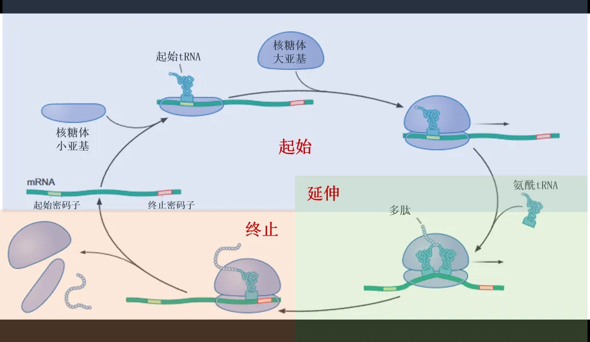
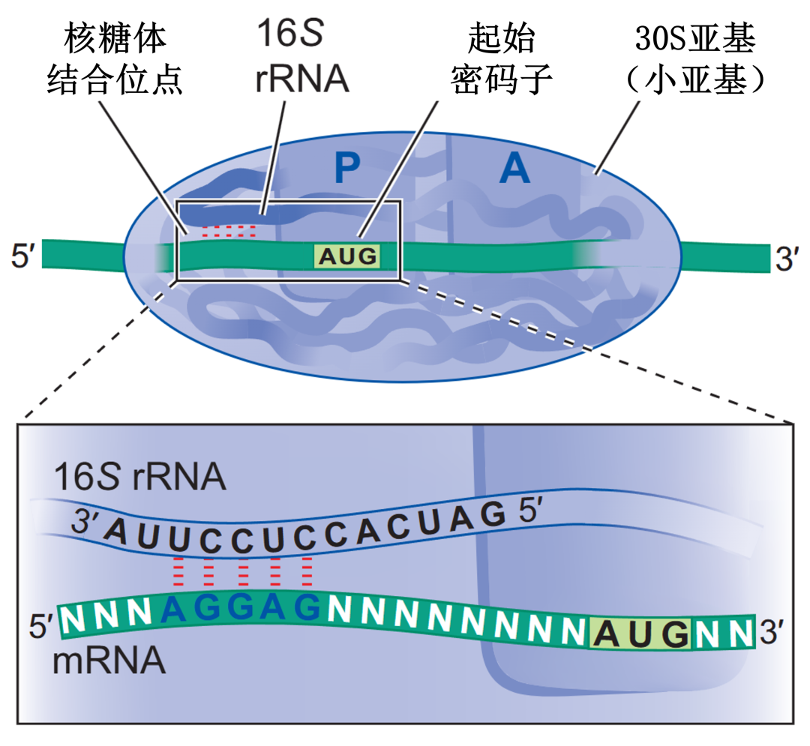
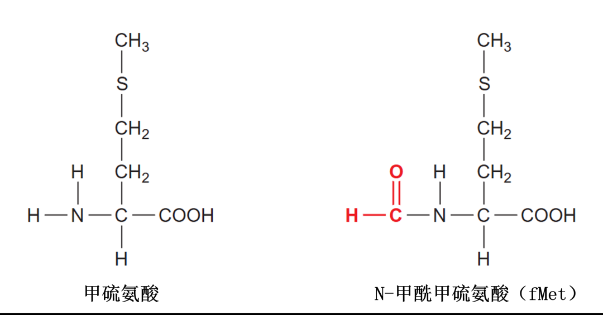
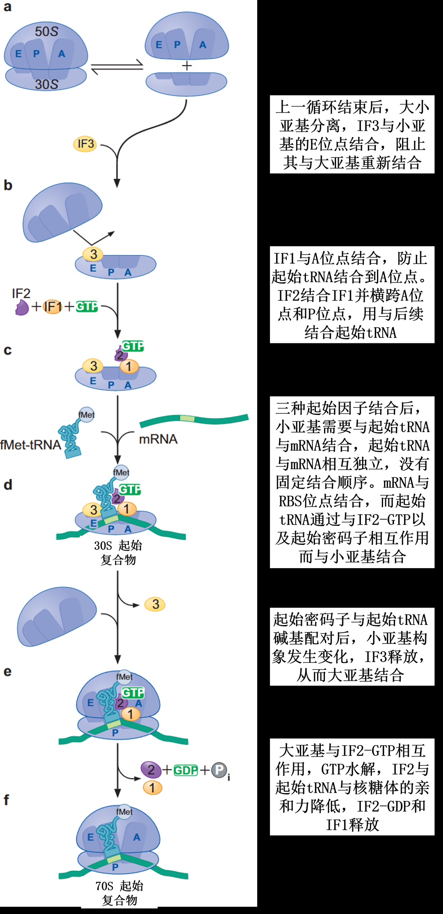
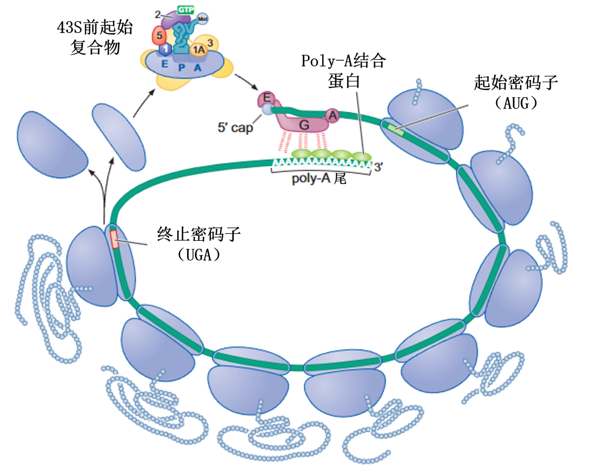
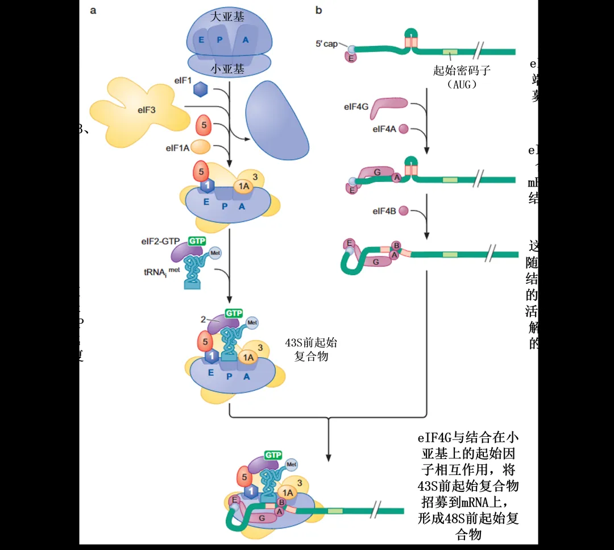
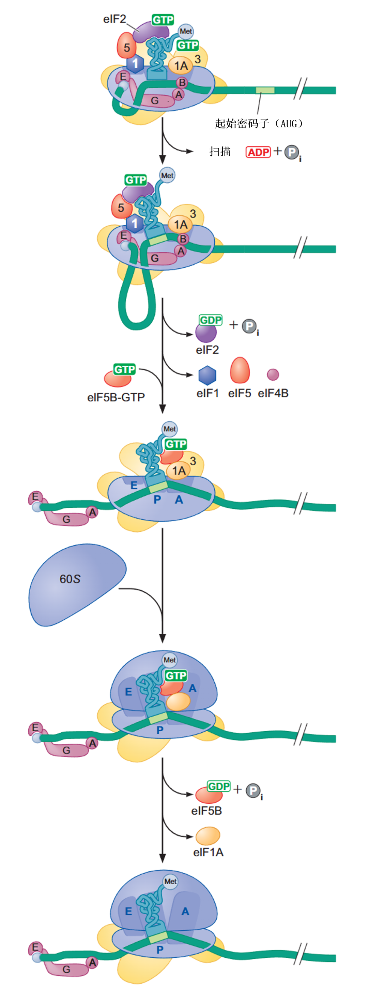
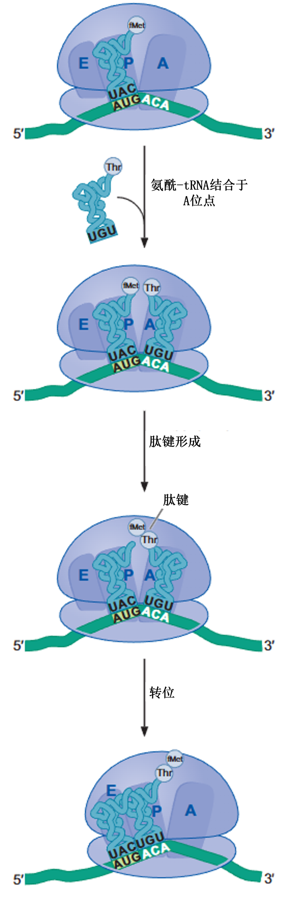

## mRNA的翻译
[翻译起始过程主要完成的三件事：①核糖体被募集到mRNA上，②负载tRNA必须位于核糖体的P位点，③核糖体必须精确定位在起始密码子上（即P位点对齐mRNA的起始密码子）](https://mp.weixin.qq.com/s/YNsIsVTmMews8xrcglDlVw)

#### 原核生物的翻译起始
- 1. 原核细胞的mRNA最初是通过与rRNA的碱基配对而募集到小亚基上的（RBS位点）。小亚基上的16S rRNA与mRNA上的RBS位点（核糖体结合位点）形成碱基配对。RBS和起始密码子AUG之间具有合适距离的mRNA，这一距离将AUG置于P位点。

- 2. 负载着修饰甲硫氨酸的特定tRNA直接结合到原核细胞的小亚基上。在翻译的起始阶段，起始tRNA直接结合到小亚基的P位点，而不用先占用A位点。起始tRNA负载的是N-甲酰甲硫氨酸（被修饰的甲硫氨酸），称为fMet-tRNAifMet（标红的部分是上角标）。需要注意的是，虽然起始tRNA上负载的是被修饰过的甲硫氨酸，但多数原核细胞的蛋白质的氨基端都没有甲酰基的结构，甚至很多都不是以Met开始的。这是因为两种酶的作用：去甲酰化酶（可以将甲酰基在多肽链合成过程中从氨基端去除）、氨肽酶（可以在氨基端切除Met及另外一两个氨基酸）。

- 3. 三种起始因子指导包含mRNA和起始tRNA的起始复合物的装配。原核生物的翻译从30S小亚基开始，由三种翻译起始因子催化：IF1、IF2、IF3（IF , initiator factors）。IF1：占据A位点，防止起始tRNA结合到小亚基中的A位点。
IF2：一种GTP酶，与起始过程中的3个主要成分（小亚基、IF1和负载起始tRNA）相互作用，促进起始tRNA与小亚基的结合，阻止其他负载tRNA与小亚基的结合。IF3：在上一轮循环结束时与小亚基结合，阻止小亚基和大亚基结合（翻译的起始需要游离的小亚基）。按照时间顺序会形成：30S起始复合物、70S起始复合物；30S起始复合物：三个起始因子+30S小亚基+mRNA+起始tRNA；70S起始复合物：50S大亚基+30S小亚基+mRNA+起始tRNA；即从30S到70S，发生了起始因子的脱离与大亚基的结合。 

总过程

#### 真核生物的翻译起始
真核生物的翻译起始很多方面与原核生物相同，主要是： 
用不同的方式识别mRNA与起始密码子 
真核生物的核糖体由mRNA的5'端帽子招募 
真核生物核糖体从mRNA的5'端向下游扫描发现Kozak序列，从而定位起始密码子 

- 1. 翻译起始因子使真核生物的mRNA保持环状。eIF4G与ploy-A结合蛋白的相互作用使5'端和3'端之间的分子紧密相连，并且使mRNA形成一个环状的构象。这种结构对于重新定位刚结束翻译的核糖体分子到起始密码子上有促进作用。（这也是poly-A尾巴提高真核生物蛋白质翻译效率的贡献之一）

- 2. 真核生物翻译起始的具体过程: 48S前起始复合物的形成

- 3. 真核生物翻译起始的具体过程: 48S前起始复合物对起始密码子的识别与大亚基的结合

#### 翻译的延伸
原核与真核的翻译延伸过程很相近，这里不做特别区分。延伸主要分为三个步骤：氨酰tRNA与A位点结合、肽键的形成、转位
