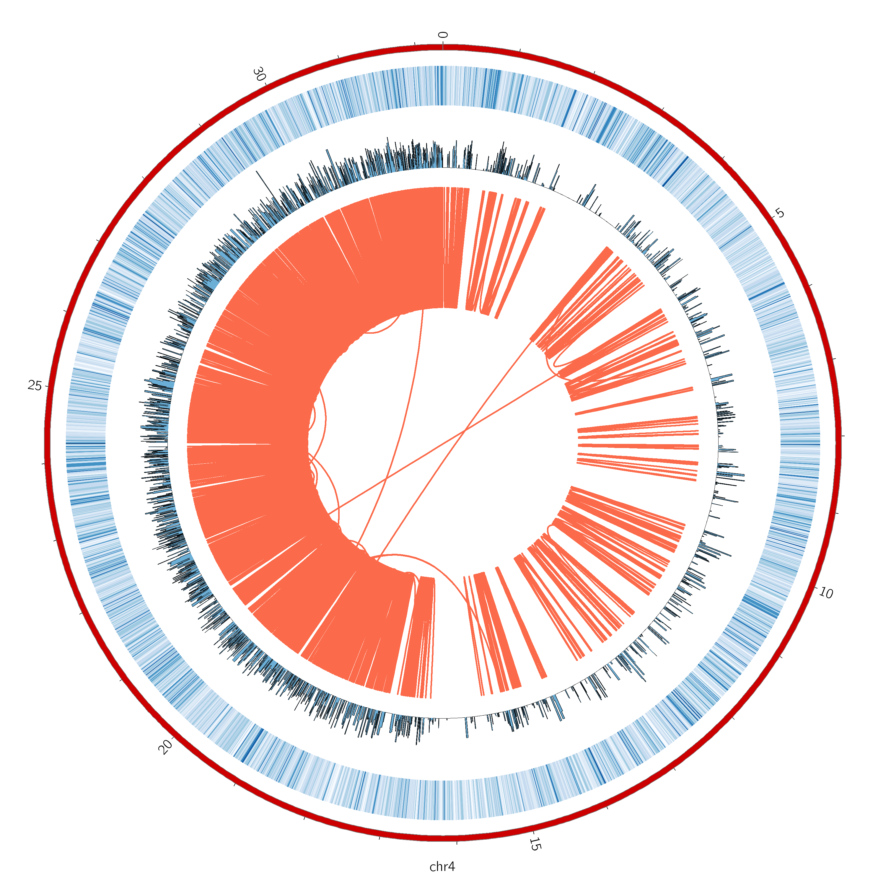

```
wget https://github.com/libgd/libgd/releases/download/gd-2.2.5/libgd-2.2.5.tar.gz
tar -xzvf libgd-2.2.5.tar.gz
cd libgd-2.2.5/
./configure --prefix=/data/home/ruanlab/huangxingyu/Tools/libgd
make
make install
make installcheck


## add ~/.bashrc
PATH=/data/home/ruanlab/huangxingyu/Tools/libgd/bin:$PATH
LD_LIBRARY_PATH=/data/home/ruanlab/huangxingyu/Tools/libgd/lib:$LD_LIBRARY_PATH


cpanm GD
cpan Math::VecStat
cpan Set::IntSpan
cpan SVG
cpan Math::Bezier


circos -png -svg -outputfile
```


#### example1
```
circos -conf circos.conf -png -svg -outputfile test
```

#### HPVloci
```
circos -conf circos.conf -png -svg -outputfile HPV.loci
```


#### [circlize](https://jokergoo.github.io/circlize_examples/)