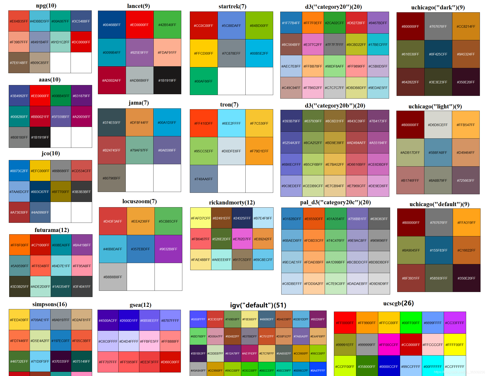
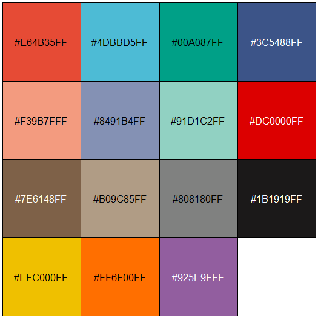
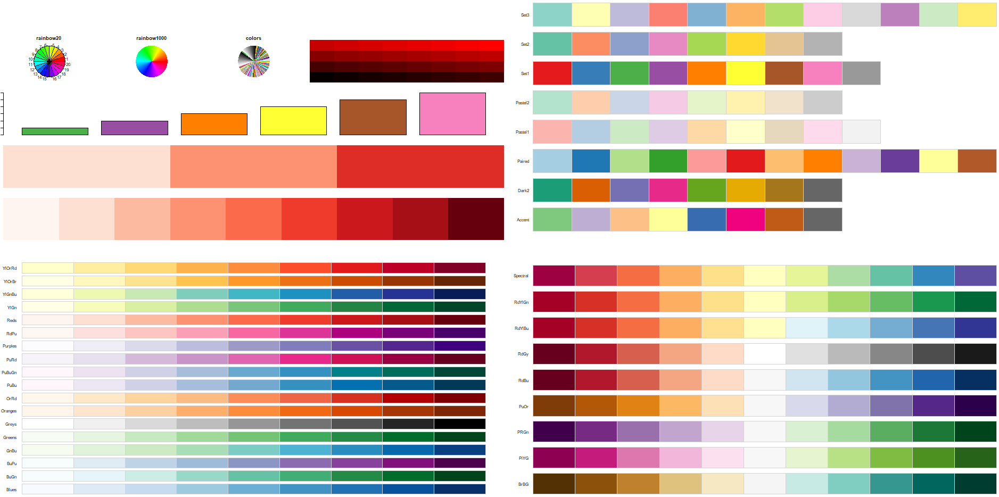
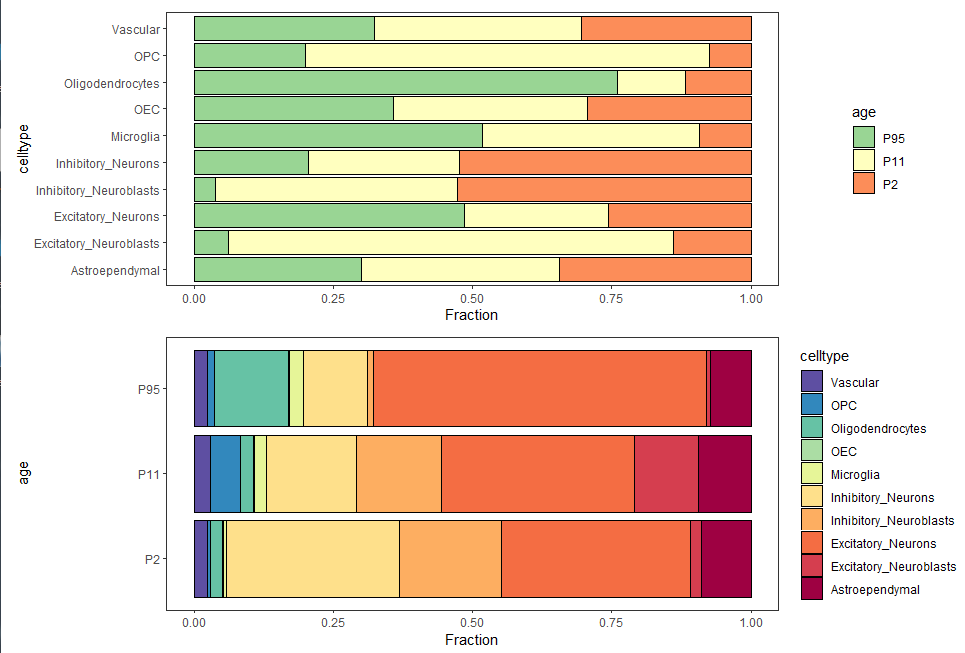

# 一个绘图参考
[参考一](https://mjfrigaard.github.io/fm-ggp2/frequency_polygons.html)，[参考二](https://r-charts.com/)，[参考三](https://www.data-to-viz.com/)，[参考四](https://zhuanlan.zhihu.com/p/336912400)，[参考五](https://www.math.pku.edu.cn/teachers/lidf/docs/Rbook/html/_Rbook/graph.html#graph-other-corr)

# R绘图
[参考1](https://zhuanlan.zhihu.com/p/619400037) <br/>
plot(x,y) # plot绘图默认为散点图，可以通过type参数修改绘图的类型。其中，type=”n”为不显示图像。bty修改边框类型，bty = "n"，表示无边框。col设置颜色。lty直线类型。lwd线条宽度。pch是点的形状。<br/>
par() # mai，数字向量，格式为c(bottom, left, top, right),以英寸为单位定义绘图区边缘空白大小。new，逻辑值，默认值为FALSE，如果设定为TRUE，那么下一个高级绘图命令会清空当前绘图设备。oma、omi，参数形式为c(bottom, left, top, right) ，用于设定外边界。<br/>
legend() # 图例 <br/>
segments() # 线段 <br/>
arrows() # 箭头 <br/>
rect() # 矩形框 <br/>
polygon() # 多边形 <br/>
draw.ellipse() # 椭圆（plotrix包） <br/>
draw.circle() # 圆（plotrix包） <br/>

----
# ggplot2
----

#### 图形设置
###### barplot（geom_bar）
```
geom_bar(stat = 'identity', position = 'fill',colour = 'black')
```

#### 设置颜色
在aes中可以用color设置边框颜色和fill设置填充颜色。在后续的设置也需要对对应的属性进行设置。 <br/>
ggplot2 默认的颜色 <br/>
```
library(scales)
hue_pal()(3)
hue_pal()(10)
hue_pal()(100)

pie(rep(1,100),hue_pal()(100))
barplot(1:300,col=hue_pal()(300))
```

###### 图例（guides）
[设置图例](https://www.jianshu.com/p/6ba336b3931f)
```
guides()
theme()
scale_*_***() # colour/fill
```
```
guides(
  colour/fill = guide_colorbar()/guide_legend(), 
  size = guide_legend(),
  shape = guide_legend(),
  linetype = guide_legend(),
  alpha = guide_legend()
)
guide_colorbar()用于连续型变量，guide_legend()用于离散型变量。


# 翻转图例
guides(color = guide_legend(reverse = TRUE))
guides(fill = guide_legend(reverse = TRUE))
```
###### [自定义颜色](https://zhuanlan.zhihu.com/p/361654063)
一些色卡，[色卡一](https://colorbrewer2.org/#type=sequential&scheme=Greys&n=3)，[色卡二](https://www.webdesignrankings.com/resources/lolcolors/)，[色卡三](https://www.jianshu.com/p/b1897f06328d)
```
连续型数据
scale_*_distiller() # colour/fill # 针对连续型数据
scale_*_fermenter() # colour/fill # 针对分箱数据
scale_*_gradient # colour/fill # 双色渐变
scale_*_gradient3 # colour/fill # 三色渐变
scale_*_gradientn # colour/fill # 多色渐变
scale_*_viridis_c() # colour/fill # viridis调色板


离散型数据
scale_*_hue # colour/fill # 分箱颜色设置，标度函数
scale_*_discrete # colour/fill # 分箱颜色设置，标度函数
scale_*_grey # colour/fill # 设置灰度颜色
scale_*_viridis_d() # colour/fill # viridis调色板
scale_*_brewer() # colour/fill # 针对离散型数据, colorbrewer调色板
scale_*_manual() # colour/fill # 针对离散型数据, 自定义色板

scale_*_steps() # colour/fill # 双色渐变 # 分箱渐变色与渐变色类似，只是应用的数据不同
scale_*_steps2() # colour/fill # 三色渐变 # 分箱渐变色与渐变色类似，只是应用的数据不同
scale_*_stepsn() # colour/fill # 多色渐变 # 分箱渐变色与渐变色类似，只是应用的数据不同

针对连续型变量
scale_colour_continuous(
  ...,
  type = getOption("ggplot2.continuous.colour", default = "gradient")
)

scale_fill_continuous(
  ...,
  type = getOption("ggplot2.continuous.fill", default = "gradient")
)

针对离散型变量
scale_colour_discrete(
  ...,
  type = getOption("ggplot2.discrete.colour", getOption("ggplot2.discrete.fill"))
)

scale_fill_discrete(
  ...,
  type = getOption("ggplot2.discrete.fill", getOption("ggplot2.discrete.colour"))
)


library(RColorBrewer)
scale_fill_brewer(palette="Dark2")

scale_colour_brewer(palette = "Spectral") # 离散型
scale_colour_distiller(palette = "Spectral") # 连续型
scale_colour_fermenter(palette = "Spectral") # 极端值型

scale_fill_manual(values = brewer.pal(length(unique(mydat$age)),"Spectral"))
scale_fill_manual(values = brewer.pal(length(unique(mydat$celltype)),"Spectral"))
scale_fill_manual(values = colorRampPalette(brewer.pal(8, "Dark2"))(length(unique(mydat$celltype))))
```

ggsci色卡

根据ggsci自定义的15个颜色


###### 轴标签（ylab，xlab）
```
ylab('Fraction')
xlab('Type')
```
###### 轴翻转
```
coord_flip()
```
###### 主题（theme）
```
theme_bw() + 
theme(panel.grid=element_blank()) 
```


## color
R包RColorBrewer提供了3类调色板，可以用包中的brewer.pal()函数生成颜色。<br/>
连续型sequential(连续的)：生成一系列连续渐变的颜色（共18组颜色，每组9个渐变色），通常用来标记连续型数值的大小，适用于顺序数据。<br/>
离散型diverging(离散的)：生成用深色强调两端、浅色标示中部的系列颜色（共9组颜色，每组11个颜色），可用来标记数据中的离群点，适用于突显极端数值。<br/>
极端值qualitative(定性的)：生成一些列彼此差异比较明显的颜色，通常用来标记分类数据。<br/>

#### 使用颜色
###### grDevices
R自带的颜色包：grDevices，包含众多[颜色相关函数](https://zhuanlan.zhihu.com/p/390532704)
```
colors() # 内置的颜色名称（657个）
rainbow(n)
heat.colors(n)
terrain.colors(n)
topo.colors(n)
cm.colors(n)
rgb()
col2rgb()
grey()
grey.colors()
```

###### RColorBrewer
```
brewer.pal(9,"Reds")
brewer.pal(9,"Set1")[3:8]
colorRampPalette(brewer.pal(8, "Dark2"))(20)
colorRampPalette(brewer.pal(8, "Dark2"))(20)[3:18]
```

#### color.1.R



## BarPlot
#### barplot.1.R

