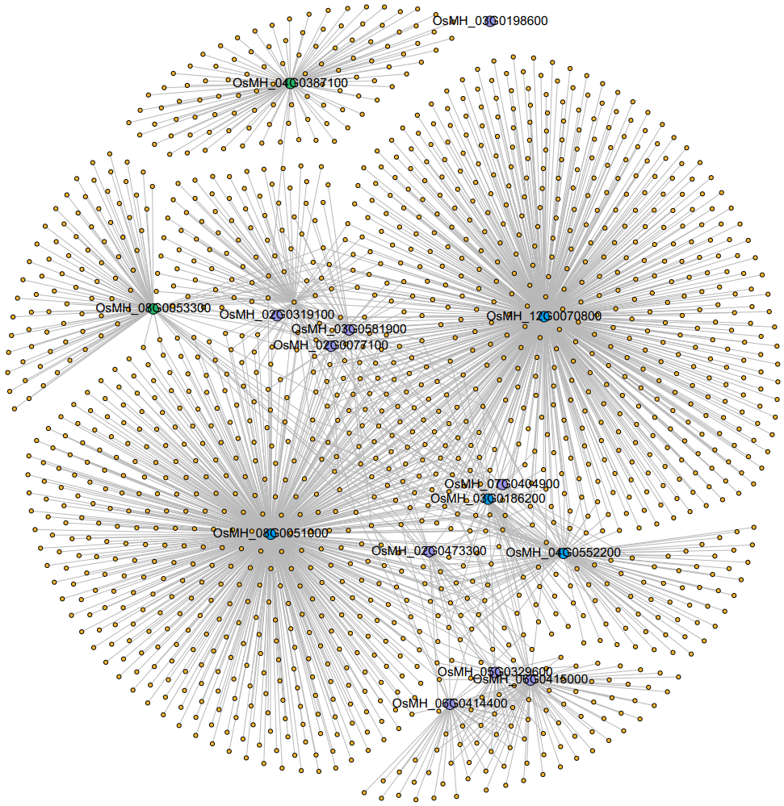

# 可视化（浏览器）
### IGV是一个复合的支持所有常见类型的基因组数据的浏览器
##### IGV可视化二级结构配对关系
准备U1的基因组文件（前后延伸了5bp）<br/>
```
>U1
CAACATACTTACCTGGACGGGGTCGACGGCCGATCAAGAAGAGCCGTGGCCTAGGCCAATGGCCCACATTGCACTTGGTGGGCGCGTTGGCTTACCATCTCCCCAAGCGGGAGAGTGGACGTCATAATTTGTGGTAGAGGGGGTACGCGTTCGCGCGGCCCCTGCCAATT

实际U1序列
>U1
TACTTACCTGGACGGGGTCGACGGCCGATCAAGAAGAGCCGTGGCCTAGGCCAATGGCCCACATTGCACTTGGTGGGCGCGTTGGCTTACCATCTCCCCAAGCGGGAGAGTGGACGTCATAATTTGTGGTAGAGGGGGTACGCGTTCGCGCGGCCCCTGC
```
将实际的U1序列投入[RNAalifold webserver](http://rna.tbi.univie.ac.at//cgi-bin/RNAWebSuite/RNAalifold.cgi)得到预测的RNA二级结构<br/>
```
UACUUACCUGGACGGGGUCGACGGCCGAUCAAGAAGAGCCGUGGCCUAGGCCAAUGGCCCACAUUGCACUUGGUGGGCGCGUUGGCUUACCAUCUCCCCAAGCGGGAGAGUGGACGUCAUAAUUUGUGGUAGAGGGGGUACGCGUUCGCGCGGCCCCUGC
...(((((..(((((((((.(((((...((.....))))))))))))(((((((((((((((..........)))))).))))))))).(((((((((.....)))))).))).)))).........))))).((((((.((((....))))))))))..  
```
得到的二级结构可以导入[R-chie](https://www.e-rna.org/r-chie/plot.cgi)生成模拟图。也可以用IGV实现<br/>
将二级结构转成点对点配对关系（python脚本）<br/>
```
aa = "U1"
bb = "...(((((..(((((((((.(((((...((.....))))))))))))(((((((((((((((..........)))))).))))))))).(((((((((.....)))))).))).)))).........))))).((((((.((((....)))))))))).."
# print(len(aa))
# print(len(bb))

mylist = []
for index,ii in enumerate(bb):
    if ii == "(":
        mylist.append(index+1)
    if ii == ")":
        p = mylist.pop()
        print("{0}\t{1}\t{2}".format(aa,p,index+1))
# print(len(mylist))

然后转化成实际位点：
awk '{if(NR==1){print $0}else{print $1"\t"5+$2-2"\t"5+$3-2}}' U1.bed > U1.cg.bed
```

```
track graphType=arc
U1	33	39
U1	32	40
U1	28	41
U1	27	42
U1	26	43
U1	25	44
U1	24	45
U1	22	46
U1	21	47
U1	20	48
U1	19	49
U1	18	50
U1	65	76
U1	64	77
U1	63	78
U1	62	79
U1	61	80
U1	60	81
U1	59	83
U1	58	84
U1	57	85
U1	56	86
U1	55	87
U1	54	88
U1	53	89
U1	52	90
U1	51	91
U1	101	107
U1	100	108
U1	99	109
U1	98	110
U1	97	111
U1	96	112
U1	95	114
U1	94	115
U1	93	116
U1	17	118
U1	16	119
U1	15	120
U1	14	121
U1	11	131
U1	10	132
U1	9	133
U1	8	134
U1	7	135
U1	147	152
U1	146	153
U1	145	154
U1	144	155
U1	142	156
U1	141	157
U1	140	158
U1	139	159
U1	138	160
U1	137	161
```
##### IGV可视化bed文件
IGV支持bed3，bed4，bed6，bed12，narrowPeak（bed10）。其中介绍一下bed12<br/>
```
U1	28	143	27_Plus_A00988:31:HYVN7DSXY:3:1101:3703:16579	.	+	28	143	255,0,0	2	39,72	0,43
U1	14	138	96_Plus_A00988:31:HYVN7DSXY:3:1101:8666:20572	.	+	14	138	255,0,0	2	21,100	0,24
U1	27	138	161_Plus_A00988:31:HYVN7DSXY:3:1101:17065:7748	.	+	27	138	255,0,0	2	41,67	0,44
U1	73	165	205_Plus_A00988:31:HYVN7DSXY:3:1101:22218:16485	.	+	73	165	255,0,0	2	69,78	0,14
U1	17	144	460_Plus_A00988:31:HYVN7DSXY:3:1102:15998:34115	.	+	17	144	255,0,0	2	50,73	0,54
U1	20	134	563_Plus_A00988:31:HYVN7DSXY:3:1102:26549:27398	.	+	20	134	255,0,0	2	47,63	0,51
U1	33	105	567_Plus_A00988:31:HYVN7DSXY:3:1102:26928:28119	.	+	33	105	255,0,0	2	90,45	0,27
U1	27	139	593_Plus_A00988:31:HYVN7DSXY:3:1102:30463:16110	.	+	27	139	255,0,0	2	40,68	0,44
U1	26	133	687_Plus_A00988:31:HYVN7DSXY:3:1103:8223:29543	.	+	26	133	255,0,0	2	42,62	0,45
U1	17	138	719_Plus_A00988:31:HYVN7DSXY:3:1103:10728:28119	.	+	17	138	255,0,0	2	51,67	0,54
U1	20	138	791_Plus_A00988:31:HYVN7DSXY:3:1103:17047:16955	.	+	20	138	255,0,0	2	48,67	0,51
U1	27	145	843_Plus_A00988:31:HYVN7DSXY:3:1103:22761:10723	.	+	27	145	255,0,0	2	35,82	0,36
U1	22	138	955_Plus_A00988:31:HYVN7DSXY:3:1103:31530:36777	.	+	22	138	255,0,0	2	46,67	0,49
U1	27	144	987_Plus_A00988:31:HYVN7DSXY:3:1104:2275:19711	.	+	27	144	255,0,0	2	41,73	0,44
U1	21	146	1173_Plus_A00988:31:HYVN7DSXY:3:1104:19651:30608	.	+	21	146	255,0,0	2	47,75	0,50
U1	20	138	1286_Plus_A00988:31:HYVN7DSXY:3:1104:31801:21496	.	+	20	138	255,0,0	2	48,67	0,51
U1	23	143	1317_Plus_A00988:31:HYVN7DSXY:3:1105:3558:30138	.	+	23	143	255,0,0	2	43,72	0,48
U1	20	141	1456_Plus_A00988:31:HYVN7DSXY:3:1105:18548:6308	.	+	20	141	255,0,0	2	48,70	0,51
U1	17	146	1540_Plus_A00988:31:HYVN7DSXY:3:1105:26323:14199	.	+	17	146	255,0,0	2	50,75	0,54

chrom   start   end rid score   strand  start   end rgb_id  block_number    block_length    block_start
```
其中block_start，第一个一定是0，第二个是第二段的起点-第一段的起点。以此类推，都是n个block的起点减去第一个block的起点。

### RNA二级结构可视化
[VARNA](http://varna.lri.fr/index.php?lang=en&page=downloads&css=varna)<br/>

### [Gephi](https://gephi.org/)
```
1：新建项目
文件 -> 新建项目 -> 保存（先把项目保存下来）
2：建立交互（CSV格式）
文件 -> 导入电子表格 -> 选中network文件（下一步-完成-选择无向图-添加到现在的工作区完成）
文件 -> 导入电子表格 -> 选中node文件（下一步-完成-混合-添加到现在的工作区完成）
3：创建布局
布局 -> 选择一个布局 -> Fruchterman Reingold -> 运行（执行到图形不再怎么变化为止）
4：设置属性
外观 -> 节点 -> 统一的 -> 设置颜色（#f8b62b 橙色） -> 应用 -> 分割 -> 选择一种渲染方式 -> taxonmy -> 设置颜色（#da1c6f） -> 应用
外观 -> 边 -> 统一的 -> 设置颜色（#b9b8b8） -> 应用
5：特异设置
图 -> 编辑（一个箭头加一个问号） -> 选择红色的点 -> 尺寸改为25 -> 
6：预览输出
预览 -> （显示标签，厚度0.2，重新调整权重，Min. rescaled weight 1，颜色 原始的，显示标签） -> 刷新
SVG/PDF/PNG -> 

panicle： 紫色（#a1429e）
leaf：深橙色（青色#00a0e9）
seedling：绿色（#da1c6f）
```


# 比对类工具
### 关于比对类工具处理兼并碱基
可以下载[水稻的细胞器基因组](https://rapdb.dna.affrc.go.jp/download/archive/Mt_Pt_genome.fasta)文件，里面包含了兼并碱基，也可以自定义。下载后，提取了一段reads做如下操作
```
@test1
ATTGGCGGGAGTATATTATGGCAGGATCAGTCACCTGGGCAAACCARCCC
+
ATTGGCGGGAGTATATTATGGCAGGATCAGTCACCTGGGCAAACCARCCC
@test2
ATTGGCGGGAGTATATTATGGCAGGATCAGTCACCTGGGCAAACCAACCC
+
ATTGGCGGGAGTATATTATGGCAGGATCAGTCACCTGGGCAAACCAACCC
@test3
ATTGGCGGGAGTATATTATGGCAGGATCAGTCACCTGGGCAAACCAGCCC
+
ATTGGCGGGAGTATATTATGGCAGGATCAGTCACCTGGGCAAACCAGCCC

bwa：
bwa index Mt_Pt_genome.fasta
bwa mem Mt_Pt_genome.fasta test.fq

hisat2:
hisat2-build Mt_Pt_genome.fasta Mt_Pt_genome
hisat2 -x Mt_Pt_genome -U test.fq

STAR:
mkdir -p starindex && STAR --runMode genomeGenerate --genomeDir starindex --genomeFastaFiles Mt_Pt_genome.fasta
STAR --genomeDir starindex/ --outFileNamePrefix startest --readFilesIn test.fq 
```
bwa的结果如图:<br/>
 <br/>
将fastq文件中的兼并碱基变成了N。同时，基因组索引文件中，这个位置被记录成了G。 <br/>
hisat2的结果如图: <br/>
 <br/>
将fastq文件中的兼并碱基变成了A。而在基因组索引文件中，该位置被记录成N了。 <br/>
STAR的结果如图: <br/>
 <br/>
三个均无错配，说明可以识别兼并碱基 <br/>
### blast
HAL1序列来源于RepBaseRepeatMaskerEdition-20181026.tar.gz，与[hg38 repeat](http://www.repeatmasker.org/genomes/hg38/RepeatMasker-rm405-db20140131/hg38.fa.out.gz)作比较。结果发现blast的比对结果短于注释的结果（bwa比对上的结果远远短于）。
```
makeblastdb -in hg38.fa -input_type fasta -dbtype nucl -parse_seqids -out hg38.blast.db -logfile hg38.log.txt
blastn -query HAL1.fa -out HAL1.blast.output -db hg38.blast.db -outfmt 6 -evalue 1e-5 -max_target_seqs 1000
```
输出文件说明
```
HAL1	chr12	74.464	979	172	43	1196	2153	49009079	49008158	1.40e-96	361
qacc：待比对的序列ID
sacc：比对上的ID
pident：相同匹配的百分比
length：比对上的长度
mismatch：错配数量
gapopen：缺口数量
qstart：待比对的序列起点
qend：待比对的序列终点
sstart：比对上的序列起点
send：比对上的序列终点
evalue：Expect value
bitscore：得分

# 亦可从下面选择任意自定义
qseqid qlen sseqid sgi slen pident length mismatch gapopen qstart qend sstart send evalue bitscore staxid ssciname

blastn -query OTTP4.unmap.fa -out OTTP4.unmap.output -db hg38 -outfmt "6 qseqid qgi qacc qaccver qlen sseqid sallseqid sgi sallgi sacc saccver sallacc slen qstart qend sstart send qseq sseq evalue bitscore score length pidehg38 nidehg38 mismatch positive gapopen gaps ppos frames qframe sframe btop staxid scomname sblastname sskingdom staxids scomnames sblastnames sskingdoms stitle salltitles sstrand qcovs qcovhsp qcovus ssciname sscinames" -evalue 1e-5 -max_target_seqs 2 -num_threads 12
```
### bwa
aln:
```
XT:U => Unique alignment
XT:R => Repeat
XT:N => Not mapped
XT:M => Mate-sw (成对比对的时候，当一端是被另一端救援而被确定比对位置的时候)
```
### STAR-Fusion 寻找融合RNA
```
STAR-Fusion --left_fq GM12878_R1.fq.gz --right_fq GM12878_R2.fq.gz --genome_lib_dir ~/Tools/STAR-Fusion/genome/GRCh38_v27_CTAT_lib_Feb092018/ctat_genome_lib_build_dir/ --CPU 20 --no_annotation_filter --examine_coding_effect --extract_fusion_reads --FusionInspector validate --denovo_reconstruct
```

### longranger
```
barcode list: ${longranger}/longranger-cs/2.2.2/tenkit/lib/python/tenkit/barcodes
```

# 定量工具
### featureCounts
[subread for featureCounts](https://github.com/DeskGen/subread).<br/>
可以对多位点比对的reads按百分数处理。单端数据：(针对RNA数据，因为一个reads只能有一个rna的来源，所以主要参数是--fraction -M)
```
featureCounts -a chr21.gtf -o chr21feature -t gene --largestOverlap --fraction -M -s 1  -J -G ~/Genome/GRCh3885/hg38.fa --donotsort -T 4 -R SAM --Rpath outtest/ --verbose -g gene_id chr21.bam

--fraction -M/-O ：平均分配多位点比对的结果
-g ：注意有些注释文件中可能不是gene_id，需要用-g修改

# 单端数据
featureCounts -a hg38.remove.gtf -o featureCounts.2.exon.txt -t exon -g gene_id -s 2 -R BAM -T 1 --Rpath exon2featureCounts --verbose uniqsplitfile/allrich-06.uniqmap.tmp.1.bam 

# 双端命令
featureCounts -a gencode_v26_Subread_to_DEXSeq.gtf -o SRR1797250.gene.count -t exon -g gene_id -p -T 1 SRR1797250.bam  
-p 将结果当成fragment来处理
-B 是不是双端都需要比对上(htseq默认是)
-P -d -D 设置插入片段大小
-C 不计算两端唯一不同染色体和位于同一染色体但链方向不一致的reads。
--donotsort 和htseq一样，都需要输入文件按name排序，不要相信提供的pos排序的参数。
--largestOverlap 分配给最长的比对的结果。

featureCounts -a ~/zhangyan/genome/hg38.analysisSet.chroms/hg38.remove.gtf -o featureCounts.${i}.${j}.txt -t ${j} -g gene_id -s ${i} -R BAM -T 1 --Rpath ${j}.${i}.featureCounts --verbose allrich-23.uniqmap.tmp.1.bam
featureCounts -a ~/zhangyan/genome/hg38.analysisSet.chroms/hg38.remove.gtf -o featureCounts.${i}.${j}.longest.txt -t ${j} -g gene_id --largestOverlap -s ${i} -R BAM -T 1 --Rpath ${j}.${i}.featureCounts.longest --verbose allrich-23.uniqmap.tmp.1.bam
```

# 序列拼接工具
### flash
[flash](http://ccb.jhu.edu/software/FLASH/index.shtml)
```
flash -M 150 -O --threads 12 --output-prefix out.flash --output-directory . read1.clean.fq read2.clean.fq
```
bug: 无法处理R1（R2）完全包含的reads。可能因为测序的偏差，导致R1和R2中的一段reads测序质量低被过滤掉。但是flash无法处理该情况。同时该情况在pandaseq中依然存在，而且pandaseq会输出一个明显错误的结果，flash输出为不拼接的结果。
```
R1: GTGAGCTGCCTTGGAAAAGGTTTGACATCATGGTCTCACCCTCCAGGCATTCGCAATGCTGTTGAAGCACTCTGGGCAATTCGGCTGGATTGCAACAGCCTCCTCGTTCTTCGCGATGCACATGTCAAACTCTCGTAGCTAAACCAAATC
R2: 
ATTTGGTTTAGCTACGAGAGGTTGACATGTGCATCGCGAAGAACGAGGAGGCTGTTGCAATCCAGCCGAATTGCCCAGAGTGCTTCAACAGCATTGCGAATGCCTGGAGGGTGAGACCATGATGTCAAACCTTTTCCAAGGC

R1: GTGAGCTGCCTTGGAAAAGGTTTGACATCATGGTCTCACCCTCCAGGCATTCGCAATGCTGTTGAAGCACTCTGGGCAATTCGGCTGGATTGCAACAGCCTCCTCGTTCTTCGCGATGCACATGTCAACCTCTCGTAGCTAAACCAAATC
R2: 
ATTTGGTTTAGCTACGAGAGGTTGACATGTGCATCGCGAAGAACGAGGAGGCTGTTGCAATCCAGCCGAATTGCCCAGAGTGCTTCAACAGCATTGCGAATGCCTGGAGGGTGAGACCATGATGTCAAACCTTTTCCAAGGC
```

# k-mer
### 得到kmer序列
[dsk](http://minia.genouest.org/dsk/)
```
i=sample
dsk  -file ${i}.1.fq,${i}.2.fq -kmer-size 20 -out $i.20.h5 -out-tmp $i
dsk2ascii -file $i.20.h5 -out $i.20.txt
```

# 变异
### 变异注释
[网页学习链接Annovar，SnpEff，Oncotator](http://yangli.name/2016/05/15/20160515annotation/)
### Annovar
```
自行建立数据库
gtfToGenePred -genePredExt zunla.gtf zunla.txt
perl ../retrieve_seq_from_fasta.pl --format refGene --seqfile zunla.fasta  zunla_refGene.txt --out zunla_refGeneMrna.fa
```

# 组装
### 合并单倍型组装的结果
[HaploMerger2]()可以用来合并用三代数据直接组装出来的单倍型的基因组到只剩一份拷贝。

# DNA甲基化
### DNA m5C 甲基化分析软件
##### hisat-3n可以针对任何转化方向的数据处理
hisat-3n可以针对
```
hisat-3n-build --base-change C,T --repeat-index hg19.fa hg19

hisat-3n -x ~/test_single/compare_software/reference_index/hisat_3N/hg19 -1 ../test_data/SRR5392315_head1M_1.cut2.fastq -2 ../test_data/SRR5392315_head1M_2.cut2.fastq -S hisat-3N.sam --base-change C,T --no-repeat-index -q -p 4
```

# 注释
### 染色质状态注释
我们用chromhmm来进行染色质状态（chromosome states）注释<br/>
```
java -jar /public/home/lxie/program/ChromHMM/ChromHMM.jar LearnModel ./output/ ./lm_15 15 spe
```
[ChromHMM下载连接](http://compbio.mit.edu/ChromHMM/)<br/>

### 转录组注释
[InterProscan](http://www.ebi.ac.uk/interpro/download/)，[GitHub](https://github.com/ebi-pf-team/interproscan)
```
module load interproscan/5.48-83.0 && interproscan.sh --appl Pfam -t n -dp -i Pfam/dir${i}/part.${i}.fa --iprlookup -f tsv -o Pfam/dir${i}/part.${i}.fa.interproscan -cpu 5 -goterms -pa
可以移除参数--appl Pfam，对所有的数据库进行注释，默认是对蛋白序列，-t n修改为DNA/RNA核苷酸序列
```

### ncRNA注释
[infernal](http://eddylab.org/infernal/)注释ncRNA（rRNA、tRNA、microRNA[结果一般]、snRNA、snoRNA）
```
module load infernal/1.1.3
module load Rfam/14.1
cmscan -Z $genomeLength --cut_ga --rfam --nohmmonly --tblout ncRNA.tblout --fmt 2 --clanin $Rfamclanin $Rfam genome.fa > ncRNA.cmscan
awk 'BEGIN{OFS="\t";} {if(FNR==1) print target_name\taccession\tquery_name\tquery_start\tquery_end\tstrand\tscore\tEvalue"; if(FNR>2 && $20!="=" && $0!~/^#/) print $2,$3,$4,$10,$11,$12,$17,$18, $27; }' ncRNA.tblout > ncRNA.filter.tblout
awk -v OFS="\t" '{$2=$2-1;print $0}' ncRNA.filter.tblout > ncRNA.bed
```

### microRNA分析
[植物miRNA分析软件](https://www.jianshu.com/p/398049692584): [miR-PREFeR](miR-PREFeR)

### KEGG注释
KEGG网站提供了在线KEGG注释功能。[KEGG主页](https://www.genome.jp/kegg/)上的[blastkoala](https://www.kegg.jp/blastkoala/)是完成该任务的工具。提交蛋白序列，选中物种类型，就可以提交任务了。宏基因组可以使用GhostKOALA。KEGG Mapper则提供了编辑KEGG通路图样修改的功能。<br/>
[KEGG Organisms](https://www.genome.jp/kegg/catalog/org_list.html)包含了目前所有有KEGG注释的物种的结果。Organisms选项栏中的第一个点击进去。以[果蝇](https://www.genome.jp/kegg-bin/show_organism?org=dme)为例。然后点击[Brite hierarchy](https://www.genome.jp/kegg-bin/show_organism?menu_type=gene_catalogs&org=dme)。点击[00001  KEGG Orthology (KO)](https://www.genome.jp/brite/dme00001.keg)。点击[Download htext](https://www.genome.jp/kegg-bin/download_htext?htext=dme00001.keg&format=htext&filedir=kegg/brite/dme)即可下载该物种的KEGG的层次注释的结果。分为 A/B/C/D 四类，依次越来越细分，一般因为AB两类过大而不处理。

### GO注释
GO注释一般用interproscan完成。[geneontology](http://current.geneontology.org/products/pages/downloads.html)上提供了一些常见模式生物的GO注释结果。一些其它的网站也提供了GO注释的结果，比如[NCBI](https://ftp.ncbi.nih.gov/gene/DATA/)的，比如[EBI](https://ftp.ebi.ac.uk/pub/databases/GO/goa/)的，还有[Rfam2go](https://ftp.ebi.ac.uk/pub/databases/Rfam/14.8/)的<br/>
[go-basic.obo](http://current.geneontology.org/ontology/go-basic.obo)提供了最新的GO层次注释的结果。

# Linux
### sort （Linux常用命令）
看起来sort是忽略了字母大小写排序，目前还没仔细研究，日后再仔细研究。现在碰到sort请全部用LANG=C sort来代替。运行速度更快，跟其它软件sort之后的结果一致。
```
echo -e "snoR1\nSNOR75\nsnoR1\nsnoR75" > test
sort test 
    snoR1
    snoR1
    snoR75
    SNOR75

LANG=C sort test
    SNOR75
    snoR1
    snoR1
    snoR75
```

# 统计学
### 变异系数（CV）
1：标准差与平均数的比值称为变异系数，记为C·V。
2：变异系数可以消除单位和（或）平均数不同对两个或多个资料变异程度比较的影响。
```
aa = c(5.8,4.6,4.9)
sd(aa)/mean(aa)
```

# RNA二级结构
### [RNAup](http://rna.tbi.univie.ac.at//cgi-bin/RNAWebSuite/RNAup.cgi)
评估两个RNA的结合能
### [RNAcofold](http://rna.tbi.univie.ac.at//cgi-bin/RNAWebSuite/RNAcofold.cgi)
给出两个RNA的结合位点和方式
```
>U4
ATCTTTGCGCTTGGGGCAATGACGCAGCTTATGAGGTTATACCGAGGCGCGTCAATTGCTGGTTGAAAACTATTTCCAAACCCCCTCTTTGGCCCACCCGGGCCACTGAGAATTTCTGGAAGGGCTCTCTCTCTTCGGAGAGAGTAAAGC
>U6
TCTCTTCGGAGACATCCGATAAAATTGGAACGATACAGAGAAGATTAGCATGGCCCCTGCGCAAGGATGACACGCACAAATCGAGAAATGGTCCAAATTTTT
```
得到
```
>U46
AUCUUUGCGCUUGGGGCAAUGACGCAGCUUAUGAGGUUAUACCGAGGCGCGUCAAUUGCUGGUUGAAAACUAUUUCCAAACCCCCUCUUUGGCCCACCCGGGCCACUGAGAAUUUCUGGAAGGGCUCUCUCUCUUCGGAGAGAGUAAAGC&UCUCUUCGGAGACAUCCGAUAAAAUUGGAACGAUACAGAGAAGAUUAGCAUGGCCCCUGCGCAAGGAUGACACGCACAAAUCGAGAAAUGGUCCAAAUUUUU
((((((((((..(((((..((((((.(((.....(((...)))..)))))))))..((((((((........((((((......(((..((((((....))))))..)))......))))))...(((((.((((((((((((.......&))))))))))))..((((((...)))))).......))))).))))))))..))))).))))))))))...............((((((.......))))))  
```
导入[R-chie](https://e-rna.org/r-chie/plot.cgi)得到:


# 杂谈
### [samtools](http://samtools.sourceforge.net/)
是一个自由操作sam/bam文件的工具集
##### samtools sort
samtools sort有两个比较重要的参数，-@ 和 -m。<br/>
-m 是每条线程使用的内存大小，-@ 是设置线程数目。所以两者乘积约等于内存消耗。因为samtools sort排序算法用的多路归并算法，即先将原始数据拆分成一个个的小文件，然后再对每个小文件内部排序（可能是快速排序法，本人未细看），然后将所有有序的文件合并成一个完整的有序文件（可以查看归并算法-二路归并）。当我在测试超大型文件的时候，我发现因为单个临时小文件是768M（实际是bam格式存储的，文件大小是110M左右），这样会生成大量的临时文件，在归并的时候效率极低，大大拖慢了整体速度。此时应当适当的升高 -m 的大小，减少临时文件的数量。可以大大的提升效率。<br/>
个人一般使用 -@ 10 -m 3840M<br/>
另外在谈一下HiC-Pro中很容易被忽略的一个小问题，在 $HiC-Pro/HiCPro/scripts/bowtie_combine.sh 脚本中<br/>
```
## Set a default for legacy config files that do not have SORT_RAM set
    if [[ "${SORT_RAM}" == "" ]]; then
       SORT_RAM="768"
    fi

    ## Divide the SORT_RAM by the number of Cpus
    SORT_RAM=$(echo ${SORT_RAM} | sed -e 's/M$//')
    SORT_RAM=$(( ${SORT_RAM}/${N_CPU} ))

    cmd="${SAMTOOLS_PATH}/samtools sort -@ ${N_CPU} -m ${SORT_RAM}M -n -T ${TMP_DIR}/$tmp_prefix -o ${BOWTIE2_FINAL_OUTPUT_DIR}/${prefix}.bwt2merged.sorted.bam ${BOWTIE2_FINAL_OUTPUT_DIR}/${prefix}.bwt2merged.bam"
```
一般我们也不会设置SORT_RAM，在config-hicpro.txt中默认的是1000M。换言之，如果我们设置的线程是10个。那么此时samtools sort的参数就是 -@ 10 -m 100M。在一些稍微大一点的数据中就容易产生上千个临时文件，在归并的时候就容易因为打开的文件句柄太多而程序终止（ulimit -n可以查看打开文件的上限）。所以 SORT_RAM 需要设置成线程数量*1000M。<br/>
### HiC-Pro
```
MIN_FRAG_SIZE，例如MIN_FRAG_SIZE = 100
MAX_FRAG_SIZE，例如MAX_FRAG_SIZE = 100000
MIN_INSERT_SIZE，例如MIN_INSERT_SIZE = 100
MAX_INSERT_SIZE，例如MAX_INSERT_SIZE = 600
GET_PROCESS_SAM，例如GET_PROCESS_SAM = 1
```

HiCPro分单倍型。<br/>
分两步，第一步：markAllelicStatus.py （285-292行）<br/>
```
if g1_count > 0 and g2_count > 0:
    code = 3
elif g1_count > 0 and g2_count == 0:
    code = 1
elif g2_count > 0 and g1_count == 0:
    code = 2
elif g1_count == 0 and g2_count == 0:
    code = 0
```
第二步：split_valid_interactions.py （117-151行）<br/>
它将一端有一端无的也算了。<br/>
```
if r1as == 1 and r2as == 1:
    isG1 = True
    G1G1_ascounter += 1
    handle_g1.write(line)
elif r1as == 1 and r2as == 0:
    isG1 = True
    G1U_ascounter += 1
    handle_g1.write(line)
elif r1as == 0 and r2as == 1:
    isG1=True
    UG1_ascounter += 1
    handle_g1.write(line)

elif r1as == 2 and r2as == 2:
    isG2 = True
    G2G2_ascounter += 1
    handle_g2.write(line)
elif r1as == 2 and r2as == 0:
    isG2 = True
    G2U_ascounter += 1
    handle_g2.write(line)
elif r1as == 0 and r2as == 2:
    isG2 = True
    UG2_ascounter += 1
    handle_g2.write(line)

elif r1as == 1 and r2as == 2:
    G1G2_ascounter += 1
elif r1as == 2 and r2as == 1:
    G2G1_ascounter += 1

elif r1as == 3 or r2as == 3:
    CF_ascounter += 1
else:
    UU_ascounter += 1
```
### [bedtools](https://bedtools.readthedocs.io/en/latest/index.html)
```
bedtools intersect -nonamecheck -wa -wb -b whole.gene.bed -a read_1.bed
```
bedtools intersect是对-b文件建立区间树，是需要整个存入内存中的。所以，请设置-b为较小的文件。
### [RSEM](https://github.com/bli25/RSEM_tutorial)
在处理过程中，也存在随机分配，稍微有点取舍的分配，但是真实情况是怎么样的依然未知。

### [PhastCons 保守性](http://compgen.cshl.edu/phast/phastCons-HOWTO.html)
[PHAST 系统发育分析](http://compgen.cshl.edu/phast/)<br/>
```
# 安装CLAPACK
cd ~/software/
wget http://www.netlib.org/clapack/clapack.tgz
tar zxf clapack.tgz
cd CLAPACK-3.2.1/
cp make.inc.example make.inc && make f2clib && make blaslib && make lib

# 安装PHAST
cd ~/software/
wget https://github.com/CshlSiepelLab/phast/archive/v1.5.tar.gz
tar zxf v1.5.tar.gz
cd phast-1.5/src/
make CLAPACKPATH=/home/chenwen/software/CLAPACK-3.2.1

# 将PHAST添加到环境变量
echo "export PATH=$HOME/software/phast-1.5/bin:\$PATH" >> ~/.bashrc
source ~/.bashrc

# 删除安装包
rm ~/software/clapack.tgz
rm -rf ~/software/CLAPACK-3.2.1
rm ~/software/v1.5.tar.gz

mkdir -p ~/software/kent/
cd ~/software/kent/
wget https://hgdownload.cse.ucsc.edu/admin/exe/linux.x86_64/mafSplit
wget https://hgdownload.cse.ucsc.edu/admin/exe/linux.x86_64/wigToBigWig
wget https://hgdownload.cse.ucsc.edu/admin/exe/linux.x86_64/bigWigAverageOverBed
chmod +x *

# 我们这里以斑马鱼（Danio rerio）、鲤鱼（Cyprinus carpio）、鲫鱼（Carassius auratus）基因组为例，斑马鱼的基因组作为参考基因组。假设我们已经通过多基因组比对，得到了Danio_rerio_mulitway.maf。
# 运行phyloFit生成MOD文件
phyloFit -i MAF Danio_rerio_mulitway.maf
# 运行phastCons计算保守性分数
# phastCons一次只能处理一条染色体，所以我们需要使用mafSplit先分割MAF文件。
mkdir maf
mafSplit _.bed maf/ Danio_rerio_mulitway.maf -byTarget -useFullSequenceName
mkdir wig
mkdir bed
for i in maf/*.maf; do x=`basename $i .maf`; phastCons $i phyloFit.mod --target-coverage 0.25 --expected-length 12 --rho 0.4 --msa-format MAF --seqname $x --most-conserved bed/$x_most-cons.bed > wig/$x.wig; done
cat wig/*.wig >> Danio_rerio_mulitway.wig
cat bed/*_most-cons.bed >> Danio_rerio_most-cons.bed
```

### clusterprofile
[做非模式生物的KEGG富集分析](https://www.jianshu.com/p/d484003dced5)<br/>
[案例2](https://www.jianshu.com/p/feaefcbdf986)<br/>
模式生物举例
```
gene.info：
chrUextra	523023	523086	FBgn0264003	.	-	mir-5613	pre_miRNA
chr3R	353	12473	FBgn0037213	.	+	CG12581	protein_coding
chr3R	12684	21933	FBgn0053294	.	+	CR33294	pseudogene
chr3R	15413	15982	FBgn0000500	.	-	Dsk	protein_coding
chr3R	22930	30294	FBgn0037215	.	+	CG12582	protein_coding
chr3R	30206	41033	FBgn0037217	.	-	CG14636	protein_coding
chr3R	37504	53244	FBgn0037218	.	+	aux	protein_coding
chr3R	44178	45852	FBgn0051516	.	-	CG31516	protein_coding
chr3R	53105	54971	FBgn0261436	.	-	DhpD	protein_coding
chr3R	56500	58054	FBgn0037220	.	-	CG14641	protein_coding

library(clusterProfiler)
library(org.Dm.eg.db)
keytypes(org.Dm.eg.db)

mydat = read.table("gene.info",header=F,stringsAsFactors=F,comment.char="")
names(mydat) = c("chromosome","start","end","gene_id","score","strand","gene_name","gene_type")
genedf = bitr(mydat$gene_id,fromType="ENSEMBL",toType=c("ENTREZID","ENSEMBL"),OrgDb = org.Dm.eg.db)
write.table(genedf,file="dm3.geneid2ncbiid.txt",sep="\t",quote=F, row.names=F, col.names=F)
gene.kegg = bitr_kegg(genedf$ENTREZID,fromType="ncbi-geneid",toType="kegg",organism='dme')
write.table(gene.kegg,file="dm3.gene2kegg.txt",sep="\t",quote=F, row.names=F, col.names=F)
```
### MUMMER
```
nucmer  -g 1000 -c 90 -l 40 -t 32  -p $index_name   $ref_file  $query_file
delta-filter -r -q  -l 1000 $index_name.delta >$index_name.delta.filter

ref_file=/home/jmsong/data/Passion_fruit/result/pf4/arrow+pilon/3_purge_merge/rename/Passion_Fruit_4_polished_chromosomes.fa
query_file=/home/jmsong/data/Passion_fruit/result/pf9/hic/3ddna/0_rev/genome.FINAL.fasta
index_name=pf4_pf9
module load mummer/4.0.0rc1
nucmer  -g 1000 -c 90 -l 40 -t 32  -p $index_name   $ref_file  $query_file
delta-filter -r -q  -l 1000 $index_name.delta >$index_name.delta.filter
#show-coords -TrHcl $index_name.delta.filter >$index_name.delta.filter.coords 
mummerplot -color  -postscript -R $ref_file -p $index_name.delta.filter $index_name.delta.filter

nucmer --prefix=ref_qry ref.fasta qry.fasta #比对
delta-filter -q ref_qry.delta > ref_qry.filter #过滤，除去不太适合的部分，但结果不适合读
show-coords -rcl ref_qry.delta > ref_qry.coords #将结果转换为以人类可读的格式显示匹配的坐标
show-aligns ref_qry.delta refname qryname > ref_qry.aligns #查看某一个匹配的序列的比对情况
show-tiling ref_qry.delta > ref_qry.tiling #将contig回帖到ref上

nucmer --prefix=ref_qry ref.fasta qry.fasta
show-snps -Clr ref_qry.delta > ref_qry.snps #-C指输出唯一匹配的snp -l 输出结果中包括序列的长度 -r 按照 ref的ID和snp位置信息进行排序
```

### [CircSplice](http://gb.whu.edu.cn/CircSplice/userguide.html)
鉴定环状RNA
```
STAR --runThreadN NumberOfThreads --runMode genomeGenerate --genomeDir /path/to/genomeDir --genomeFastaFiles /path/to/genome/fasta1 /path/to/genome/fasta2 --sjdbGTFfile /path/to/annotations.gtf
STAR --genomeDir /path/to/genomeDir --readFilesIn Sample.R1_trimmed.fq.gz Sample.R2_trimmed.fq.gz --readFilesCommand zcat --runThreadN 10 --chimSegmentMin 20 --chimScoreMin 1 --alignIntronMax 100000 --outFilterMismatchNmax 4 --alignTranscriptsPerReadNmax 100000 --outFilterMultimapNmax 2 --outFileNamePrefix Sample

# For paired-end library,
CircSplice.pl Chimeric.out.sam hg38.genome.fa bed_refFlat_hg38.txt
# For single-end library,
CircSplice-single.pl Chimeric.out.sam hg38.genome.fa bed_refFlat_hg38.txt
```

### 模拟二代测序数据
[art-illumina](https://www.niehs.nih.gov/research/resources/software/biostatistics/art/)<br/>
[wgsim](https://github.com/lh3/wgsim)<br/>

### 鉴定R-loop
[QmRLFS-finder](https://github.com/piroonj/QmRLFS-finder)<br/>

### 细胞系详细信息查询网站
[Expasy](https://web.expasy.org/cellosaurus/CVCL_0023)<br/>

### 数据下载
[EBI数据库中的数据查询和下载](https://www.ebi.ac.uk/ena/browser/view/SRR1569501?show=reads)<br/>

### 相互作用预测（DNA-DNA RNA-RNA DNA-RNA）
[RIsearch](https://rth.dk/resources/risearch/) 预测DNA-RNA， DNA-DNA，RNA-RNA交互<br/>
[LnChrom](https://academic.oup.com/database/article/doi/10.1093/database/bay039/4999394?login=true) 预测DNA-RNA相互作用<br/>
