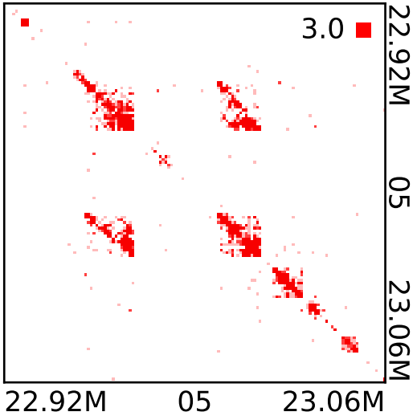
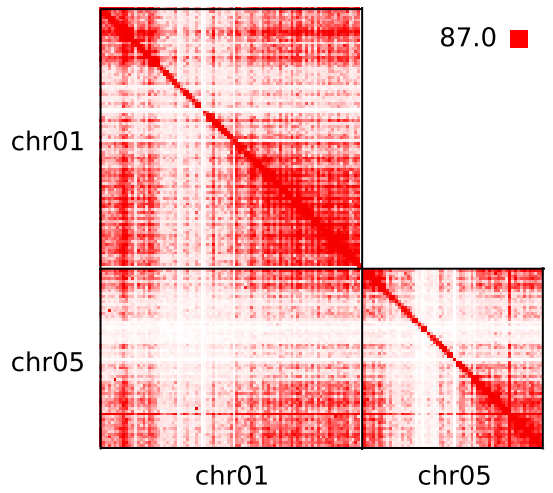
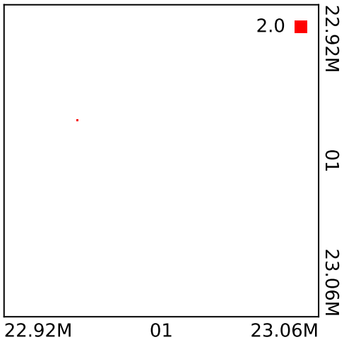
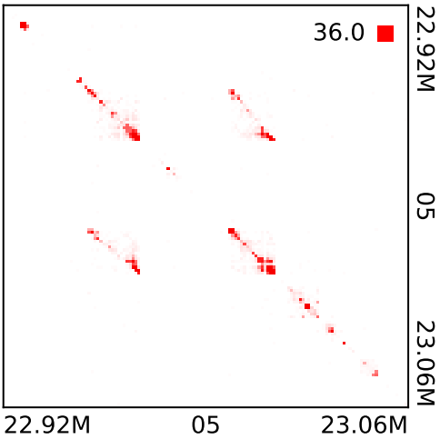
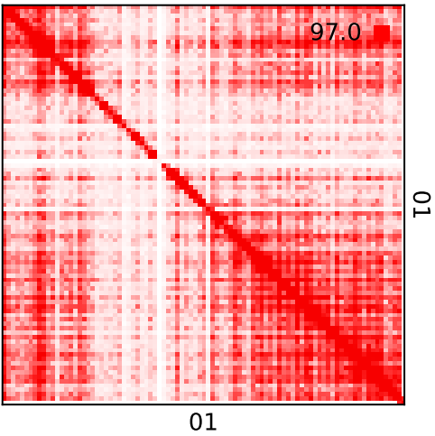
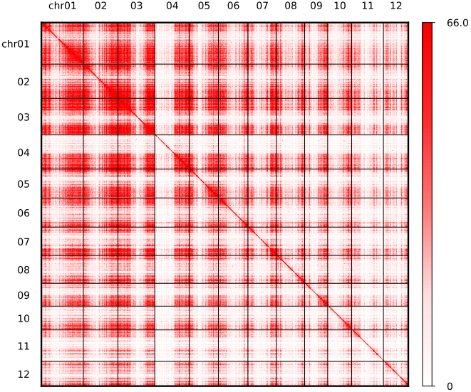

```
python plot-matrix.py 4dn.hic.mcool 1000 pdf.pdf 05 22921000 23060000
```


```
python plot-matrix.all.genome.py 4dn.hic.mcool 1000 pdf.pdf 05 22921000 23060000
python plot-matrix.all.genome.py --cool 4dn.hic.mcool::/resolutions/1000000 -b raw -o pdf.pdf -a
```


```
python plot-hic.pro.py --cool /data/home/ruanlab/huangxingyu/MH63RIC/tissueRICresult/figure2new/2.tohic/paniclenorRNA/paniclenorRNA.genome.chromosome.4dn.hic.mcool::/resolutions/500000 -o pdf.pdf -b raw -c 01 -c2 05 # two chromosome
python plot-hic.pro.py --cool /data/home/ruanlab/huangxingyu/MH63RIC/tissueRICresult/figure2new/2.tohic/paniclenorRNA/paniclenorRNA.genome.chromosome.4dn.hic.mcool::/resolutions/1000 -o pdf.pdf -b raw -c 01 -s 22921000 -e 23060000 -c2 05 -s2 22921000 -e2 23060000 # two region
python plot-hic.pro.py --cool /data/home/ruanlab/huangxingyu/MH63RIC/tissueRICresult/figure2new/2.tohic/paniclenorRNA/paniclenorRNA.genome.chromosome.4dn.hic.mcool::/resolutions/1000 -o pdf.pdf -b raw -c 05 -s 22921000 -e 23060000 # region
python plot-hic.pro.py --cool /data/home/ruanlab/huangxingyu/MH63RIC/tissueRICresult/figure2new/2.tohic/paniclenorRNA/paniclenorRNA.genome.chromosome.4dn.hic.mcool::/resolutions/1000 -o pdf.pdf -b raw -c 05 # single chromosome
python plot-hic.pro.py --cool /data/home/ruanlab/huangxingyu/MH63RIC/tissueRICresult/figure2new/2.tohic/paniclenorRNA/paniclenorRNA.genome.chromosome.4dn.hic.mcool::/resolutions/500000 -o pdf.pdf -a -b raw # whole genome
```




