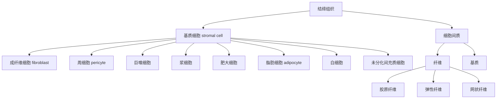
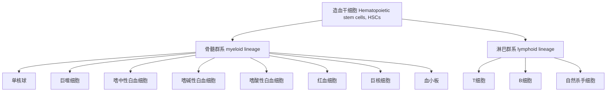
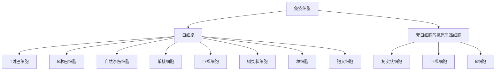

## mark gene
胚胎细胞：[wiki](https://zh.wikipedia.org/wiki/%E4%B8%AD%E8%83%9A%E5%B1%82)<br/>
基质细胞: [wiki](https://zh.wikipedia.org/wiki/%E5%9F%BA%E8%B4%A8%E7%BB%86%E8%83%9E)<br/>
<br/>
<br/>
<br/>
<br/>
<br/>

内胚层Endoderm mark gene：SOX17, FOXA2, CXCR4, GATA4 <br/>
中胚层Mesoderm mark gene：NCAM1, TBXT <br/>
外胚层Ectoderm mark gene：NES, PAX6, TUBB3, OTX2 <br/>
[Evaluation of commonly used ectoderm markers in iPSC trilineage differentiation](https://www.ncbi.nlm.nih.gov/pmc/articles/PMC6570500/)

人胚胎阶段（卡内基分类）：[ref1](https://en.wikipedia.org/wiki/Carnegie_stages), [ref2](https://www.ehd.org/virtual-human-embryo/intro.php?stage=1), [ref3](https://embryology.med.unsw.edu.au/embryology/index.php/Carnegie_Stages)

[脑：](https://www.nature.com/articles/s41593-020-00794-1)
- 大类：祖细胞和神经元细胞
  - 类：hindbrain：HOX基因（后脑）; midbrain: PAX7（中脑）; thalamus: GBX2（丘脑）; medial ganglionic eminence: NKX2-1（内侧神经节隆起）; cerebral cortex: FOXG1（大脑皮层）
    - 亚类：神经上皮细胞（neuroepithelial cells）、放射状胶质细胞（radial glia）、中间祖细胞 (intermediate progenitor cells， IPC)、神经元（neurons）、间充质样细胞（mesenchymal-like cells）。含有SOX2祖细胞：放射状胶质细胞；不含有SOX2祖细胞：神经上皮细胞。


广义祖细胞 ( SOX2 )、放射状胶质细胞 ( NES )、IPC ( PPP1R17 ) 和神经元 ( BCL11B ) 
新生神经元以 DCX（绿色）标记，祖细胞以 SOX2（红色）标记，IPC 以 TBR2（黄色）标记，成熟神经元以 CTIP2（青色）标记




- 间充质干细胞(mesenchymal stem cells,MSC), 是属于中胚层的一类多能干细胞，主要存在于结缔组织和器官间质中，以骨髓组织中含量最为丰富，它具有干细胞的所有共性，即自我更新和多向分化能力。间充质干细胞不仅存在于骨髓中，也存在于骨骼肌、骨外膜和骨小梁中。<strong>具有分化为肌细胞、肝细胞、成骨细胞、脂肪细胞、软骨细胞、基质细胞等多种细胞的能力</strong>。
  - 基质细胞(Stromal cells)：<strong>源自血液器官（如骨髓或胎肝）的一种非血细胞。是器官中结缔组织细胞，起到为器官中实质细胞提供支持和营养的作用，成纤维细胞、炎症细胞、免疫细胞以及周皮细胞都是常见的基质细胞类型。</strong>。是存在于免疫组织（胸腺，淋巴结，脾脏，骨髓）中的上皮细胞，表达多种生长因子，配体和受体，并促进淋巴细胞的发育，成熟，凋亡和免疫反应。粘附的多层细胞复合物的基质，为造血作用提供了微环境。由内皮，成纤维细胞，网状细胞，脂肪细胞和巨噬细胞组成。提供住宿并发布短期生长因子。源自血液器官（如骨髓或胎肝）的一种非血细胞，可支持血细胞在体外的生长，形成骨髓基质的基质细胞也可来自间充质干细胞。基质细胞是人体内具有强分化能力和再生能力的功能细胞。基质细胞是器官中结缔组织细胞，起到为器官中实质细胞提供支持和营养的作用，成纤维细胞、炎症细胞、免疫细胞以及周皮细胞都是常见的基质细胞类型。
    - 单核细胞:
      - 巨噬细胞(macrophage): 是体内广泛存在的具有强大吞噬功能的免疫细胞。
    - 成纤维细胞(fibroblast): 成纤维细胞既合成和分泌胶原蛋白，弹性蛋白，生成胶原纤维、网状纤维和弹性纤维，也合成和分泌糖胺多糖和糖蛋白等基质成分。成纤维细胞处于功能静止状态时，称为纤维细胞（fibrocyte）
    - 浆细胞(plasma cell): 具有合成、贮存与分泌抗体（antibody）即免疫球蛋白（immunoglobulin,Ig）的功能，参与体液免疫应答。浆细胞来源于B淋巴细胞。在抗原的反复刺激下，B淋巴细胞增殖、分化，转变为浆细胞，产生抗体。抗体能特异性地中和、消除抗原。
    - 肥大细胞(mast cell):
    - [周细胞（pericyte）](https://zh.wikipedia.org/wiki/%E5%91%A8%E7%BB%86%E8%83%9E)：又称外被细胞，旧名Rouget氏细胞。是与微血管的血管壁结合的一类细胞，类似于血管平滑肌细胞，因定位于毛细血管及微血管基膜周围而得名。周细胞最初被证明与血管收缩，调控局部微血管的血流量有关。调控血管生成及促进血管成熟等功能则被陆续认知，并且发现多种微血管病变伴随着周细胞结构及功能的异常。同时又发现周细胞有助于维持大脑的稳态和止血功能，并且维持血脑屏障。中枢神经系统中缺乏周细胞则可以导致血脑屏障的破坏。此外，周细胞是神经血管单位 (包括内皮细胞、星形胶质细胞和神经元) 的关键组成部分，故而周细胞的调控受到广泛关注，但是许多机制仍然未能阐明。
    - 白细胞
    - 平滑肌细胞
    - 少突先驱胶质细胞(OPC)
    - 肌细胞
    - 脂肪细胞(fat cell):
      - 白色（黄色）脂肪组织（white，yellow adipose tissue）
      - 棕色脂肪组织（brown adipose tissue）
    - 未分化的间充质细胞(undifferentiated mesenchymal cell): 是保留在成体结缔组织内的一些较原始的细胞，它们保持着间充质细胞的分化潜能，在炎症与创伤时可增殖分化为成纤维细胞、脂肪细胞。间充质细胞常分布在小血管尤其是毛细血管周围，并能分化为血管壁的平滑肌和内皮细胞。
    - 网状细胞(reticular cell): 网状组织成为支架，网孔中充满淋巴细胞和巨噬细胞，或者是发育不同阶 段的各种血细胞。网状细胞则成为T、B淋巴细胞和血细胞发育微环境的细胞成分之一。
    - 纤维，包括胶原纤维、弹性纤维和网状纤维


###### 神经系统
[神经干细胞（英语：Neural stem cells (NSCs)）](https://zh.wikipedia.org/wiki/%E7%A5%9E%E7%B6%93%E5%B9%B9%E7%B4%B0%E8%83%9E)是一类存在于中枢神经系统中的干细胞，属于多能干细胞。神经干细胞在人、小鼠等生物的胚胎发育中扮演重要角色，亦存在于这些生物的成体中。这类细胞具有分化为神经元、星状细胞、寡突胶质细胞的能力。胚胎发育过程中，神经干细胞称为“放射状胶质细胞”（Radial glial cell）。

###### 血细胞
<br/>
<br/>
<br/>
<br/>
[造血干细胞（英语：Hematopoietic stem cells, HSCs）](https://zh.wikipedia.org/wiki/%E9%80%A0%E8%A1%80%E5%B9%B2%E7%BB%86%E8%83%9E)是可以分化出所有血细胞的干细胞。增殖、分化血细胞的过程称作造血作用 (Hematopoiesis)，主要发生在红骨髓。而红骨髓则是在胚胎发育过程中，从中胚层分化出来的。人类的造血干细胞在胚龄第2～3周时开始产生，主要产生位置在卵黄囊。胚龄第2～3月时，主要产生造血干细胞的位置在肝和脾。胚龄第5个月起，一直到出生之后，主要产生造血干细胞的位置则在骨髓。<strong>HSCs 分化出的血细胞可以分成两大群系：骨髓群系（myeloid lineage）和淋巴群系（lymphoid lineage）</strong>，两者皆参与树突状细胞的形成。骨髓群系的细胞包含有：单核球、巨噬细胞、嗜中性白血细胞、嗜碱性白血细胞、嗜酸性白血细胞、红血细胞、巨核细胞和血小板。淋巴群系的细胞则有：T细胞、B细胞、自然杀手细胞等。HSCs 在骨髓组织内的占比约是1/10000。<br/>


###### 免疫系统
<br/>
[免疫细胞（immunocyte）](https://zh.wikipedia.org/wiki/%E5%85%8D%E7%96%AB%E7%B4%B0%E8%83%9E)广义上泛指所有参与免疫应答或与免疫应答相关的细胞，主要是所有的白细胞及非白细胞的抗原呈递细胞（如内皮细胞）；狭义上特指能识别抗原，产生特异性免疫应答的淋巴细胞。

[所有的T细胞都来源于造血干细胞（HSC），造血干细胞会分化为多能祖细胞（MPP），多能祖细胞又会分化为共同淋巴祖细胞（CLP），之后CLP只有三种分化路径，即T细胞、B细胞和NK细胞。 那些分化为T细胞的CLP将会随着血流到达胸腺，并成为早期胸腺祖细胞(ETP)，现在这些细胞既不表达CD4也不表达CD8。这些细胞将经过一轮分裂之后会进入DN1阶段。在DN2阶段(CD44+CD25+)，细胞上调RAG1/2并重排TCR（T细胞受体）-β基因座，V-D-J序列和恒定区序列，目的是产生一个有功能的TCR-β链。当细胞经过DN3阶段(CD44-CD25+)时，细胞将会和TCRβ一起表达一个未经重排的α-链（pre-Tα），如果重排后的β-链可以和pre-Tα形成二聚体，细胞将产生信号停止β-链的重排。虽然这个信号需要pre-TCR在细胞膜上表达，不过它与pre-TCR和配体的结合无关。如果pre-TCR形成了，细胞会下调CD25并进入DN4阶段(CD25-CD44-)，这些细胞将继续分裂并重排TCRα的基因座。双阳性(CD4+/CD8+)的T细胞会向胸腺皮层深处迁移，并会接触到胸腺皮层上皮细胞表面的“自体抗原”（self-antigens）。这些自体抗原结合在胸腺上皮细胞表面的MHC分子上，只有与胸腺细胞的MHC分子表现出足够强的结合力的T细胞，才能接收到必要的“存活信号”，而无法接收到足够“存活信号”的T细胞将会凋亡。在这个持续几天的阳性选择过程中，大部分的T细胞都会死去。一个T细胞的命运就在阳性选择的过程中被决定。在双阳性(CD4+/CD8+)T细胞中，能够与MHC Ⅱ类分子结合得较好的将成为CD4+细胞，而和MHC Ⅰ类分子有更高亲和力的将成为CD8+细胞。将成为CD4+细胞的细胞将会逐渐下调自己的CD8，最终成为单阳性的CD4+细胞。在阳性选择中存活下来的T细胞将会向胸腺皮质边缘和髓质区迁移；在髓质区，它们又会接触到胸腺髓质上皮细胞（mTECs）表面的自体抗原。mTECs会在它们的MHC Ⅰ类分子上呈递来自全身各个组织的自体抗原。一些mTECs被胸腺树状细胞吞噬，它们的自体抗原就会呈递在树状细胞的MHC Ⅱ类分子上（经过了阳性选择的CD4+细胞只能识别MHC Ⅱ类分子）。在这里，与自体抗原表现出过强的亲和力的T细胞会接收到凋亡信号并凋亡（在这些细胞中也有一部分会成为调节T细胞），存活下来的细胞就作为成熟的初级T细胞离开胸腺。这一过程是中枢免疫耐受的重要组成部分，其意义在于筛选掉可能对自体抗原产生反应的T细胞，从而避免自体免疫疾病的发生。经过阳性选择和阴性选择，最初到达胸腺的T细胞中有98%死亡，存活下来的2%成为了具有成熟免疫功能的T细胞。胸腺产生成熟T细胞的数量大致随着个体衰老而减少，在中年人的体内，胸腺的大小平均每年缩小3%。所以，对中老年人而言，外周T细胞的增殖和再生对于免疫系统的意义更大。](https://zh.wikipedia.org/wiki/T%E7%BB%86%E8%83%9E)

###### mark gene
血液分类：<br/>
[CellMarker](http://117.50.127.228/CellMarker/index.html), [proteinatlas](https://www.proteinatlas.org/), [Adult mouse brain](http://mousebrain.org/adolescent/celltypes.html), [dropviz1](https://www.genengnews.com/best-of-the-web/dropviz/), [dropviz2](http://dropviz.org/), 

| 细胞类型 | marker基因 |
| ----------- | ----------- |
| T Cells | CD3D, CD3E |
| Th | CD3D, CD3E, CD40LG |
| Tc | CD3D, CD3E, CD8A, CD8B |
| gdT | TRDV2, TRGV9 |
| B cells | CD19,CD79A,CD79B, MS4A1 [CD20] |
| Plasma cells | IGHG1, MZB1, SDC1, CD79A |
| Monocytes and DCs | CST3, LYZ |
| Monocytes and macrophages | CST3, LYZ, CD68, CD163, CD14 
| NK Cells | FGFBP2, FCG3RA, CX3CR1, GNLY, NKG7, TYOBP, PRF1 |
| Neutrophils | CST3, LYZ, FCGR3B, CSF3R |
| Photoreceptor cells | RCVRN |
| Megakaryocytes | CST3, PF4, PPBP |
| Fibroblasts | FGF7, MME, ACTA2 |
| Endothelial cells | PECAM1, VWF |
| epi or tumor | EPCAM, KRT18, KRT19, PROM1, ALDH1A1, CD24 |
| immune | CD45, PTPRC |
| epithelial/cancer | EpCAM+, EPCAM |
| stromal | CD10+, MME, fibo or CD31+, PECAM1, endo |
| mast cell | CST3, KIT, CPA3 |
| RBC | HBA1, HBA2, HBB, HBD, HBE1, HBG1, HBG2, HBM, HBQ1, HBZ(用于细胞过滤) |

[dropClust: efficient clustering of ultra-large scRNA-seq data](https://academic.oup.com/nar/article/46/6/e36/4816215?login=false)
| 细胞类型 | marker基因 |
| ----------- | ----------- |
| Naive T cells	| CD27, CCR7, CD8A, CD8B
| CD4+ memory cells	| IL7R, CD27, CCR7
|	NKT cells	| ZNF683, CD8A, CD8B
|	B cells	| CD79A, CD37
| CD8+ T cells |	GZMK, CD8A, CD8B
|	NK cells |	CD160, NKG7, GNLY, CD247, CCL3, GZMB
| CD16+ and CD14+ monocytes |	CD68, CD16 (FCGR3A), CD14, S100A12
|	Regulatory T cells |	CCR10, CD25 (IL2RA), CD52, CMTM7, FOXP3
|	Monocyte derived dendritic cells |	CST3, CD1C, FCER1A
|	Megakaryocyte progenitors |	PF4, PPBP, PLA2G12A
|	Progenitor-NK cells |	ID2
|	Plasmacytoid dendritic cells |	GZMB, CD123 (IL3RA)

[Single-Cell Analyses Inform Mechanisms of Myeloid-Targeted Therapies in Colon Cancer](https://www.cell.com/cell/fulltext/S0092-8674(20)30341-X?_returnURL=https%3A%2F%2Flinkinghub.elsevier.com%2Fretrieve%2Fpii%2FS009286742030341X%3Fshowall%3Dtrue), [COVID-19 immune features revealed by a large-scale single-cell transcriptome atlas](https://www.cell.com/cell/fulltext/S0092-8674(21)00148-3), [Temporally integrated single cell RNA sequencing analysis of PBMC from experimental and natural primary human DENV-1 infections](https://journals.plos.org/plospathogens/article?id=10.1371/journal.ppat.1009240), [A single-cell map for the transcriptomic signatures of peripheral blood mononuclear cells in end-stage renal disease](https://academic.oup.com/ndt/article/36/4/599/5688957?login=false), [Single-cell RNA sequencing reveals the sustained immune cell dysfunction in the pathogenesis of sepsis secondary to bacterial pneumonia](https://www.sciencedirect.com/science/article/pii/S0888754321000884?via%3Dihub), 

```
1. 先分大类：
T/NK cells (CD3D+ IL32+ NKG7+), myeloid cells (CD14+ FCGR3A+ S100A9+) and B cells (CD79B+ CD79A+ IGHM+)
```


胚胎大脑分类（已成形）：<br/>
[Single-cell atlas of early human brain development highlights heterogeneity of human neuroepithelial cells and early radial glia](https://www.nature.com/articles/s41593-020-00794-1#MOESM1), [brain web](https://cells-test.gi.ucsc.edu/?ds=early-brain&cell=CS14_3_TGGACGCAGTGGAGTC_7335)<br/>
human brain in Carnegie stages (CS) 12 to 22 (卡内基分期，妊娠6-10周，胎儿时期的大脑，此时已发育成型)，mark gene参见正文+附图+附表，三者对应起来看
| 脑区分类 | marker基因 |
| ----------- | ----------- |
| hindbrain 后脑 | HOX |
| midbrain 中脑 | PAX7 |
|	thalamus 丘脑 | GBX2 |
|	medial ganglionic eminence 内侧神经节隆起 | NKX2-1 |
| cerebral cortex 大脑皮层 | FOXG1 |

| 细胞类型 | marker基因 |
| ----------- | ----------- |
|	progenitor cells (PCs) 祖细胞 | SOX2 |
| neuroepithelial cells 神经上皮细胞 | NGFR, Nestin, SOX2, Notch1, HES1, HES3, SOX10, PAX6 |
| radial glia 放射状胶质细胞 | NES, PAX6, HES1, HES5, GFAP, GLAST, BLBP, SOX2, Nestin, Vimentin, TN-C, N-cadherin |
|	intermediate progenitor cells (IPCs) 中间祖细胞 | PPP1R17, TBR2, TBR2 |
|	Immature neurons 未成熟神经元 | BCL11B, DCX |
| neurons 神经元 | BCL11B, CTIP2, NEUROD6, CALB2, MEF2C  |
| Oligodendroycte precursor cells (OPCs) 少突胶质细胞前体细胞 | PDGF 受体 α, NG2 |
| oligodendrocytes 少突胶质细胞 | olig 1、olig 2、olig 3、MBP、OSP、MOG、SOX10 |
| Schwann cells 施旺细胞 | MPZ, NCAM, GAP43, S100 |
| Microglia 小胶质细胞 | AIF1, CD11b、CD45、Iba1、F4/80、CD68、CD40 |
| Astrocytes 星形胶质细胞 | GFAP、EAAT1/GLAST、EAAT2/GLT-1、谷氨酰氨合成酶、S100-β, ALDH1L1 |
| mesenchymal-like cells 间充质样细胞 | FOXG1 |
| endothelial 内皮 | FN1 |
| pericyte 周细胞 | RGS5 |
| mesenchymal 间充质 | LUM |

[Nestin](https://weibo.com/ttarticle/p/show?id=2309404750839695671609): 一种在神经上皮干细胞中特异性表达的中间丝蛋白。在放射状胶质细胞中持续存在，直到星形胶质细胞发育。Nestin几乎不在成熟中枢神经细胞上表达。<br/>
SOX2: 干细胞的标志, 广义的祖细胞, 在经过有丝分裂之后的神经元中下调。<br/>
HES3: 是DNA结合蛋白超家族的成员，bHLH转录抑制因子。仅在小脑Purkinje细胞中表达。<br/>
PAX6: 神经外胚层


胚胎分类（未成形）：<br/>
[A molecular atlas of the developing ectoderm defines neural, neural crest, placode, and nonneural progenitor identity in vertebrates](https://www.ncbi.nlm.nih.gov/pmc/articles/PMC5663519/), [Deconstructing and reconstructing the mouse and human early embryo](https://www.nature.com/articles/s41556-018-0144-x)

## 通用
#### ChIAPIPE数据分析需要识别正确的测序标签，从geo上下载的数据已经丢失read id，变为SRR的序列，人为构建正确的read id。
```
python /data/home/ruanlab/huangxingyu/Tools/littletools/sra2readsid.py -r1 SRR17666401_1.fastq.gz -r2 SRR17666401_2.fastq.gz -o1 SRR17666401.name_1.fastq -o2 SRR17666401.name_2.fastq && pigz -p 10 SRR17666401.name_1.fastq && pigz -p 10 SRR17666401.name_2.fastq
```

## scHiC
#### [BandNorm](https://sshen82.github.io/BandNorm/index.html)<br/>
对scHiC数据聚类
```
python BandNormbedpe2mat.py file.bedpe file.mat

file.bedpe数据格式示例
chr1	41526218	41526368	chr1	42735421	42735468	SCG0092_AAACAGCCAGACAAAC-1	101302810:22096:8454144:58786689:1433:15646:21324	37	+	-
chr3	145107632	145107658	chr3	145118537	145118619	SCG0092_AAACAGCCAGACAAAC-1	103933621:24154:8454274:58852226:1440:31584:15859	37	-	+
chr6	29590106	29590125	chr6	29590171	29590226	SCG0092_AAACAGCCAGACAAAC-1	107906240:24154:8519809:58786689:1450:30219:27806	20	+	-
chr10	68252340	68252481	chr10	68550776	68550830	SCG0092_AAACAGCCAGACAAAC-1	10895412:22098:8454274:58852226:1130:7699:15389	37	-	+
chr8	84650218	84650372	chr8	84650413	84650437	SCG0092_AAACAGCCAGACAAAC-1	11440121:22096:8519680:58852226:1131:23393:30859	25	+	-
chr16	22429590	22429658	chr16	22615984	22616057	SCG0092_AAACAGCCAGACAAAC-1	115511568:24154:8519809:58786689:1470:14091:21574	37	+	-
chr7	68034221	68034244	chr7	68034294	68034421	SCG0092_AAACAGCCAGACAAAC-1	117345993:22098:8454274:58852226:1475:10700:14137	37	+	-
chr2	61743478	61743506	chr2	61749851	61749989	SCG0092_AAACAGCCAGACAAAC-1	119689623:22096:8454144:58786689:1503:18005:21872	37	+	+
chr8	3395221	3395259	chr8	3395726	3395764	SCG0092_AAACAGCCAGACAAAC-1	120804683:24154:8519809:58786689:1506:16631:21183	37	-	-
chr19	34254557	34254615	chr19	34254890	34255027	SCG0092_AAACAGCCAGACAAAC-1	121506217:22098:8454274:58852226:1508:26332:16282	37	+	+
```

#### [scanpy](https://scanpy.readthedocs.io/en/latest/tutorials/plotting/advanced.html)<br/>
```
import scanpy as sc
# sc.pl.embedding 自定义绘图
sc.pl.embedding(adata, color='leiden', basis="X_pca")
sc.pl.embedding(query, color=["total_counts", "n_genes_by_counts"], basis="spatial", save="test.spatial.png")
```

## scRNA-Seq
#### 鉴定mark gene
[mark gene是针对原数据的normalization之后的矩阵](https://github.com/satijalab/seurat/discussions/4000)。如果是用seurat的integrate，需要指定assay为integrated做聚类，在做findmark的时候需要将assay指定为原始的（RNA）。[链接2](https://github.com/satijalab/seurat/issues/7532)。<br/>
```
library(Signac)
library(Seurat)
library(stringr)
library(dplyr)
library(ggplot2)
library(DoubletFinder)
library(clustree)
library(patchwork)

#加载数据
counts <- Read10X_h5("filtered_feature_bc_matrix.h5")

# 创建Seurat对象
seurat <- CreateSeuratObject(counts, project = "SCG0164", min.cells = 5)
seurat <- NormalizeData(seurat)
seurat <- FindVariableFeatures(seurat)
seurat <- ScaleData(seurat)

#降维、聚类
seurat <- RunPCA(seurat)
seurat <- FindNeighbors(seurat, dims = 1:20)
# seurat <- FindClusters(seurat, resolution = 0.6)
seurat <- FindClusters(seurat, resolution = c(seq(0,2,.1)))
seurat <- RunUMAP(seurat,dims = 1:20)

clustree(seurat@meta.data, prefix = "RNA_snn_res.", node_colour_aggr = "median")
# clustree(seurat, prefix = "RNA_snn_res.", node_colour = "purple", node_size = 10, node_alpha = 0.8)

# 可视化结果
DimPlot(seurat, reduction = "umap", label = TRUE, group.by = "RNA_snn_res.0.4") + DimPlot(seurat, reduction = "umap", label = TRUE, group.by = "RNA_snn_res.0.8")

seurat<- AddMetaData(seurat,seurat@reductions$umap@cell.embeddings, col.name = c("UMAP_1","UMAP_2"))
seurat<- AddMetaData(seurat,seurat@reductions$pca@cell.embeddings, col.name = colnames(seurat@reductions$pca@cell.embeddings))
clustree_overlay(seurat, prefix = "RNA_snn_res.", x_value = "UMAP_1", y_value = "UMAP_2")
clustree_overlay(seurat, prefix = "RNA_snn_res.", x_value = "UMAP_1", y_value = "UMAP_2", use_colour = "points", alt_colour = "blue")
clustree_overlay(seurat, prefix = "RNA_snn_res.", x_value = "UMAP_1", y_value = "UMAP_2", use_colour = "points", alt_colour = "blue", label_nodes = TRUE,plot_sides = TRUE)

clustree(seurat, prefix = "RNA_snn_res.") +
  guides(edge_colour = FALSE, edge_alpha = FALSE) +scale_color_brewer(palette = "Set1") +
  scale_edge_color_continuous(low = "blue", high = "red")+
  theme(legend.position = "bottom")

clustree(seurat) + 
  theme(legend.position = "bottom") + 
  scale_color_brewer(palette = "Set3")


sapply(grep( "^RNA_snn_res",colnames(seurat@meta.data),value = TRUE), function( x) length(unique(seurat@meta.data[, x])))
clip()


# 整合数据
ifnb.list = list(SCG0054=SCG0054flt,SCG0074=SCG0074flt,SCG0075=SCG0075flt,SCG0076=SCG0076flt,SCG0077=SCG0077flt,SCG0078=SCG0078flt,SCG0079=SCG0079flt,SCG0080=SCG0080flt)
features <- SelectIntegrationFeatures(object.list = ifnb.list)
immune.anchors <- FindIntegrationAnchors(object.list = ifnb.list, anchor.features = features)
immune.combined <- IntegrateData(anchorset = immune.anchors)
DefaultAssay(immune.combined) <- "integrated"
```

## 时序分析
```
#####################################################################################
##0. 包的安装和加载
#if (!requireNamespace("BiocManager", quietly = TRUE))
#  install.packages("BiocManager")
#BiocManager::install("DOSE")
#BiocManager::install("clusterProfiler")
#BiocManager::install("org.Hs.eg.db")
#BiocManager::install("org.Mm.eg.db")
#BiocManager::install("org.Rn.eg.db")
#BiocManager::install("org.At.tair.db")
#BiocManager::install("GO.db")
#BiocManager::install("monocle")
#BiocManager::install("AUCell")
#install.packages("rjson")
#install.packages("stringr")
#载入R包；
#devtools::load_all("D:/Program_Files/R-4.1.1/library/monocle")
library(monocle)
library(Seurat)
library(AUCell)
library(patchwork)
library(ggplot2)
library(DOSE)
library(clusterProfiler)
library(org.Hs.eg.db)
library(org.Mm.eg.db)
library(org.Rn.eg.db)
library(org.At.tair.db)
library(dplyr)
library(GO.db)
library(rjson)
library(stringr)

####################################################################################
##1. 数据加载、提取、构建CDS对象
##1.1 从seurat对象中提取部分细胞作为拟时分析的输入数据
#加载seurat对象的数据
setwd("C:/Genedenovo/单细胞培训班/单细胞培训班/单细胞三天培训班/NO.3 单细胞转录组高级分析及绘图/8.monocle实操脚本及数据")
#load("obj.Rda")
load("harmony_obj.Rda")
seurat_object@meta.data$celltype = as.vector(seurat_object@meta.data$seurat_clusters)
seurat_object@meta.data$celltype[ seurat_object@meta.data$seurat_clusters == "0"] = "Naive CD4 T"
seurat_object@meta.data$celltype[ seurat_object@meta.data$seurat_clusters == "1"] = "Memory CD4 T"
seurat_object@meta.data$celltype[ seurat_object@meta.data$seurat_clusters == "4"] = "CD8 T"
seurat_object@meta.data$celltype = factor(seurat_object@meta.data$celltype)
#统计细胞类型在样本中的分布
Idents(seurat_object) = "celltype"
table(seurat_object$orig.ident,seurat_object$celltype)
#根据细胞数量提取特定的细胞类型进行拟时分析
Tcell <- subset(seurat_object,idents = c("Naive CD4 T","Memory CD4 T","CD8 T"))
dim(Tcell)
Tcell=subset(Tcell,orig.ident=="stimulus")
dim(Tcell)
#提取亚群的umap图分布
DimPlot(seurat_object, reduction = "umap") + DimPlot(Tcell, reduction = "umap")

#为了减少内存占用，可以保存提取数据的seurat对象，并且删除原来的seurat对象
save(Tcell,file = "Tcell.Rda")
rm(seurat_object)

#从亚群seurat对象中提取拟时分析所需的数据
exp <- Tcell@assays[["RNA"]]@counts
fdata <- data.frame(gene_short_name = row.names(Tcell), row.names = row.names(Tcell))
pdata <- Tcell@meta.data

##1.2 CDS对象的创建
#将基因特征文件和细胞表型文件重新写一个对象
fd <- new("AnnotatedDataFrame", data = fdata)
pd <- new("AnnotatedDataFrame", data = pdata)

#构建monocle分析的CDS对象
CDS <- newCellDataSet(cellData = exp,phenoData = pd,featureData = fd)

#计算size factors 和 dispersions（离差），用于后期分析；
#结果：在phenoData表格添加1列Size_Factor；
CDS <- estimateSizeFactors(CDS)
CDS <- estimateDispersions(CDS)

#fData()函数用于提取CDS对象中的基因注释表格，得到的结果为数据框；
#pData()函数作用类似，提取CDS对象中的细胞表型表格；
head(pData(CDS))
head(fData(CDS))
head(dispersionTable(CDS))

#保存创建的CDS对象
save(CDS,file = "CDS_new.Rdata")
rm(list = ls())
load("CDS_new.Rdata")
dim(CDS)

############################################################################################
##2. 差异分析寻找高变基因
#detectGenes()函数：同时统计表达当前基因的细胞数量和细胞表达的基因数；
#min_expr参数用于设置检测阈值，比如min_expr = 0.1表示当前基因的表达量超过0.1才会纳入统计；
CDS <- detectGenes(CDS, min_expr = 0.1)
#过滤低表达的基因，以降低噪音和减少差异分析计算量
expressed_genes <-  row.names(subset(fData(CDS),num_cells_expressed >= 20));length(expressed_genes)
#不同细胞类型的差异分析
clustering_DEG_genes <-differentialGeneTest(CDS[expressed_genes,],fullModelFormulaStr = '~celltype')

############################################################################################
##3. 时间轨迹及其差异分析
##3.1 构建细胞轨迹
#第一步：选择用于构建细胞轨迹的基因集；
#选择Top2000差异基因作为排序基因；
ordering_genes <-row.names(clustering_DEG_genes)[order(clustering_DEG_genes$qval)][1:2000]
#fData(CDS)$use_for_ordering <-fData(CDS)$num_cells_expressed > 0.1 * ncol(CDS)
#将差异基因储存到CDS对象中；
CDS <- setOrderingFilter(CDS,ordering_genes = ordering_genes)
plot_ordering_genes(CDS)

#第二步: 数据降维
#降维函数与上文的t-SNE一致，但降维算法这里用的是“DDRTree”，
CDS <- reduceDimension(CDS, method = 'DDRTree')

#第三步: 构建细胞分化轨迹
#按照分化轨迹排序细胞；
CDS <-orderCells(CDS)

#绘制细胞分化轨迹：
#按“Pseudotime”分组；
plot_cell_trajectory(CDS, color_by = "Pseudotime")
#按“State”分组；
plot_cell_trajectory(CDS, color_by = "State")
#按seurat分群结果分组
plot_cell_trajectory(CDS, color_by = "seurat_clusters")
#按细胞类型分组
plot_cell_trajectory(CDS, color_by = "celltype")

# save(CDS,file = "CDS_pseudotime.Rda")
load("CDS_pseudotime.Rda")
##3.2 比较细胞分化轨迹进程中功能基因的表达差异
#主要用到sm.ns()函数根据表达量拟合曲线；
diff_test_res <- differentialGeneTest(CDS[expressed_genes,],fullModelFormulaStr = "~sm.ns(Pseudotime)")

head(diff_test_res[,c("gene_short_name", "pval", "qval")])
#按q值从小到大排序后，查看最显著的前4个基因的拟时间趋势
sig_gene_names1 <- rownames(diff_test_res[order(diff_test_res$qval)[1:4],])
plot_genes_in_pseudotime(CDS[sig_gene_names1,], color_by = 'Pseudotime')
plot_genes_in_pseudotime(CDS[sig_gene_names1,], color_by = 'State')
#也可以查看比较关注基因的拟时间趋势
sig_gene_names1 <- c("GZMB","CXCL10","RPL13","RPL7")
plot_genes_in_pseudotime(CDS[sig_gene_names1,], color_by = 'Pseudotime')

##3.3 对比较关注的基因使用ggplot2重新绘制非线性拟合曲线，可用于文章发表
#从CDS对象中提取数据
data <- data.frame(pData(CDS)[,c("Pseudotime","State")],t(as.matrix(CDS[c("GZMB","CXCL10","RPL13","RPL7"),])))
#将宽数据整理成长数据，方便使用ggplot2绘制多曲线图
data1=data.frame()
for (i in 1:(ncol(data)-2)){
  a=data.frame(cell = rownames(data),Pseudotime=data[,1],Expression=data[,2+i],gene=rep(colnames(data)[2+i],nrow(data)))
  data1=rbind(data1,a)
} 
#按照指定顺序绘制不同gene曲线
data1$gene <- factor(data1$gene,levels = unique(data1$gene),ordered = T)
#数据映射到图形上
p1 <- ggplot(data1)+geom_smooth(aes(Pseudotime,Expression,color=gene),method = "loess",se = F,size = 1.2);p1
p2 <- p1+scale_color_manual(values = c("red","OrangeRed","green","SeaGreen"));p2
p3 <- p2+labs(color="Gene Name",x="Pseudo-time",y="Gene Expression",
              title="Pseudo-time curve of different genes");p3
mytheme<-theme_bw()+theme(text = element_text(family = "sans"),  #调整图形字体型号
                          plot.title = element_text(size = rel(1.2),hjust = 0.5),  #图形标题字体大小及居中
                          axis.title = element_text(size = rel(1)),  #坐标轴标题字体大小
                          axis.text = element_text(size=rel(0.8),colour = "black"),  #坐标轴刻度的字体大小
                          legend.text = element_text(size = rel(0.8)),  #图例标题字体大小
                          legend.title = element_text(size = rel(1)),  #图例内容字体大小
                          plot.margin=unit(x=c(0.2,0.2,0.2,0.2),units="inches"),  #图形外边框的间距
                          panel.grid = element_blank()) #去除网格线
p4<-p3+mytheme;p4
ggsave(p4,filename = "curve_gene.pdf",width = 15,height = 15,units = "cm")

##3.4 差异基因的拟时表达模式聚类分析
#提取差异基因；
sig_gene_names2 <- row.names(subset(diff_test_res, qval < 0.0001))
#绘制拟时间差异基因表达谱热图；
plot_pseudotime_heatmap(CDS[sig_gene_names2[1:100],],num_clusters = 3,
                        show_rownames = F)

######################################################################################################
##4.单细胞轨迹分支分析 
#当细胞分化轨迹出现分支的时候，意味着细胞将面临不同的分化命运“fate”，接下来主要分析分支事件，比如沿着分化轨迹，基因的表达量如何变化？
#不同分支之间的差异基因有哪些？

#Monocle 提供一个特定的统计检验方法: branched expression analysis modeling（BEAM）.
##4.1 BEAM检验
#使用BEAM()函数对基因进行注释；
#BEAM函数的输入对象： 完成拟时间分析的CellDataSet且轨迹中包含1个分支点；
#返回一个包含每个基因significance scores 的表格,若得分是显著的则表明该基因的表达是与分支相关的（branch-dependent）。

BEAM_res <- BEAM(CDS[expressed_genes,], branch_point = 1, progenitor_method = "duplicate")
#按照qval升序排列；
BEAM_res <- BEAM_res[order(BEAM_res$qval),]
head(BEAM_res)

##4.2轨迹分支表达分析
#使用pheatmap包绘制分支表达量热图；
plot_genes_branched_heatmap(CDS[row.names(subset(BEAM_res,qval < 1e-5)),],branch_point = 1,num_clusters = 4
                            ,use_gene_short_name = F,show_rownames = F)

#使用 plot_genes_branched_pseudotime() 函数绘制拟合曲线
plot_genes_branched_pseudotime(CDS[rownames(BEAM_res)[1:4],],branch_point = 1,color_by = "Pseudotime",ncol = 1)

###################################################################################################
##5. 基因集分析
##5.1 免疫相关的GO term基因集的查找
#获取人类的所有GO term基因集
source("getGoTerm.R")
GO_DATA <- get_GO_data("org.Hs.eg.db", "ALL", "SYMBOL")
save(GO_DATA, file = "GO_DATA.Rda")

#根据关键词查找相关通路的ID
load("GO_DATA.Rda") # 载入数据 GO_DATA
findGO("T cell") # 寻找含有指定关键字的 pathway name 的 pathway
findGO("CXCL10", method = "gene") # 寻找含有指定基因名的 pathway

#T cell differentiation involved in immune response
T_cell_differentiation <- getGO("GO:0002292");T_cell_differentiation

#T cell receptor signaling pathway
T_cell_costimulation <- getGO("GO:0031295");T_cell_costimulation

#T cell lineage commitment
T_cell_lineage_commitment <- getGO("GO:0002360");T_cell_lineage_commitment


##5.2 免疫相关的KEGG通路基因集  https://www.kegg.jp/kegg/pathway.html  Search=T cell immune
#Systemic lupus erythematosus
download.file("http://togows.dbcls.jp/entry/pathway/hsa05322/genes.json", "hsa05322.json")
Systemic_lupus_erythematosus = fromJSON(file ="hsa05322.json")
SLE_geneset = list(as.character(sapply(Systemic_lupus_erythematosus[[1]], function(x) sapply(strsplit(x[1], ";"), function(x) x[1]))))
SLE_geneset

#T cell receptor signaling pathway
download.file("http://togows.dbcls.jp/entry/pathway/hsa04660/genes.json", "hsa04660.json")
T_cell_receptor_signaling_pathway = fromJSON(file ="hsa04660.json")
TCR_geneset = list(as.character(sapply(T_cell_receptor_signaling_pathway[[1]], function(x) sapply(strsplit(x[1], ";"), function(x) x[1]))))
TCR_geneset

#Th17 cell differentiation
download.file("http://togows.dbcls.jp/entry/pathway/hsa04659/genes.json", "hsa04659.json")
Th17_cell_differentiation = fromJSON(file ="hsa04659.json")
TCD_geneset = list(as.character(sapply(Th17_cell_differentiation[[1]], function(x) sapply(strsplit(x[1], ";"), function(x) x[1]))))
TCD_geneset

#方法二
#source("hsa_kegg_path_db.R")
#findKEGG("T cell")
#getKEGG("hsa04660")

#MsigDB通路搜索
source("hsa_MsigDB_path_db.R")
findMsigDB("signaling")
Il6_Jak_Stat3_Signaling <- getMsigDB("Il6 Jak Stat3 Signaling");Il6_Jak_Stat3_Signaling

##5.3 基因集score值计算
load("Tcell.Rda")
#计算每个细胞的基因集score值。具体过程为先计算目标基因集在每个细胞中所有目标基因的平均值，再根据平均值把表达矩阵切割成若干个文件，
#然后从切割后的每一个文件中随机抽取对照基因作为背景值（基因集外的基因，默认取100个）。
#最后所有的目标基因算一个平均值，所有的背景基因算一个平均值，两者相减就是改基因集在某一个细胞的score值。
#所以会出现相同基因集在相同的细胞打分，也可能会产生不同的score值。
#免疫相关的GO基因集评分
Tcell <- AddModuleScore(Tcell,features = T_cell_differentiation,name = "T_cell_differentiation")
Tcell <- AddModuleScore(Tcell,features = T_cell_costimulation,name = "T_cell_costimulation")
Tcell <- AddModuleScore(Tcell,features = T_cell_lineage_commitment,name = "T_cell_lineage_commitment")

#免疫相关的KEGG基因集评分
Tcell <- AddModuleScore(Tcell,features = SLE_geneset,name = "Systemic_lupus_erythematosus")
Tcell <- AddModuleScore(Tcell,features = TCR_geneset,name = "T_cell_receptor_signaling_pathway")
Tcell <- AddModuleScore(Tcell,features = TCD_geneset,name = "Th17_cell_differentiation")

Tcell <- AddModuleScore(Tcell,features = Il6_Jak_Stat3_Signaling,name = "Il6_Jak_Stat3_Signaling")

##5.4 不同基因集的拟时间曲线图
cell_gene_score <- FetchData(Tcell,vars = c(colnames(Tcell@meta.data)[-7:-1]))
cell_gene_score1 = cell_gene_score[rownames(pData(CDS)),]
data <- data.frame(pData(CDS)[,c("Pseudotime","State")],cell_gene_score1)
data <- data.frame(pData(CDS)[,c("Pseudotime","State")],cell_gene_score)
colnames(data)[-2:-1] <- sub("1$","",str_replace_all(colnames(data)[-2:-1],"_", " "))

#将宽数据整理成长数据，方便使用ggplot2绘制多曲线图
data1=data.frame()
for (i in 1:(ncol(data)-2)){
  a=data.frame(cell = rownames(data),Pseudotime=data[,1],Expression=data[,2+i],gene=rep(colnames(data)[2+i],nrow(data)))
  data1=rbind(data1,a)
} 
#按照指定顺序绘制不同gene set曲线
data1$gene <- factor(data1$gene,levels = unique(data1$gene),ordered = T)
#数据映射到图形上
p1 <- ggplot(data1)+geom_smooth(aes(Pseudotime,Expression,color=gene),method = "loess",se = F,size = 1.2);p1
p2 <- p1+scale_color_manual(values = c("red","OrangeRed","green","SeaGreen","#FFD700","#1E90FF","blue"));p2
p3 <- p2+labs(color="GO Term/\nKEGG Pathway",x="Pseudo-time",y="Gene set score",
              title="Pseudo-time curve of different gene set score");p3
mytheme<-theme_bw()+theme(text = element_text(family = "sans"),  #调整图形字体型号
                          plot.title = element_text(size = rel(1.2),hjust = 0.2),  #图形标题字体大小及居中
                          axis.title = element_text(size = rel(1)),  #坐标轴标题字体大小
                          axis.text = element_text(size=rel(0.8),colour = "black"),  #坐标轴刻度的字体大小
                          legend.text = element_text(size = rel(0.8)),  #图例标题字体大小
                          legend.title = element_text(size = rel(1)),  #图例内容字体大小
                          plot.margin=unit(x=c(0.2,0.2,0.2,0.2),units="inches"),  #图形外边框的间距
                          panel.grid = element_blank()) #去除网格线
p4<-p3+mytheme;p4
ggsave(p4,filename = "curve_gene_set_score.pdf",width = 18,height = 15,units = "cm")

##5.5 小提琴图展示
VlnPlot(Tcell,features = "T_cell_differentiation1",
        pt.size = 0.1, adjust = 1,group.by = "celltype")

#5.6 基因得分的umap映射图
mydata <- FetchData(Tcell,vars = c("UMAP_1","UMAP_2","T_cell_differentiation1"))
p1 <- ggplot(mydata,aes(x = UMAP_1,y =UMAP_2,colour = T_cell_differentiation1))+
  geom_point(size = 1)+scale_color_gradientn(values = seq(0,1,0.2),
  colours = c("#333366","#6666FF","#CC3333","#FFCC33"));p1
p2 <- p1 + labs(colour="Gene set score",title = "UMAP graph of T cell differentiation");p2
p3 <- p2 + theme_classic() + theme(text = element_text(family = "sans"),  #调整图形字体型号
                              plot.title = element_text(size = rel(1.4),hjust = 0.3,face = "bold"),  #图形标题字体大小及居中
                              axis.title = element_text(size = rel(1.3),colour = "black"),  #坐标轴标题字体大小
                              axis.text = element_text(size=rel(1.1),colour = "black"),  #坐标轴刻度的字体大小
                              legend.text = element_text(size = rel(1)),  #图例标题字体大小
                              legend.title = element_text(size = rel(1.1)),  #图例内容字体大小
                              plot.margin=unit(x=c(0.2,0.2,0.2,0.2),units="inches"),  #图形外边框的间距
                              panel.grid = element_blank());p3 #去除网格线

p4 <- p3+DimPlot(Tcell,reduction = "umap",group.by = "celltype",label = T,pt.size = 1.2,label.size = 3);p4
ggsave(p4,filename = "UMAP_gene_score.pdf",width = 25,height = 12,units = "cm")

##5.7 箱型散点图
data<- FetchData(Tcell,vars = c("celltype","T_cell_receptor_signaling_pathway1"))
p1 <- ggplot(data, aes(x=celltype,y=T_cell_receptor_signaling_pathway1)) + geom_jitter(col="#00000033", pch=19,cex=2, position = position_jitter(0.2))+
  geom_boxplot(position=position_dodge(0),aes(color = factor(celltype)));p1
p2 <- p1 + labs(x=NULL,y="Gene set score",title = "T cell receptor signaling pathway",color = "Cell Type");p2
p3 <-  p2 + theme_bw() + theme(text = element_text(family = "sans"),  #调整图形字体型号
                               plot.title = element_text(size = rel(1.2),hjust = 0.5),  #图形标题字体大小及居中
                               axis.title = element_text(size = rel(1)),  #坐标轴标题字体大小
                               axis.text = element_text(size=rel(0.8),colour = "black"),  #坐标轴刻度的字体大小
                               axis.text.x = element_text(size = rel(1.1)),
                               legend.text = element_text(size = rel(0.8)),  #图例标题字体大小
                               legend.title = element_text(size = rel(1)),  #图例内容字体大小
                               plot.margin=unit(x=c(0.2,0.2,0.2,0.2),units="inches"),  #图形外边框的间距
                               panel.grid = element_blank());p3 #去除网格线
ggsave(p3,filename = "boxplot_gene_score.pdf",width = 15,height = 15,units = "cm")

######################################################################################
##6 SCENIC计算每个细胞的TF regulons的AUC值（感兴趣的老师可以尝试）（不是本节课的重点）
##该部分消耗内存和CPU极大，有32G内存电脑的老师可以尝试运行，运行时间大约2小时左右。输出结果就是文件中的int和output两个文件，
##6.1 包的安装与加载
#BiocManager::install(version = "3.15")
#BiocManager::install(c("AUCell", "RcisTarget"))
#BiocManager::install(c("GENIE3"))
#BiocManager::install(c("zoo", "mixtools", "rbokeh"))
#BiocManager::install(c("DT", "NMF", "pheatmap", "R2HTML", "Rtsne", "doRNG"))
#if (!requireNamespace("devtools", quietly = TRUE)) install.packages("devtools")
#devtools::install_github("aertslab/SCopeLoomR", build_vignettes = TRUE)
#devtools::install_github("aertslab/SCENIC")
#install.packages("dplyr")
#install.packages("doMC", repos="http://R-Forge.R-project.org")

#library(SCENIC)
#library(dplyr)
#library(Seurat)
#library(foreach)

##6.2 下载人类的SCENIC数据库
#下载500bp upstream
#RcisTarget_hgnc_500bp <- "https://resources.aertslab.org/cistarget/databases/homo_sapiens/hg19/refseq_r45/mc9nr/gene_based/hg19-500bp-upstream-7species.mc9nr.feather"
#download.file(RcisTarget_hgnc_500bp, destfile=basename(RcisTarget_hgnc_500bp))
#下载TSS+/-10kbp
#RcisTarget_hgnc_10kbp <- "https://resources.aertslab.org/cistarget/databases/homo_sapiens/hg19/refseq_r45/mc9nr/gene_based/hg19-tss-centered-10kb-7species.mc9nr.feather"
#download.file(RcisTarget_hgnc_10kbp, destfile=basename(RcisTarget_hgnc_10kbp))

##6.3 从seurat对象中提取数据用于SCENIC的输入
#load("Tcell.Rda")
#exprMat <- as.matrix(Tcell@assays$RNA@counts)
#dim(exprMat)
#cell.meta <- data.frame(Tcell@meta.data)
#colnames(cell.meta)[which(colnames(cell.meta)=="orig.ident")] <- "sample"
#colnames(cell.meta)[which(colnames(cell.meta)=="seurat_clusters")] <- "cluster"
#cell.meta <- cell.meta[,c("sample","cluster")]

##6.4 初始设置
#scenicOptions <- initializeScenic(org = "hgnc",dbDir = ".",nCores = 4)
#saveRDS(cell.meta,file = "int/cell.meta.Rds")
#scenicOptions@inputDatasetInfo$cellInfo <- "int/cell.meta.Rds"

##6.5 构建网络
#genesKept <- geneFiltering(exprMat = exprMat,scenicOptions = scenicOptions,minCountsPerGene = 3 * 0.01 *ncol(exprMat),minSamples = ncol(exprMat)*0.01)
#exprMat_filter <- exprMat[genesKept,]
#runCorrelation(exprMat_filtered = exprMat_filter,scenicOptions = scenicOptions)
#exprMat_filtered_log <- log2(exprMat_filter+1)
#runGenie3(exprMat = exprMat_filtered_log,scenicOptions = scenicOptions)

##6.6 基因调控网络的构建和评分
#exprMat_log <- log2(exprMat+1)
#scenicOptions <- runSCENIC_1_coexNetwork2modules(scenicOptions)
#scenicOptions <- runSCENIC_2_createRegulons(scenicOptions, coexMethod=c("top5perTarget"))
#scenicOptions <- runSCENIC_3_scoreCells(scenicOptions, exprMat_log)

########################################################################
rm(list = ls())
##7. TF regulons的AUC值拟时间曲线
#基于样本中的regulons基因表达排名（gene expression rank），使用曲线下面积来评估输入基因集是否在样本的前5%表达基因内富集
##7.1 整理数据
#加载SCENIC计算的regulonAUC的rds文件
regulonAUC=readRDS("3.4_regulonAUC.Rds")
#从rsd文件种提取每个细胞的不同regulons的AUC值
AUC_cell_data=t(regulonAUC@assays@data@listData[["AUC"]])
#加载CDS对象
load("CDS_pseudotime.Rda")
head(pData(CDS)) #查看CDS对象的细胞表型
#将每个细胞的AUC值与拟时间值整理成一个数据框
AUC_cell_data1=data.frame(Pseudotime=pData(CDS)$Pseudotime,AUC_cell_data)
#整理后的数据框由于列名格式发生了变化，这里需要重新修改，以便于后续图形的图例可以正常显示regulons名称
colnames(AUC_cell_data1) <- c("Pseudotime",colnames(AUC_cell_data))
#将宽数据整理成长数据，方便使用ggplot2绘制多曲线图
AUC_cell_data2=data.frame()
for (i in 1:(ncol(AUC_cell_data1)-1)){
  a=data.frame(cell = rownames(AUC_cell_data1),Pseudotime=AUC_cell_data1[,1],
               ACU_score=AUC_cell_data1[,1+i],regulons=rep(colnames(AUC_cell_data1)[1+i],nrow(AUC_cell_data1)))
  AUC_cell_data2=rbind(AUC_cell_data2,a)
} 

##7.2 ggplot2绘制图形
##绘制非线性拟合曲线，将每个细胞坐落在拟时间轴上的点拟合成曲线
#按照指定顺序绘制不同regulons曲线
AUC_cell_data2$regulons <- factor(AUC_cell_data2$regulons,levels = unique(AUC_cell_data2$regulons),ordered = T)
#数据映射到图形上
p1 <- ggplot(AUC_cell_data2)+geom_smooth(aes(Pseudotime,ACU_score,color=regulons),method = "loess",se = F,size = 1.2);p1
color <- colorRampPalette(c("#DC143C","#0000FF","#00BFFF","#7FFF00","#FF0000"))(length(unique(AUC_cell_data2$regulons)))
p2 <- p1+scale_color_manual(values = color);p2
p3 <- p2+labs(color="TF Regulons",x="Pseudo-time",y="AUC score",
              title="Pseudo-time curve of TF regulons");p3
mytheme<-theme_bw()+theme(text = element_text(family = "sans"),  #调整图形字体型号
                          plot.title = element_text(size = rel(1.2),hjust = 0.5),  #图形标题字体大小及居中
                          axis.title = element_text(size = rel(1)),  #坐标轴标题字体大小
                          axis.text = element_text(size=rel(0.8),colour = "black"),  #坐标轴刻度的字体大小
                          legend.text = element_text(size = rel(0.8)),  #图例标题字体大小
                          legend.title = element_text(size = rel(1)),  #图例内容字体大小
                          plot.margin=unit(x=c(0.2,0.2,0.2,0.2),units="inches"),  #图形外边框的间距
                          panel.grid = element_blank()) #去除网格线
p4<-p3+mytheme;p4
ggsave(p4,filename = "curve_regulons_all.pdf",width = 18,height = 15,units = "cm")

##7.3 挑选几个regulons绘制拟时间曲线
AUC_cell_data3=subset(AUC_cell_data2,regulons == c("MYC_extended (22g)","SPI1_extended (334g)","CREM (12g)","IRF7 (354g)"))
AUC_cell_data3$regulons <- factor(AUC_cell_data3$regulons,levels = unique(AUC_cell_data3$regulons),ordered = T)
p1 <- ggplot(AUC_cell_data3)+geom_smooth(aes(Pseudotime,ACU_score,color=regulons),method = "loess",se = F,size = 1.2);p1
color <- colorRampPalette(c("#DC143C","#0000FF","#00BFFF"))(length(unique(AUC_cell_data3$regulons)))
p2 <- p1+scale_color_manual(values = color);p2
p3 <- p2+labs(color="TF Regulons",x="Pseudo-time",y="AUC score",
              title="Pseudo-time curve of TF regulons");p3
mytheme<-theme_bw()+theme(text = element_text(family = "sans"),  #调整图形字体型号
                          plot.title = element_text(size = rel(1.2),hjust = 0.5),  #图形标题字体大小及居中
                          axis.title = element_text(size = rel(1)),  #坐标轴标题字体大小
                          axis.text = element_text(size=rel(0.8),colour = "black"),  #坐标轴刻度的字体大小
                          legend.text = element_text(size = rel(0.8)),  #图例标题字体大小
                          legend.title = element_text(size = rel(1)),  #图例内容字体大小
                          plot.margin=unit(x=c(0.2,0.2,0.2,0.2),units="inches"),  #图形外边框的间距
                          panel.grid = element_blank()) #去除网格线
p4<-p3+mytheme;p4
ggsave(p4,filename = "curve_regulons_4.pdf",width = 18,height = 15,units = "cm")

```

[scihub2](https://tool.yovisun.com/scihub/)<br/>
[wiki百科](https://zh.wikipedia.org/wiki/Wikipedia:%E9%A6%96%E9%A1%B5)<br/>

# RNA 数据库条目
### snoRNA/snRNA database
刚开始的时候，snoRNA和snRNA没有明显的差别，可以看到很多早期文献还在称U3为snRNA。所以合并了snRNA/snoRNA。<br/>
[酵母的snoRNA数据库](https://people.biochem.umass.edu/fournierlab/snornadb/mastertable.php)<br/>
[人的snoRNA数据库](https://www-snorna.biotoul.fr/getseq.php)。可以从这个网站下载snoRNA的序列。<br/>


### 人类基因组
[GRC](https://www.ncbi.nlm.nih.gov/grc)<br/>
[ChromHMM注释](https://egg2.wustl.edu/roadmap/web_portal/chr_state_learning.html)结果<br/>
[ChromHMM解释](https://pubs.broadinstitute.org/mammals/haploreg/documentation_v2.html)<br/>
```
STATE NO.	MNEMONIC	DESCRIPTION	COLOR NAME	COLOR CODE
1	TssA	Active TSS	Red	255,0,0
2	TssAFlnk	Flanking Active TSS	Orange Red	255,69,0
3	TxFlnk	Transcr. at gene 5' and 3'	LimeGreen	50,205,50
4	Tx	Strong transcription	Green	0,128,0
5	TxWk	Weak transcription	DarkGreen	0,100,0
6	EnhG	Genic enhancers	GreenYellow	194,225,5
7	Enh	Enhancers	Yellow	255,255,0
8	ZNF/Rpts	ZNF genes & repeats	Medium Aquamarine	102,205,170
9	Het	Heterochromatin	PaleTurquoise	138,145,208
10	TssBiv	Bivalent/Poised TSS	IndianRed	205,92,92
11	BivFlnk	Flanking Bivalent TSS/Enh	DarkSalmon	233,150,122
12	EnhBiv	Bivalent Enhancer	DarkKhaki	189,183,107
13	ReprPC	Repressed PolyComb	Silver	128,128,128
14	ReprPCWk	Weak Repressed PolyComb	Gainsboro	192,192,192
15	Quies	Quiescent/Low	White	255,255,255

STATE NO.	MNEMONIC	DESCRIPTION	COLOR NAME	COLOR CODE
1	TssA	Active TSS	Red	255,0,0
2	TssFlnk	Flanking TSS	Orange Red	255,69,0
3	TssFlnkU	Flanking TSS Upstream	Orange Red	255,69,0
4	TssFlnkD	Flanking TSS Downstream	Orange Red	255,69,0
5	Tx	Strong transcription	Green	0,128,0
6	TxWk	Weak transcription	DarkGreen	0,100,0
7	EnhG1	Genic enhancer1	GreenYellow	194,225,5
8	EnhG2	Genic enhancer2	GreenYellow	194,225,5
9	EnhA1	Active Enhancer 1	Orange	255,195,77
10	EnhA2	Active Enhancer 2	Orange	255,195,77
11	EnhWk	Weak Enhancer	Yellow	255,255,0
12	ZNF/Rpts	ZNF genes & repeats	Medium Aquamarine	102,205,170
13	Het	Heterochromatin	PaleTurquoise	138,145,208
14	TssBiv	Bivalent/Poised TSS	IndianRed	205,92,92
15	EnhBiv	Bivalent Enhancer	DarkKhaki	189,183,107
16	ReprPC	Repressed PolyComb	Silver	128,128,128
17	ReprPCWk	Weak Repressed PolyComb	Gainsboro	192,192,192
18	Quies	Quiescent/Low	White	255,255,255
```
[circRNADb](http://reprod.njmu.edu.cn/cgi-bin/circrnadb/circRNADb.php)环状RNA<br/>
```
cd ~/reference
mkdir -p genome/hg19  && cd genome/hg19 
nohup wget http://hgdownload.cse.ucsc.edu/goldenPath/hg19/bigZips/chromFa.tar.gz &
tar zvfx chromFa.tar.gz
cat *.fa > hg19.fa
rm chr*.fa


#### 一些软件
```
python38：
hicexplorer # pip install hicexplorer
hicrep # python版hicrep
```