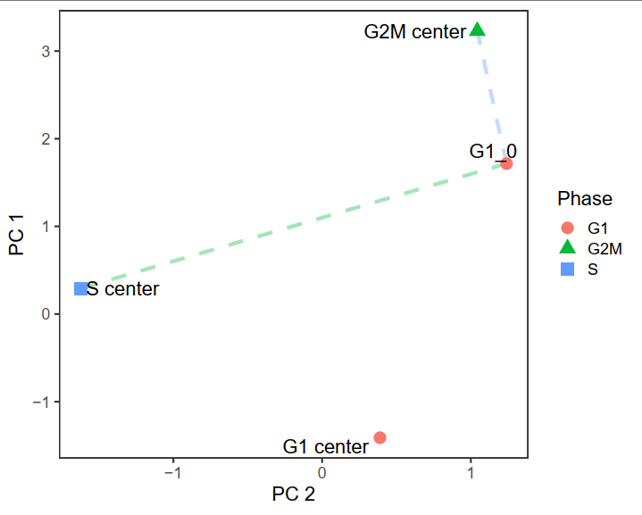
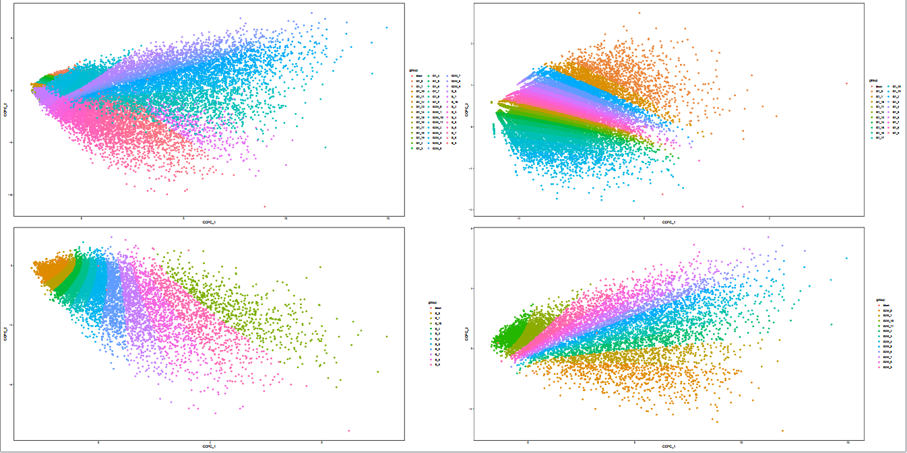
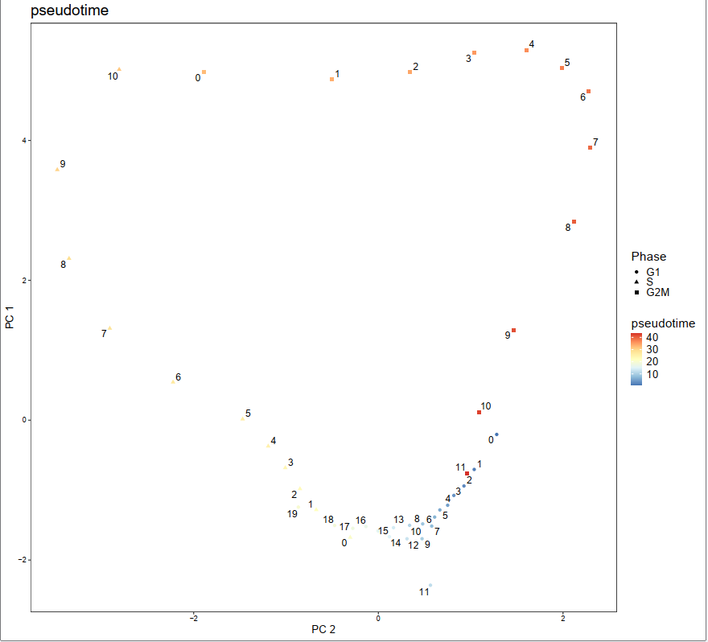

现根据xf的标签拆分成四个文件，再分别转回fastq文件，二次比对，rerun25.sh的结果和之前的cellranger的结果完全一致。

bedtools sort -i peak/8kmousecortex-5M.peak -g /data/home/ruanlab/huangxingyu/Tools/cellranger-atac-2.1.0/genome/refdata-cellranger-arc-mm10-2020-A-2.0.0/fasta/genome.fa.fai > peak/8kmousecortex-5M.peak2

/data/home/ruanlab/huangxingyu/Tools/cellranger-atac-2.1.0raw/cellranger-atac reanalyze --id 10xATAC --peaks peak/8kmousecortex-5M.peak2 --fragments fragment/8kmousecortex-5M_fragments.tsv.gz --reference /data/home/ruanlab/huangxingyu/Tools/cellranger-atac-2.1.0/genome/refdata-cellranger-arc-mm10-2020-A-2.0.0 --localcores 10

#### 细胞周期
ChAIR数据捕获的PET数量太少，在做NUC_dynamic时效果很糟糕，需要考虑将临近的点的信息合并。mergePCAloci.R根据cellcyclescore和PCA的结果根据该位置在上下两个相位的相对差值排序分组

