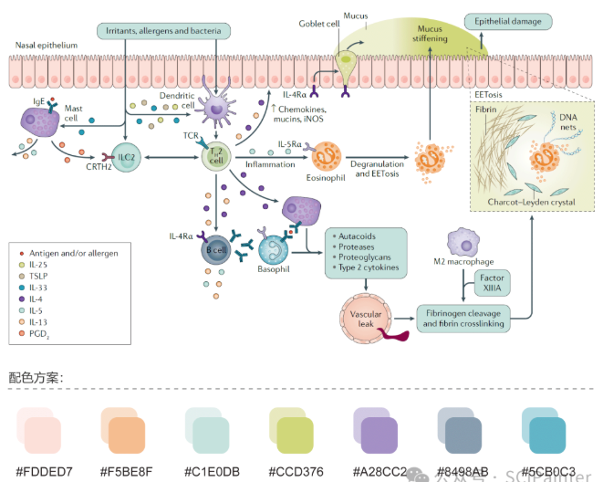
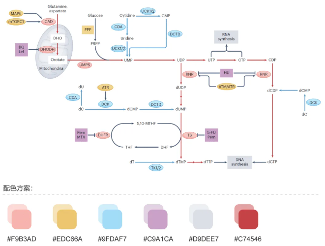
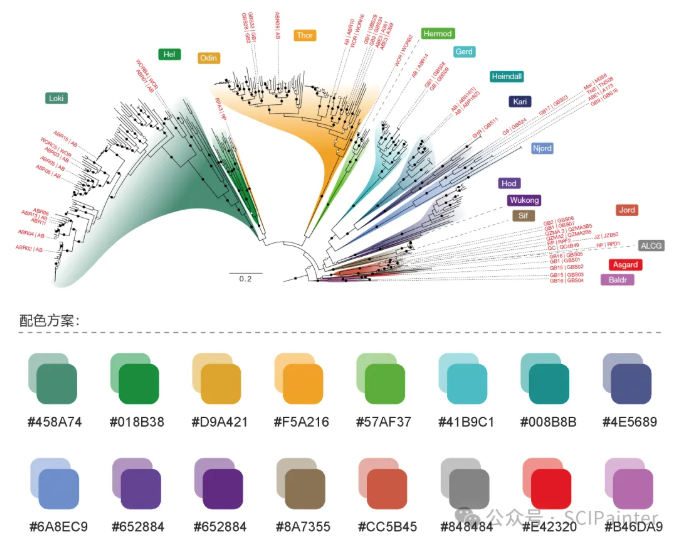
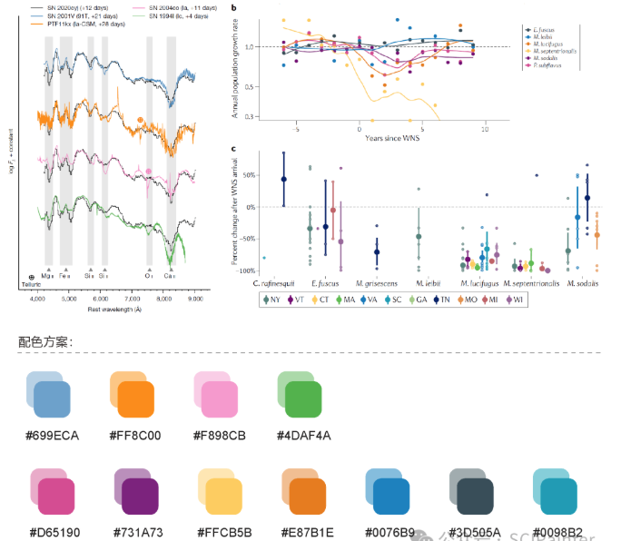
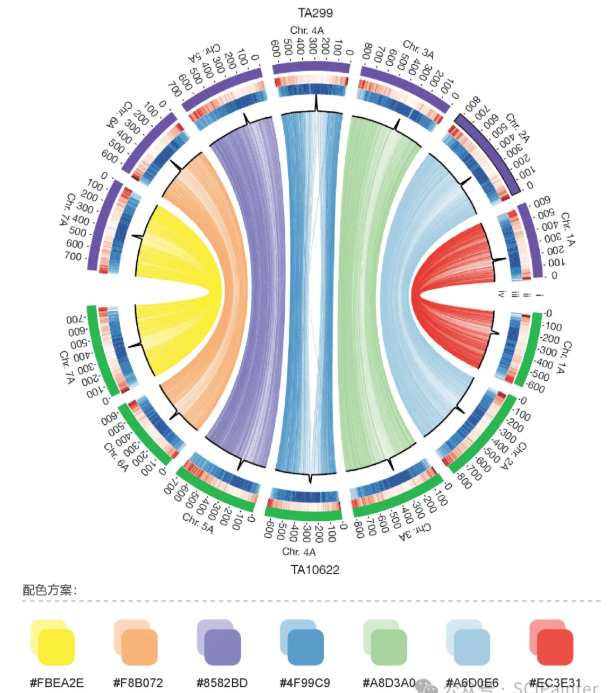

1. Nature reviews Disease primers


2. Nature Reviews Cancer


3. Nature


4. Nature Reviews Microbiology


5. Nature



#### [color sheme for the schema for Chromosome Band (Ideogram)](https://jianhong.github.io/trackViewer/reference/gieStain.html). 为染色质band绘制颜色。
[cytoband](https://bioinformaticsworkbook.org/dataVisualization/Plotly/01-ideogram-chromosome-bands.html#gsc.tab=0)
```
library(BiocManager)
BiocManager::install("trackViewer")

gieStain()
#>     gpos1     gpos2     gpos3     gpos4     gpos5     gpos6     gpos7     gpos8 
#> "#FDFDFD" "#FBFBFB" "#F8F8F8" "#F6F6F6" "#F3F3F3" "#F1F1F1" "#EEEEEE" "#ECECEC" 
#>     gpos9    gpos10    gpos11    gpos12    gpos13    gpos14    gpos15    gpos16 
#> "#E9E9E9" "#E6E6E6" "#E4E4E4" "#E1E1E1" "#DFDFDF" "#DCDCDC" "#DADADA" "#D7D7D7" 
#>    gpos17    gpos18    gpos19    gpos20    gpos21    gpos22    gpos23    gpos24 
#> "#D4D4D4" "#D2D2D2" "#CFCFCF" "#CDCDCD" "#CACACA" "#C8C8C8" "#C5C5C5" "#C3C3C3" 
#>    gpos25    gpos26    gpos27    gpos28    gpos29    gpos30    gpos31    gpos32 
#> "#C0C0C0" "#BDBDBD" "#BBBBBB" "#B8B8B8" "#B6B6B6" "#B3B3B3" "#B1B1B1" "#AEAEAE" 
#>    gpos33    gpos34    gpos35    gpos36    gpos37    gpos38    gpos39    gpos40 
#> "#ACACAC" "#A9A9A9" "#A6A6A6" "#A4A4A4" "#A1A1A1" "#9F9F9F" "#9C9C9C" "#9A9A9A" 
#>    gpos41    gpos42    gpos43    gpos44    gpos45    gpos46    gpos47    gpos48 
#> "#979797" "#949494" "#929292" "#8F8F8F" "#8D8D8D" "#8A8A8A" "#888888" "#858585" 
#>    gpos49    gpos50    gpos51    gpos52    gpos53    gpos54    gpos55    gpos56 
#> "#838383" "#808080" "#7D7D7D" "#7B7B7B" "#787878" "#767676" "#737373" "#717171" 
#>    gpos57    gpos58    gpos59    gpos60    gpos61    gpos62    gpos63    gpos64 
#> "#6E6E6E" "#6C6C6C" "#696969" "#666666" "#646464" "#616161" "#5F5F5F" "#5C5C5C" 
#>    gpos65    gpos66    gpos67    gpos68    gpos69    gpos70    gpos71    gpos72 
#> "#5A5A5A" "#575757" "#545454" "#525252" "#4F4F4F" "#4D4D4D" "#4A4A4A" "#484848" 
#>    gpos73    gpos74    gpos75    gpos76    gpos77    gpos78    gpos79    gpos80 
#> "#454545" "#434343" "#404040" "#3D3D3D" "#3B3B3B" "#383838" "#363636" "#333333" 
#>    gpos81    gpos82    gpos83    gpos84    gpos85    gpos86    gpos87    gpos88 
#> "#313131" "#2E2E2E" "#2C2C2C" "#292929" "#262626" "#242424" "#212121" "#1F1F1F" 
#>    gpos89    gpos90    gpos91    gpos92    gpos93    gpos94    gpos95    gpos96 
#> "#1C1C1C" "#1A1A1A" "#171717" "#141414" "#121212" "#0F0F0F" "#0D0D0D" "#0A0A0A" 
#>    gpos97    gpos98    gpos99   gpos100      gneg      acen      gvar     stalk 
#> "#080808" "#050505" "#030303" "#000000" "#FFFFFF" "#660033" "#660099" "#6600CC" 

```